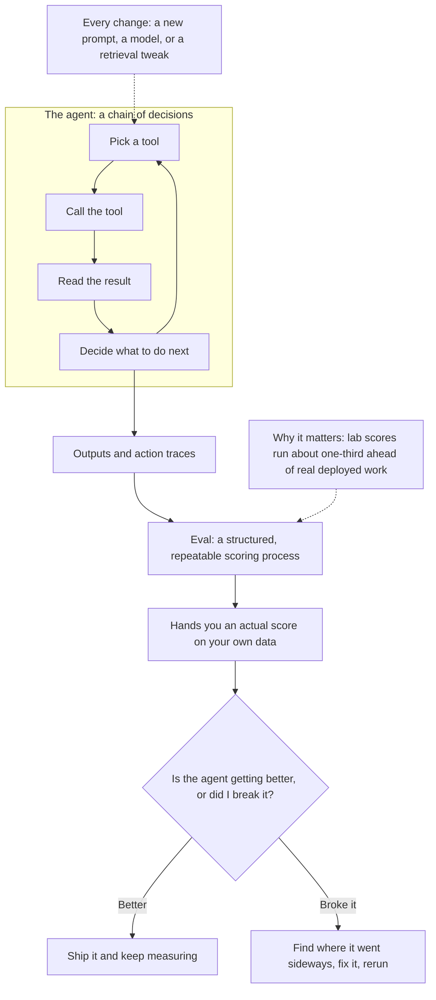
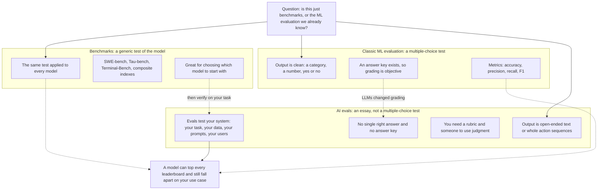
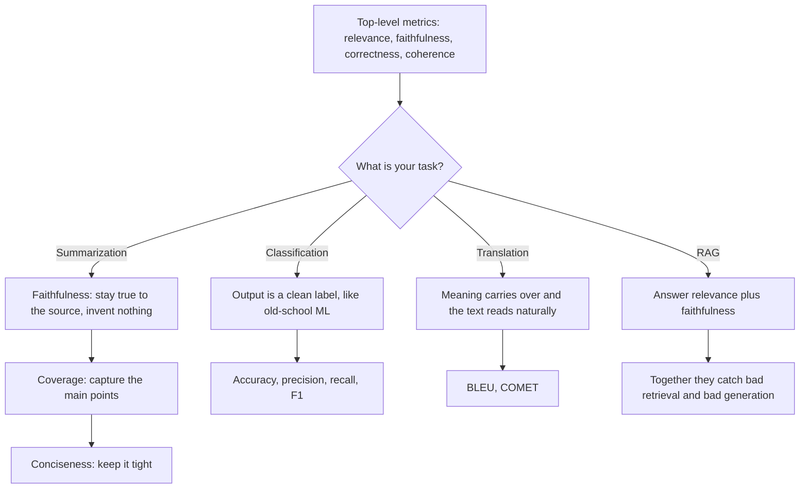
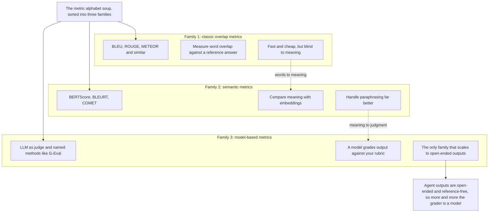
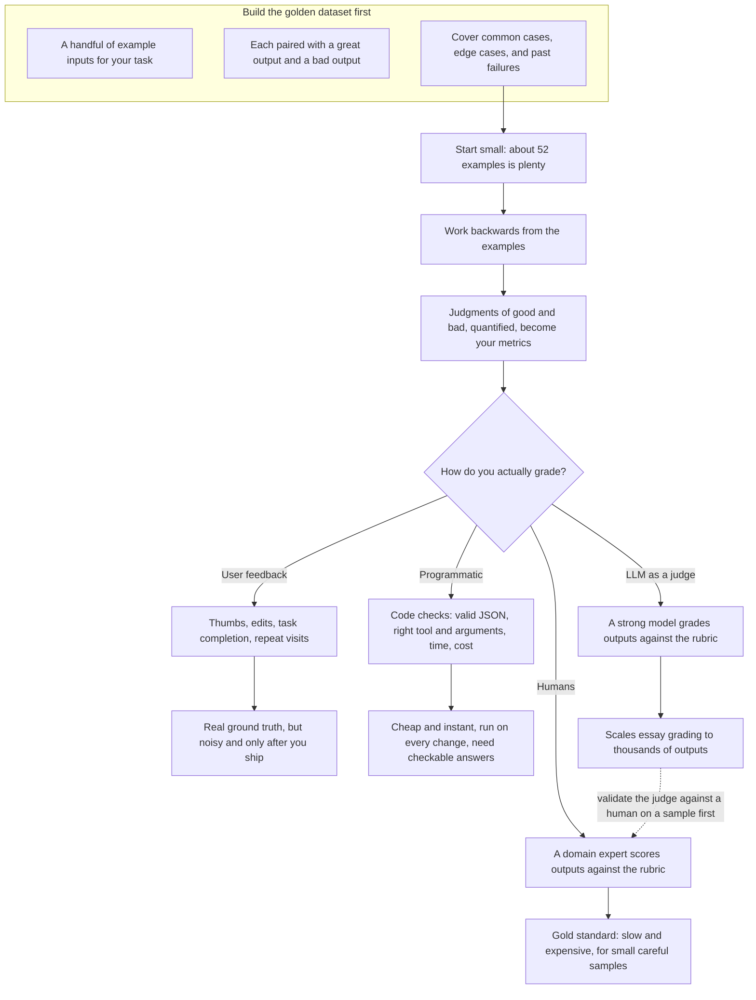
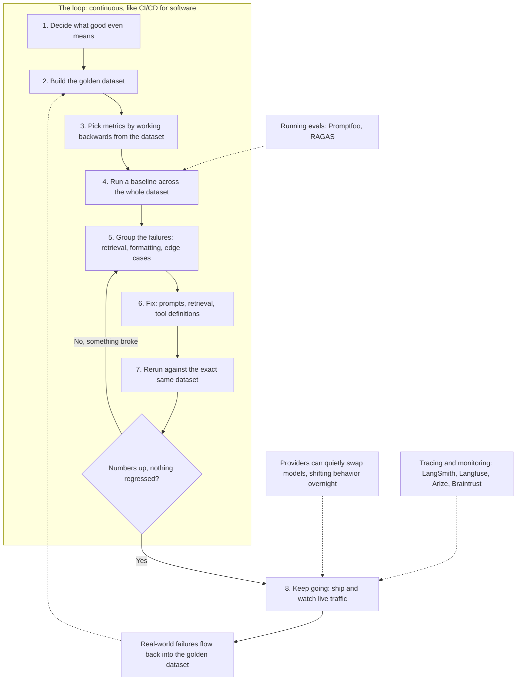

# AI Evals Explained | How to evaluate AI Agents?

This article turns Aishwarya Srinivasan's beginner-friendly explainer into a practical guide to AI evals: what they are, how they differ from benchmarks and classic machine learning evaluation, which metrics to track for which task, and the evaluation loop that separates teams shipping production AI agents from teams shipping demos. It is written for anyone building AI agents — coding agents, customer-support agents, or RAG pipelines — who has ever wondered whether what they built actually works.

## Diagrams

### 1. What an AI Eval Measures: From Agent Decisions to a Score

This diagram illustrates Section 1, "What Is an AI Eval?" — an agent is a chain of decisions, and an eval is the repeatable, structured score that tells you whether each change helped or broke something.

### 2. Benchmarks, Classic ML Evals, and AI Evals: What Each One Tests

This diagram illustrates Section 2, "Evals vs. Benchmarks vs. Classic Machine Learning Evaluation" — benchmarks and classic ML evals grade clean, generic answers, while AI evals grade your specific system's open-ended essays.

### 3. Choosing Metrics by Task: From the Core Four to Task-Specific

This diagram illustrates Sections 3.1 and 3.2, "The Metrics That Matter" — start from the four core metrics, then pick task-specific ones for summarization, classification, translation, and RAG.

### 4. The Three Families of Grading Metrics

This diagram illustrates Section 3.4, "Three Families of Metrics" — word-overlap, semantic, and model-based scores form an escalating ladder of grading power.

### 5. Golden Dataset First, Then Four Ways to Grade Outputs

This diagram illustrates Sections 4 and 5, "Start With a Golden Dataset" and "Four Ways to Grade Agent Outputs" — build the dataset first, let the metrics fall out of it, then choose among human, user-feedback, programmatic, and LLM-judge grading.

### 6. The Evaluation Loop: CI/CD for AI Agents

This diagram illustrates Sections 6 and 7, "Evals Are a Loop" and "Tools for Running and Monitoring Evals" — the eight-step loop that teams run forever, plus the tooling that runs and monitors evals.

## Table of Contents

1. What Is an AI Eval?
2. Evals vs. Benchmarks vs. Classic Machine Learning Evaluation
3. The Metrics That Matter
4. Start With a Golden Dataset, Not a Metric List
5. Four Ways to Grade Agent Outputs
6. Evals Are a Loop, Not a Report Card
7. Tools for Running and Monitoring Evals

- Key Takeaways
- Source

## 1. What Is an AI Eval?

Nobody really tells you this when you start building AI agents: the hardest part is not building the agent. Building the agent is the fun part. The hard part is knowing whether the thing you just built is actually any good. You wire up an agent, hand it some tools, run it once, and it does something that looks almost magical — so you say "yes, it works." But does it? Working the one time you tried it is not the same as working in production, and that gap — the little voice in the back of your head asking "but does it actually work?" — has a name. It is called evaluation. Evals, for short.

> An AI eval is just a structured way of measuring how good your AI outputs really are.

That is the whole definition, and it is simpler than it sounds. Instead of eyeballing a couple of answers and deciding "yeah, that looks fine to me," you set up a small, repeatable process that hands you an actual score. That score answers the only question that matters here: is my AI agent getting better, or did I just do something to break it? Every time you change a prompt, swap a model, or tweak your retrieval, an eval tells you whether you helped the agent or silently broke something.

This matters more for agents than for any other AI artifact, because an agent is not one answer — it is a whole chain of decisions. It picks a tool, calls it, reads the result, decides what to do next, and on and on, with many places along the way where things can quietly go sideways. When your agent breaks in production, you need to know where, and you need to know why — and you are not going to figure that out by reading transcripts one at a time at two in the morning. Research this year shows roughly a one-third gap between how models score in the lab and how they perform in real, deployed work. Evals are how you close that gap before your users feel it.

The teams that actually get agents into production — real coding agents, real customer-support agents — all have one thing in common: they are not guessing, and they are not doing "vibe evals." They are measuring.

## 2. Evals vs. Benchmarks vs. Classic Machine Learning Evaluation

### 2.1 Benchmarks test the model; evals test your system

If you have seen the leaderboards, a fair question is: "isn't this just benchmarks?" There are boards like SWE-bench for coding, Tau-bench for customer-service agents, Terminal-Bench for command-line work, and composite indexes that mash a bunch of these together into a single score.

The distinction really matters. Benchmarks do test the model — but they are a generic test, the same test applied to every single model. AI evals test your specific agentic system: your task, your data, your prompts, your users. A model can sit at the top of every leaderboard and still completely fall apart on your use case, because that benchmark never saw your data. So benchmarks are great for picking which models to start with, while evals are how you find out whether that thing actually works for you.

### 2.2 From a multiple-choice test to an essay

If you have done machine learning before, you may be thinking: "we have been evaluating models for decades — what is the big deal?" Evaluation is genuinely not new; it has been done for machine learning and even statistical models for years. What is worth understanding is why it used to be easier.

In traditional machine learning, the output was usually really clean: a category, like spam or not spam; a number, like a predicted house price; a simple yes or no. Because the output was clean, grading was clean. You had a test set with the right answers, you compared the model's predictions against those answers, and you could easily compute metrics like accuracy, precision, recall, and F1 score. It was very objective — everybody agreed on what "correct" meant, and you could slap a hard number on it. Think of it like a multiple-choice test: the answer is A, B, C, or D, there is an answer key, and you just count up how many times the model got it right.

Large language models and AI agents changed that. The output is no longer a tidy category; it is open-ended text, or a whole sequence of actions the agent took. And most of the time there is no single correct answer. Ask for a summary of an article and there could be a hundred good summaries and a hundred bad ones — and two great summaries can look completely different from each other. You cannot check that against an answer key, because there is no answer key.

That is the shift: we went from grading a multiple-choice test to grading an essay. Grading an essay is just harder. There is no single right answer; you need a rubric, and somebody has to actually use their judgment. That is exactly why AI evals are messier and more qualitative than the ML evals you might be used to. The good news: once the rubric mindset clicks, everything else gets simpler.

## 3. The Metrics That Matter

### 3.1 The core four

Metrics are one of the places where people get confused, because there are dozens of them and it all feels like alphabet soup. In practice, only a handful of core metrics are worth reaching for again and again:

- **Relevance** — did the output actually answer what was asked?
- **Faithfulness**, sometimes called **groundedness** — is this actually true and backed by real data, or is the model making it up? This one is your hallucination check.
- **Correctness** — did it match the expected answer, when there is one?
- **Coherence** — does it actually read well?

Those four are the top-level metrics. But the right metric for any given evaluation depends entirely on your task.

### 3.2 Matching metrics to your task

**Summarization.** You care about faithfulness — did it stay true to the source without inventing stuff? You care about coverage — did it actually capture the main points? And you care about conciseness — did it keep it tight?

**Classification.** This one looks like old-school machine learning again, because the output is a clean label. You are right back to accuracy, precision, recall, and F1 score.

**Translation.** You care about whether the meaning carried over, and whether it really reads naturally in the other language. Metrics like BLEU and COMET show up here.

**Retrieval-augmented generation (RAG).** You measure things like faithfulness and answer relevance, because together they catch the two totally different ways a RAG system breaks: bad retrieval or bad generation.

### 3.3 A quick pause: building a demo generator

Mid-video, Srinivasan shares a practical aside: something she built that changed how she works. Between running her company Gen Academy and making content, she is constantly building demos — every single week, on different topics, with different frameworks and SDKs. And it is not just code: every demo requires a README, a slide deck, a script, and a social post. Doing all of that weekly is genuinely a lot, so she built herself a demo generator.

She set it up once, and now every demo is a single slash command in her terminal: she types the topic, names the toolkits she wants to use, and out comes a full demo package. It is built using Mistral Vibe, Mistral's terminal-native coding agent powered by their flagship Mistral Medium 3.5 model, which runs in the terminal and IDE, understands a full codebase, and helps write, test, refactor, and deploy using natural language. The feature that made the build possible is custom subagents: specialized agents for targeted tasks, each with a specific scope, tools, and permissions, which a main skill delegates to on demand. Custom skills are defined as markdown files with YAML frontmatter that declares the slash command and the workflow behind it. Her `generate-demo` skill first asks clarifying questions — Vibe has built-in multiple-choice clarifications — and then delegates in order: one subagent does the research, one writes the actual demo code and runs it in her terminal to confirm it works, and one drafts the README and slide outline. Each subagent has its own config file and system prompt, and the writer reads from a "voice file" where she has written out her tone rules, so the output actually sounds like her rather than generic AI copy. What used to take a full afternoon now takes a few minutes. It is a nice worked example of composing specialized agents into one repeatable workflow.

### 3.4 Three families of metrics

Zooming out, all of these metrics really fall into three buckets, and it helps to know them by name.

**Classic overlap metrics.** These are the old, reliable ones from the natural language processing world: BLEU for translation, ROUGE for summarization, METEOR, and similar. All they really do is check how much of your output text overlaps with the reference answer. They are fast, they are cheap, and they are dead simple — but they are basically blind to meaning. Two sentences that say the exact same thing in different words can be scored differently.

**Semantic metrics.** Things like BERTScore, BLEURT, and COMET. Instead of just matching words, they actually compare meanings using embeddings, so they handle paraphrasing far better than overlap-based scores.

**Model-based metrics.** Here you literally use an LLM to do the grading for you — your LLM as a judge — plus newer named methods like G-Eval. These are the only ones flexible enough to grade open-ended, messy, creative outputs with no reference answers at all, which, let's be real, is what most actual agent tasks look like.

You can see the pattern: different tasks call for different metrics — and more and more these days, the thing doing the grading is a model.

## 4. Start With a Golden Dataset, Not a Metric List

Here is the single most important habit in the whole video, the thing to walk away with: do not start by grabbing a metric off a list. Start by building a golden dataset.

A golden dataset is honestly not complicated. It is just a handful of example inputs, paired with what a great output looks like and what a bad output could look like. You include your common cases, your annoying edge cases, and every failure you have already watched blow up. Think of it as an answer key that you have been writing for your own specific task. Start small — 52 examples is genuinely plenty to get going, and you will obviously grow it over time.

Here is the part that really clicks for people: once that golden dataset is sitting in front of you, you work backwards from it to figure out your metrics. You look at your examples and ask yourself: what would make this output good, and what would make it bad? The quantified ways of judging those answers are your metrics. The dataset comes first, and the metrics fall out of it — not the other way around.

## 5. Four Ways to Grade Agent Outputs

Once you have a dataset and know what to measure, the next question is how to actually do the grading. There are four ways.

### 5.1 Human evals

Exactly what it sounds like: a person — ideally somebody who knows the domain — sits down and grades the outputs against your rubric. This is the gold standard; nothing beats it for quality. The catch is that it is slow, it is expensive, and it does not scale — you are not going to have a human grade every single request. So save it for small, careful samples and treat it as a source of truth.

### 5.2 User feedback from live production

This is a real signal from your real users in a live production environment. Did they give your answer a thumbs up or a thumbs down? Did they accept it or reject it? Did they edit what you gave them? Did they finish the task, or not? Did they come back the next day with the same question again? This is ground truth that actually matters, because it is real people using your product. The downside: it can be noisy, and you only get it after you have actually shipped — so it cannot be your safety net.

### 5.3 Programmatic evals

Sometimes called code-based evals, these are just simple checks you write in code. Did the output match the expected value? Is the JSON valid? Did the agent call the right tool with the right arguments? How long did it take? How much did it cost? They are cheap and instant, and you can run them automatically on every single change. The catch is that they only work when you have clearly checkable answers — which is exactly why they pair so beautifully with classification tasks.

### 5.4 LLM as a judge

The fourth approach is the one that completely changed the game. You take a really strong, large model and use it to grade your outputs against your rubric. This is what finally lets essay-style grading scale: an LLM judge can assess the open-ended stuff that plain code never could — is this helpful? Is this grounded in the source? — and it can do that for thousands of outputs.

There is one rule, and it is a real one: your judge model has biases. It tends to like longer answers, and it tends to like whatever response it happens to see first. So you should only trust your LLM judge after you have checked its grades against a human grader on a sample. Keep it honest, and it becomes your absolute workhorse.

## 6. Evals Are a Loop, Not a Report Card

AI evals are not a one-time report card that you run right before launch and never touch again. They are a loop — something you run over and over again. The easiest way to think about it is automated testing for software: you do not test your code once and then walk away; you run your tests on every change, forever. It is the exact same idea. In software you do CI/CD. In AI agents you do CI/CD plus continuous evaluation and continuous monitoring.

The cycle is nice and simple:

1. **Decide what "good" even means.** You have to get really specific about this.
2. **Build the golden dataset** described above.
3. **Pick your metrics** by working backwards from the dataset.
4. **Run a baseline.** Run your current system across the whole dataset and get a number. That number is your starting line — without it, "it feels better" is not really data, it is just vibes.
5. **Go look at the failures and group them** — this is the step everyone rushes past. Are they all coming from retrieval misses? Are they all formatting screw-ups? Are they the same weird edge cases? That grouping tells you exactly what to fix in your agent.
6. **Fix it** — usually by tweaking your prompts, your retrieval, or your tool definitions.
7. **Rerun against the same exact dataset.** Did your numbers go up? And just as important: did you accidentally break something that used to work earlier? Catching something you broke without even realizing it is the entire reason the loop exists.
8. **Keep going, because this never stops.** Once you are in production you are always watching your live traffic. Here is the fun part: your model provider can quietly update the models underneath you, and your agent's behavior can shift overnight without you touching a thing. Real-world failures should flow right back into your golden dataset, and then you run the whole thing again.

> You will never know whether your AI agent actually works by watching it succeed one time. You only know by measuring it — on your data, again and again.

That skill is what separates people who are just building demo agents from people who are actually shipping them. The teams really winning in this game treat evals like continuous testing: they are always running them and catching problems before users ever see them. The teams whose products keep breaking run evals once at shipping time, and then find out about every single bug from angry users. Do not be that team.

## 7. Tools for Running and Monitoring Evals

The good news is that you do not have to build any of this from scratch. For running the evals themselves, there are tools like Promptfoo, which lets you test prompts and run evals right from the command line, and a library like RAGAS, which gives you those RAG metrics straight out of the box. For watching what is happening in production — the tracing and monitoring side — you have tools like LangSmith, Langfuse, Arize, and Braintrust. Pick the ones that fit your stack, wire them into the loop, and start measuring.

## Key Takeaways

- An AI eval is a structured, repeatable way of scoring how good your AI outputs really are — it answers the only question that matters: is my agent getting better, or did I break it?
- Benchmarks are generic tests of the model; evals test your specific system on your task with your data. A model can top every leaderboard and still fail your use case.
- LLMs moved evaluation from grading a multiple-choice test to grading an essay: open-ended outputs have no answer key, so you need a rubric and judgment.
- Four core metrics — relevance, faithfulness (groundedness), correctness, coherence — cover most cases, but the right metric depends on your task: coverage and conciseness for summarization, accuracy/precision/recall/F1 for classification, BLEU and COMET for translation, faithfulness and answer relevance for RAG.
- Metrics fall into three families: cheap word-overlap scores (BLEU, ROUGE, METEOR), meaning-aware semantic scores (BERTScore, BLEURT, COMET), and model-based grading (LLM-as-a-judge, G-Eval), which alone can grade open-ended outputs at scale.
- Start with a golden dataset of good and bad examples for your own task, then work backwards to choose metrics — 52 examples is enough to begin.
- The four graders are humans (gold standard, use on small samples), user feedback (real but noisy and post-ship only), programmatic checks (instant, but need checkable answers), and LLM judges (scalable, but biased toward longer and first-seen answers — validate them against humans).
- Evals are a continuous loop: define good, build the dataset, baseline, group failures, fix, and rerun against the same dataset — and keep watching production, because model updates can shift agent behavior overnight.

## Source

- Video: [AI Evals Explained | How to evaluate AI Agents?](https://www.youtube.com/watch?v=_Er8Hao_gmQ)
- Channel: [Aishwarya Srinivasan](https://www.youtube.com/@aishwaryasrinivasan)
- Fetched at: 2026-09-02
- The captions for this video were machine-transcribed in Hindi (Hinglish) and translated to English by this pipeline; wording was reconstructed conservatively from the transcript.
