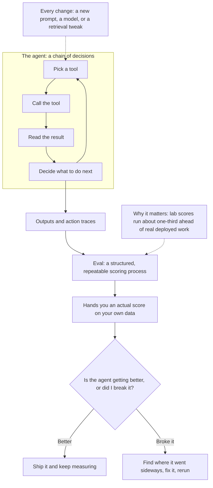
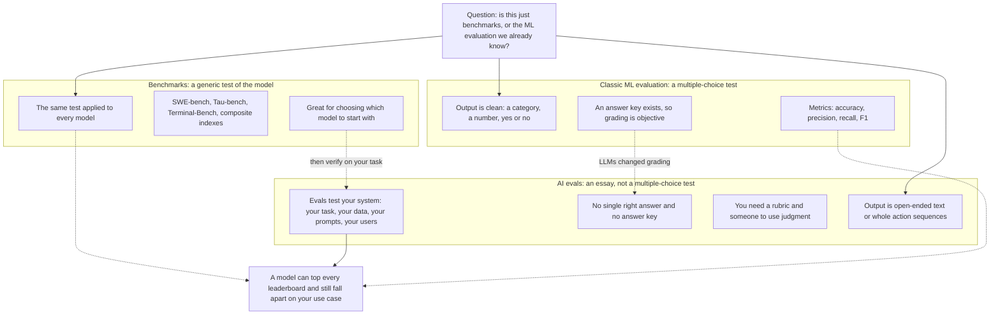
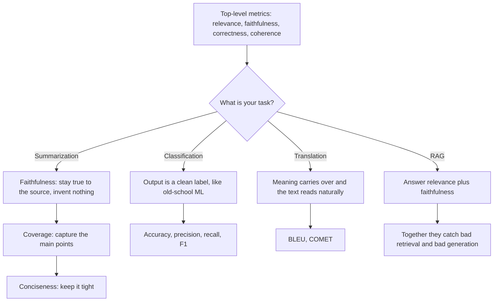
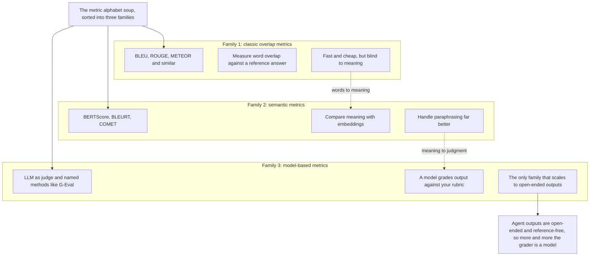
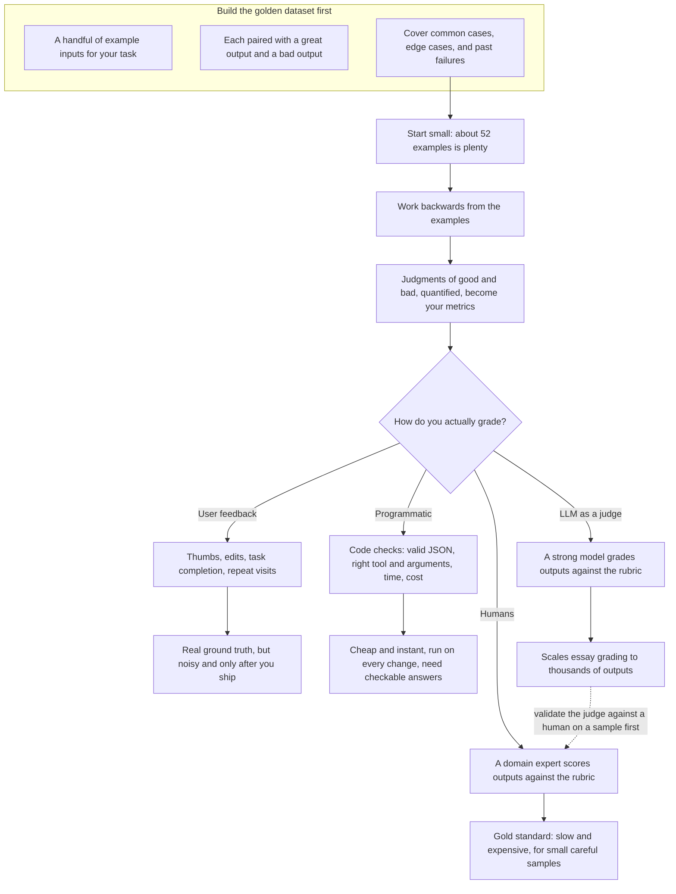
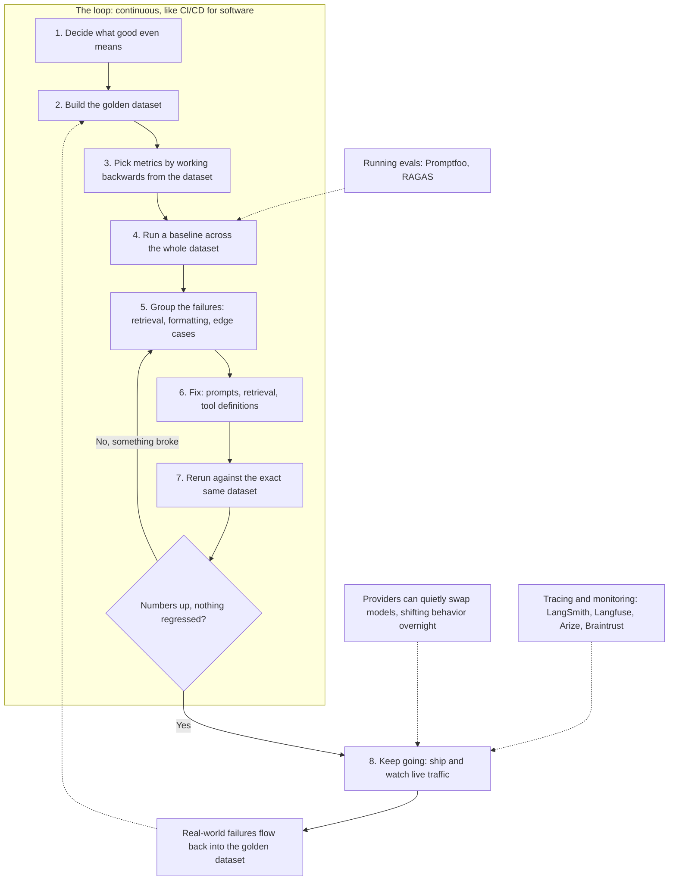

## Diagrams

### 1. What an AI Eval Measures: From Agent Decisions to a Score

This diagram illustrates Section 1, "What Is an AI Eval?" — an agent is a chain of decisions, and an eval is the repeatable, structured score that tells you whether each change helped or broke something.

### 2. Benchmarks, Classic ML Evals, and AI Evals: What Each One Tests

This diagram illustrates Section 2, "Evals vs. Benchmarks vs. Classic Machine Learning Evaluation" — benchmarks and classic ML evals grade clean, generic answers, while AI evals grade your specific system's open-ended essays.

### 3. Choosing Metrics by Task: From the Core Four to Task-Specific

This diagram illustrates Sections 3.1 and 3.2, "The Metrics That Matter" — start from the four core metrics, then pick task-specific ones for summarization, classification, translation, and RAG.

### 4. The Three Families of Grading Metrics

This diagram illustrates Section 3.4, "Three Families of Metrics" — word-overlap, semantic, and model-based scores form an escalating ladder of grading power.

### 5. Golden Dataset First, Then Four Ways to Grade Outputs

This diagram illustrates Sections 4 and 5, "Start With a Golden Dataset" and "Four Ways to Grade Agent Outputs" — build the dataset first, let the metrics fall out of it, then choose among human, user-feedback, programmatic, and LLM-judge grading.

### 6. The Evaluation Loop: CI/CD for AI Agents

This diagram illustrates Sections 6 and 7, "Evals Are a Loop" and "Tools for Running and Monitoring Evals" — the eight-step loop that teams run forever, plus the tooling that runs and monitors evals.

