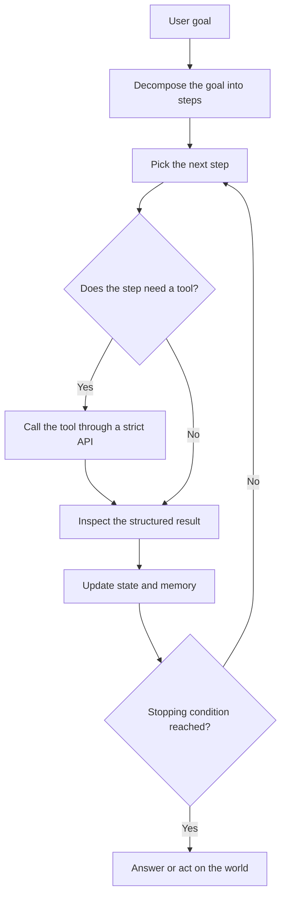
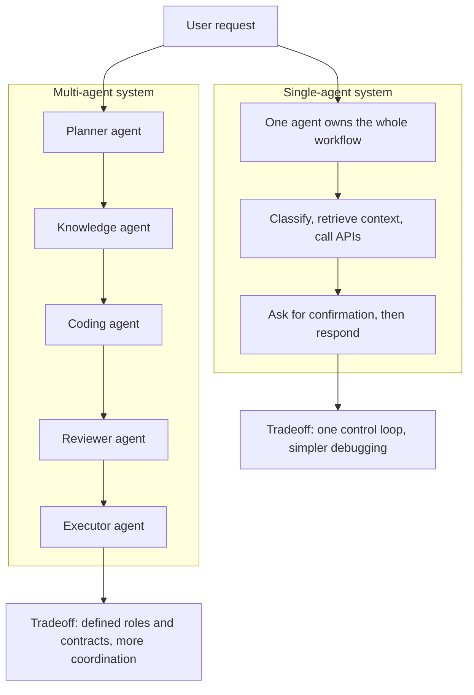
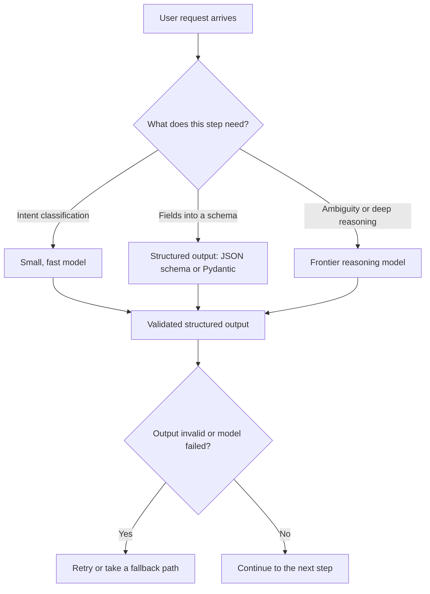
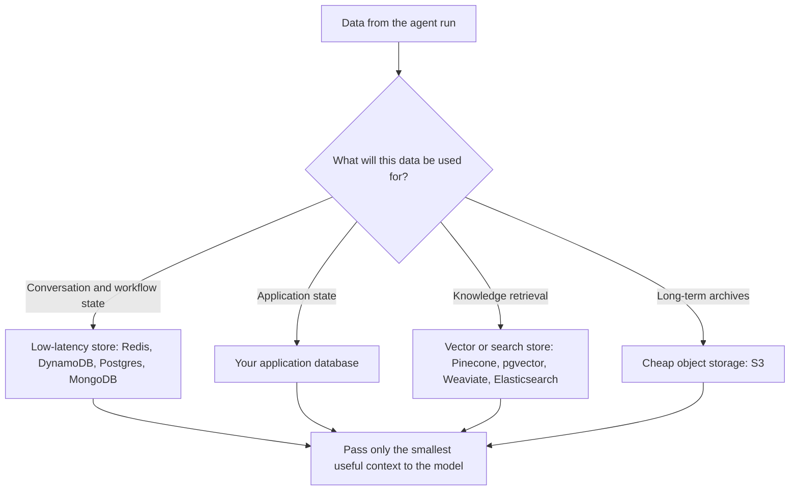
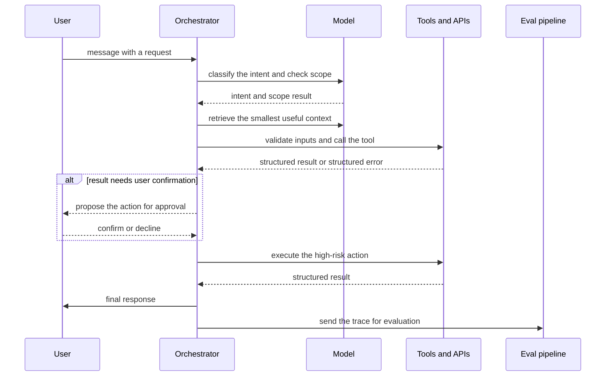
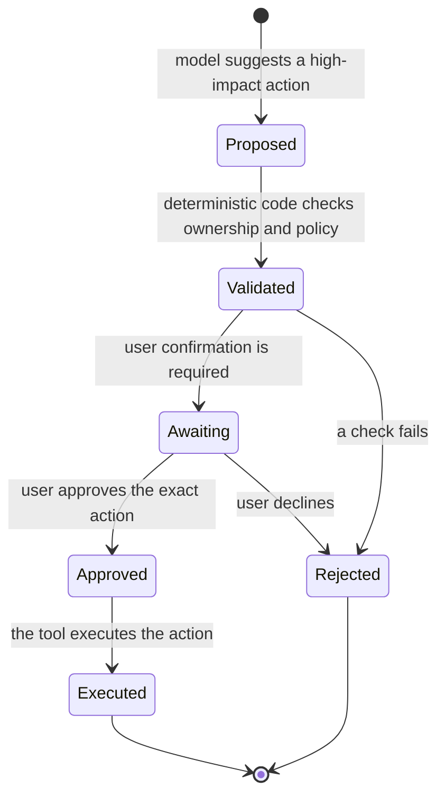

# Agent AI System Design Explained in 27 Minutes

Many people stop at understanding what AI agents are, but the moment you actually build one, the most important thing to understand is the system design behind it — because an agentic AI system is not an LLM wrapped inside a chat interface. This article, based on Aishwarya Srinivasan's video, breaks down agentic AI system design from a builder's perspective, walking through the core building blocks — model routing, tools, memory, orchestration, evaluation, approvals, and production controls. It is for developers and AI engineers who already know what agents are and want the practical mental model for moving from a demo to a production-grade system real users can rely on.

## Diagrams

### 1. The Agentic Loop: From Goal to Action

Illustrates the core agent loop from Section 1, What Is an Agentic AI System — decompose a goal, act through tools, update state, and repeat until a stopping condition is reached.

### 2. Single-Agent vs. Multi-Agent: A Design Tradeoff

Illustrates Section 2, Single-Agent vs. Multi-Agent Systems, and the tradeoff between one control loop and many specialized roles with contracts.

### 3. Model Routing: Matching Model Strength to Each Step

Illustrates the model-layer strategy from Section 3, The Model Layer — send each step to a cheap model or a strong one based on complexity, and demand structured outputs everywhere.

### 4. Memory and State: Data Architecture First

Illustrates Section 5, Memory and State — keep workflow state separate from memory, and choose each store by access pattern.

### 5. The Orchestrated Lifecycle of One Request

Illustrates the explicit control flow from Section 6, Orchestration — one user request moving through intent, context, tools, confirmation, response, and asynchronous evaluation.

### 6. The Approval Gate: Suggest, Validate, Approve, Execute

Illustrates the human-in-the-loop pattern from Section 8, Approval Gates and Policy Control — the model suggests, code validates, the user approves, and only then does the tool execute.

## Table of Contents

1. What Is an Agentic AI System?
2. Single-Agent vs. Multi-Agent Systems
3. The Model Layer: Routing and Structured Output
4. Tools: The Interface to the Real World
5. Memory and State
6. Orchestration
7. Evaluation
8. Approval Gates and Policy Control
9. Reliability
10. Cost and Latency
11. Context and RAG Design
12. Observability, Security, and Privacy
13. Putting It All Together

## 1. What Is an Agentic AI System?

A basic LLM application is simple: it takes an input, sends it to a model, and returns an output. An agentic AI system goes much further. It is a production software system in which a model can reason over a goal, decompose that goal into steps, decide which step to take next, call external tools, inspect the tool results, update its own state, and continue the workflow until it reaches a stopping condition. Along the way it can retrieve context, maintain state, make decisions across multiple steps, and trigger real actions through APIs.

That last part is what separates agentic AI design from ordinary prompt engineering: an agent is not just answering — it is acting on the world through tools, which makes it a full software system with all of the reliability, security, and operations concerns that implies.

Why does system design matter so much here? Because the hard part is not getting a model to answer. The hard part is designing a system that is reliable, cost-aware, fast enough for a good user experience, context-aware, observable, and safe enough to connect to real tools. This video focuses on exactly that system-design level. If you are new to AI agents, the speaker suggests first watching her two earlier videos — one explaining what AI agents are and one comparing single-agent vs. multi-agent systems — before returning to this material.

## 2. Single-Agent vs. Multi-Agent Systems

At a high level, agentic AI systems come in two common patterns: single-agent systems and multi-agent systems.

In a **single-agent system**, one primary agent owns the entire workflow. It may still call multiple tools, retrieve documents, update its memory, and perform many reasoning steps, but the control loop is centralized — one agent is responsible for everything end to end. For example, a customer support agent might classify an incoming request, retrieve the account context, call a billing API, ask the user for confirmation, and then generate a final response. All of that happens inside one agent's loop.

In a **multi-agent system**, the workflow is split across multiple specialized agents. One agent handles planning, another retrieves knowledge, another writes code, another reviews the output, and another handles execution. The key idea is separation of responsibilities: instead of one agent doing everything, you design several agents with defined roles, explicit input contracts, explicit output contracts, and routing logic between them.

Multi-agent systems earn their complexity when the task has clear specialization, benefits from parallel work, needs review loops, or involves long-running workflows. But they also add real costs: more coordination overhead, more failure modes, more state to track, more logs to inspect, and more places where cost and latency can creep up. The choice between the two patterns is a design tradeoff, not a matter of which sounds more advanced.

## 3. The Model Layer: Routing and Structured Output

The first building block is the model layer, which includes the actual LLM (or multimodal models) you use, plus the strategy for *when each model gets used*. The default of letting one powerful model handle every step is a trap: it gets expensive and slow very quickly.

A better design is **model routing**. Use cheaper, faster models for low-complexity steps such as intent classification, routing, extraction, schema filling, and simple summarization. Reserve stronger reasoning models only for the steps where deeper reasoning actually changes the outcome.

The speaker's example is an appointment booking agent. You probably do not need a frontier reasoning model to detect whether the user wants to book, reschedule, cancel, or just ask a question — a small model classifies that fine. You may not need an LLM at all to extract the date, time, doctor name, and appointment type into a JSON schema. But you do want a stronger model when the user gives ambiguous constraints, like "I'm going to be traveling next week, I want to avoid mornings," or "make sure this happens after my lab results come in." Those cases need real reasoning.

The model layer also means thinking about structured outputs. Any step whose output feeds another system should return a predictable structure, not free-form prose. Use JSON schema, Pydantic models, function calling or tool calling — whichever structured-output mechanism your model provider supports.

Every decision in the model layer should answer three questions: What model is going to be used for this step? What output contract does it return? And what happens if the model fails or returns an invalid output?

## 4. Tools: The Interface to the Real World

Tools are the interface between the model and the external world. A tool can be a database lookup, a CRM API, a calendar API, a payment API, a code interpreter, an internal search service, a ticketing system, a Slack action, a Google action, or any backend function the agent is allowed to call.

In production, tools should be designed like APIs with strict contracts. Every tool should have a clear name, a description, an input schema, an output schema, permission boundaries, timeout behavior, retry behavior, and an error format. This matters because the model should never be allowed to send arbitrary instructions into your backend.

Consider a tool called "update user." It should not accept one vague natural-language string like "update this user based on the request" — that is far too open-ended. A safer tool contract is explicit structured fields: the user ID, the field to update, the new value, the reason, the source request ID, and whether confirmation is required.

Tool outputs should also be machine-readable. If a tool fails, it returns a structured error; if it succeeds, it returns a structured result. The agent should never have to parse messy prose coming back from your backend.

A good design pattern is to separate read tools from write tools, then layer in risk gradually: start with read-only capabilities, add low-risk write tools next, and only then add high-risk write tools — and only with validation and human approval in place. Fetching available appointment slots is very different from canceling an appointment, so you need to understand the risk factor of each tool.

This is also where MCP — the Model Context Protocol — becomes relevant. It is an emerging pattern for exposing tools, resources, and context to agents in a standardized way. But even if you are not using MCP, the system-design principle is the same: tools need contracts, permissions, boundaries, and logs.

## 5. Memory and State

Memory and state are where many agentic systems become messy, and the root cause is usually treating memory as one thing. In agentic systems you need to separate memory from state.

**State** is the current execution context of the workflow: what step are we on, what information has already been collected, which tools have we called, what did those tools return, has the user confirmed the action, and did the workflow pass or fail.

**Memory** is broader. It includes conversation history, user preferences, past actions, retrieved knowledge, document context, summaries, and long-form information that may be useful later.

A common mistake is pulling all of this into a vector database. That is not a good default. You should choose storage based on access patterns:

- Conversation and workflow state belongs in low-latency stores such as Redis, DynamoDB, Postgres, or MongoDB.
- Application state belongs in your application database.
- Knowledge retrieval can use RAG with Pinecone, pgvector, Weaviate, Elasticsearch, OpenSearch, or a managed knowledge base.
- Long-term archives belong in cheaper object storage such as an S3 bucket.

The speaker's example: an agent helping a user reschedule a doctor's appointment should store the current appointment ID, the proposed new time, the confirmation status, and the workflow step as structured workflow state. The user's medical history should not be casually passed through the LLM if the model only needs the appointment ID and the list of available slots.

You should also distinguish short-term context from long-term memory. Short-term context is what you pass into the prompt for your current turn. Long-term memory is something you retrieve selectively. The goal is never to stuff everything into the model's context window — that creates context bloat. The goal is to retrieve the smallest useful context for the current step so the model can make its decision.

This is exactly why memory design is really data architecture: you are deciding what to store, where to store it, how long to keep it, how to retrieve it, and what is safe to send to the model — or not.

## 6. Orchestration

Once you have the model layer, tools, and memory, you need something to coordinate them: **orchestration**. Orchestration is the control layer of an agentic system. It defines how the system moves from a user request, through intermediate steps and tool calls, to a final output.

It can be implemented with plain application code, a graph-based framework like LangGraph, a workflow engine like Temporal, LlamaIndex workflows, LangChain, or custom state machines — often a combination of several.

The orchestration layer should define the control flow explicitly. A typical flow: you receive a user message, classify the intent, retrieve the required context, decide whether the request is in scope, select the tools, validate the tool inputs, execute the tools, inspect the results, ask for confirmation if needed, finally generate the response, then log the trace and send evaluation data asynchronously.

For simple use cases, a deterministic pipeline is often better than a fully autonomous agent loop. Not every workflow needs planning and reflection. If a sequence of steps is mostly known in advance, design it as a pipeline or a state machine, and use agentic reasoning only when the workflow genuinely needs dynamic decision-making.

For most complex systems, graph-based orchestration becomes useful because it lets you represent branching, retries, loops, approval gates, and fallback paths. For example: if extraction fails, retry with a different prompt or a different model; if a tool returns "no available appointment," branch into a path that suggests alternatives; if the user asks for a cancellation, branch into a confirmation path.

For multi-agent systems, orchestration also includes agent-to-agent routing. You need to define which agent owns the next step, what information gets passed along, what output format is expected, and how conflicts are resolved. Without that, multi-agent systems become extremely difficult to debug. The key point: do not confuse autonomy with a lack of structure.

> Do not confuse autonomy with lack of structure. Production agents need a very clear control flow.

## 7. Evaluation

Evaluation is one of the most important — and most ignored — parts of agentic AI system design. In traditional software, if a function runs and no exception is thrown, we assume the system works. In agentic AI systems that assumption breaks very quickly.

A model can return valid JSON that is semantically wrong. It can call the correct tool with the wrong arguments. It can retrieve irrelevant context. It can answer using stale information. It can fail to ask for confirmation. It can refuse a valid request. And it can comply with an unsafe request. So evals need to be designed into the system from the very beginning.

For agentic systems you need more than final-answer evaluation — you need **trace-level evaluation**: evaluating each and every important step in the trajectory. That means intent classification, retrieval quality, tool selection, tool arguments, policy compliance, confirmation behavior, final answer quality, and task success.

Here is why. A support agent could produce a very polished final answer, yet have selected the wrong refund policy. If you only evaluate the final text, you miss the actual failure. If you evaluate the trace, you can see that the retrieval step pulled the wrong policy document, or that the model misclassified the user's plan type.

You should always maintain a test set of realistic scenarios: happy paths, ambiguous requests, out-of-scope requests, tool failures, malicious inputs, partial information, policy edge cases, and escalation cases. These become regression tests whenever you change the model, the prompt, the retrieval logic, or your tool schemas.

You can also run sampled asynchronous evaluations in production: a judge model — an LLM used as a judge — can score a percentage of conversations offline, and high-signal user feedback can go directly into your evals. But be careful: LLM-as-judge is useful, not perfect. For important workflows, combine model-based grading with deterministic checks and human review.

Finally, your eval system should eventually produce metrics, not just examples: intent accuracy, tool-call success rate, invalid-schema rate, retrieval hit rate, refusal accuracy, escalation rate, task completion rate, user flag rate, and cost per successful task. Evaluation is genuinely a complex field — and it is the point where agentic systems start to look like real production systems.

## 8. Approval Gates and Policy Control

Not every action needs human approval, but high-impact actions should have gates. Sending an email, deleting data, issuing a refund, canceling an appointment, changing billing, updating a CRM record, running code, placing an order, or making a financial transaction should not happen just because the model inferred the intent. There should always be a human in the loop.

The safer design pattern: the model *suggests* something, code *validates* it, a user *approves* it, and then the tool *executes* it. The validation step should be deterministic wherever possible: check ownership, check permissions, check whether the requested action is allowed, check whether the required fields are present, check that the user has confirmed the exact action — and only then execute.

For example, if the user says "cancel my appointment," the model can classify that intent as cancellation and propose the target appointment. But the system must verify that the logged-in user actually owns that appointment, that it is cancellable, that cancellation is allowed under policy, and that the user explicitly confirms before the cancellation API is called.

This matters just as much in multi-agent systems. If one agent generates a plan and another agent executes it, the execution layer should not blindly trust the planning layer — tool execution still needs validation and authorization. The agent should never be the source of truth for your business rules; your application code should be.

## 9. Reliability

Reliability means the system behaves predictably even when the model does not. You get it through decomposition, contracts, retries, validation, fallbacks, and monitoring.

First, decompose large prompts into smaller steps. A single joint prompt that classifies intent, retrieves context, decides policies, calls tools, and writes the final response is going to be extremely hard to test. Smaller steps are far easier to evaluate and debug.

Second, use structured outputs between steps. If the next step depends on the model's output, do not rely on free-form text. Validate the schema; if the output is invalid, retry; if it still fails, use a fallback path.

Third, wrap every model call like the unreliable upstream dependency it is. Timeouts, malformed outputs, rate limits, provider errors, and degraded quality should all have handling paths.

Fourth, separate deterministic validation from model reasoning. If the model extracts a date, code should be able to validate that date. If the model selects a user ID, code should be able to verify the permissions. If the model proposes a tool call, code should be able to validate the arguments.

Reliability is not about making the model perfect. It is about designing the system so that model imperfections do not immediately become product failures.

## 10. Cost and Latency

Cost and latency need to be designed together, because agentic systems often involve multiple model calls per user request. A single interaction might include intent classification, query rewriting, retrieval, planning, tool selection, tool argument generation, tool result interpretation, final response generation, and evaluation. If every step uses a large reasoning model, your system will be extremely slow and extremely expensive.

This is exactly where model routing pays off again: use small models for simple classification and extraction, and larger models only when ambiguity, reasoning, and synthesis are actually required.

Then limit tokens aggressively. Output tokens are both a cost lever and a latency lever. If the user only needs a two-sentence answer, do not generate a long explanation. If the downstream system only needs JSON, do not ask for prose.

Use caching where it makes sense — cache retrieval results, repeated policy lookups, tool metadata, and stable context. Use batching and asynchronous execution for non-blocking work like evaluation and summarization. Always use streaming responses for user-facing tasks when the response may take time, and if the workflow requires long-running tool calls, show progress states instead of leaving the user with a blank screen.

Also enforce scope early. Out-of-scope requests can burn tokens and tool calls, so put cheap filters, rules, and intent gates before the expensive reasoning step even happens. Finally, a production agent should have cost observability: tokens in, tokens out, cost per step, cost per conversation, and cost per successful task.

## 11. Context and RAG Design

Context design is one of the biggest differences between a toy agent and a useful production agent. The goal is not to pass everything into the prompt; the goal is to pass the right context for the current step.

In practice, context can come from many places: the user message, the conversation state, the application database, retrieved documents, tool results, the user profile, or long-term memory. Each source has different freshness, trust, privacy, and latency characteristics, and the system design should respect that.

For RAG specifically, retrieval quality matters more than simply having a vector database. You need document chunking, metadata filters, hybrid search where useful, reranking, freshness controls, and source attribution when the user needs to trust the answer.

You also need to separate trusted instructions from untrusted content. Retrieved documents should not be allowed to override the system instructions. Tool outputs should be treated as data, not as instructions. And user-provided content should be isolated from developer or system instructions.

For really long conversations, use summarization and checkpoints instead of passing the full history forever. Store the summary separately from the raw conversation logs, and keep track of what the summary is allowed to influence.

A context-aware system is one that knows what information it needs, where to retrieve it from, whether it is trusted, and whether it is safe to send to the model.

## 12. Observability, Security, and Privacy

**Observability.** You need to log the anatomy of every agent run: the model name, the model version, the prompt version, the step name, the workflow ID, the conversation ID, the tool name, and the tool arguments — with sensitive values masked. Then latency, time to first token, tokens in, tokens out, and cost. How many retries were there? Were there any fallbacks or errors? Was there any use of feedback, and what were the eval scores? It is a lot, but you need to log all of it and more. You should be able to answer: where did the failure happen — intent classification, retrieval, planning, tool selection, tool execution, policy validation, or the final response?

**Security.** Treat everything that touches the model as attacker-controlled input unless proven otherwise. User messages can contain direct prompt injection. Retrieved documents can contain indirect prompt injection. Tool outputs could contain poisoned data. And model outputs can contain unsafe commands — things like SQL, HTML, or other kinds of code. So isolate untrusted content: separate the instructions from the data, never execute raw model output, never run SQL or shell commands directly from model-generated text, give tools least-privilege permissions, and add approval gates for risky actions.

**Privacy.** Send the minimum data needed to the model. If the model only needs an appointment ID and availability, do not send the full patient report. If it only requires a summarized ticket, do not send the full customer history. Mask PII at the right time, set retention policies for logs, traces, and conversation archives, and keep sensitive fields out of the prompt unless they are required for the task. Remember that your model provider, your vector database, your observability platform, and your logging systems are all part of your data boundary.

## 13. Putting It All Together

A production-grade agentic AI system needs all of these pieces: clear model routing, strict tool contracts, explicit memory and state management, orchestration, trace-level evals, approval gates, cost and latency controls, context design, observability, security, and privacy. All of it, together.

That is why agentic AI system design is not just prompt engineering. It is backend design, data design, security design, and product design with an LLM in the loop. The speaker's sign-off for going deeper: a free, roughly two-hour "Agentic AI System Design" masterclass recording that goes much deeper into the architecture, production patterns, tradeoffs, and real design decisions behind agentic AI systems, plus a live, project-based certification program at her Gen Academy — weekly classes, production-level projects rather than demos, low-code/no-code or code-heavy tracks, and open to anyone who wants to become an AI professional, not only engineers.

## Key Takeaways

- An agentic AI system is a production software system — a model that reasons over a goal, uses tools, retrieves context, maintains state, and triggers real actions through APIs — not an LLM wrapped in a chat interface.
- Choose between single-agent and multi-agent architectures deliberately: separation of responsibilities buys specialization and review loops, but adds coordination overhead, failure modes, state, and cost.
- Route models by step complexity: cheap fast models for classification, extraction, and schema filling; strong reasoning models only where reasoning changes the outcome.
- Design tools like strict APIs — names, schemas, permissions, timeouts, retries, and structured errors — and phase in risk from read-only to low-risk writes to high-risk writes with approval.
- Separate memory from state; store each in the right place (low-latency store, application database, vector store, object archive) and pass the smallest useful context, not the whole context window.
- Orchestration should define an explicit control flow; use deterministic pipelines and state machines where steps are known, and graph-based orchestration for branching, retries, and approval gates.
- Evaluate the trace, not just the final answer — every step from intent classification to tool arguments to policy compliance — against a realistic regression test set.
- Put human approval gates and deterministic validation behind high-impact actions; the model suggests, code validates, the user approves, the tool executes.
- Design reliability, cost, latency, and context together: decompose prompts, validate schemas, cache and stream, enforce scope early, and treat retrieved content as untrusted data.
- Log the full anatomy of every run, treat everything touching the model as attacker-controlled input, and send the minimum data needed to the model.

## Source

- Video: [Agent AI System Design Explained in 27 Minutes](https://www.youtube.com/watch?v=mwN75EiGfCE)
- Channel: [Aishwarya Srinivasan](https://www.youtube.com/@aishwaryasrinivasan)
- Metadata fetched at: 2026-09-02T10:10:12.681076+00:00
- The captions this article was written from were auto-transcribed from Hindi and translated to English by this pipeline.
