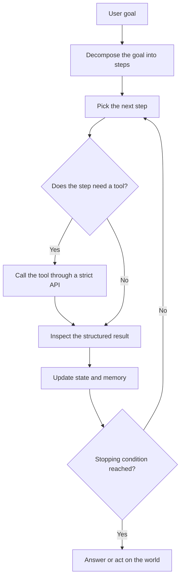
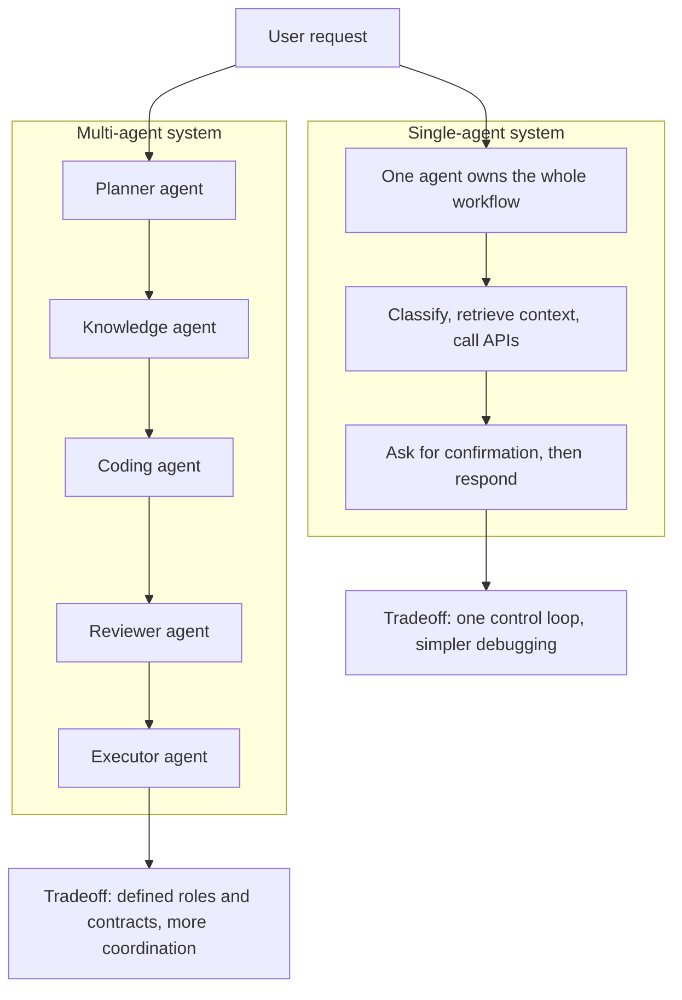
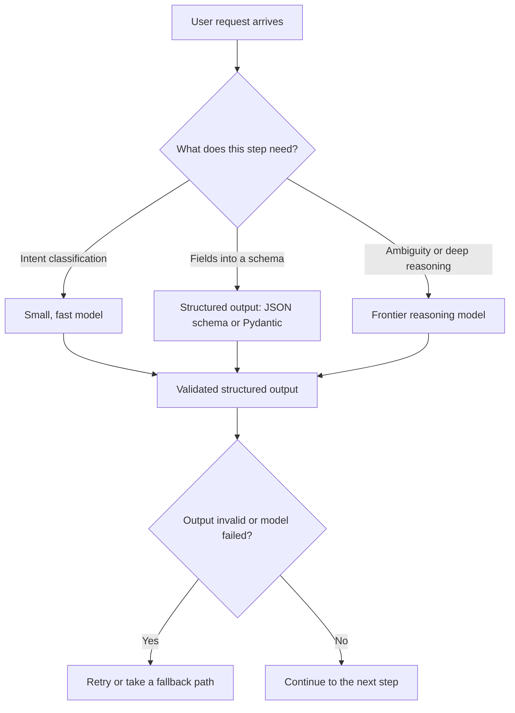
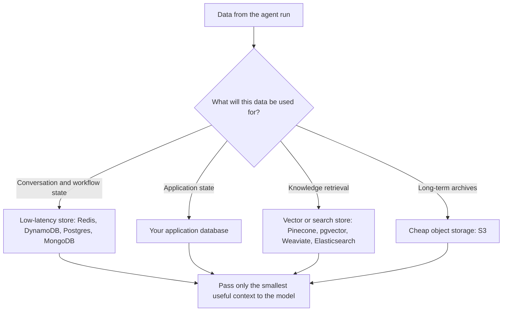
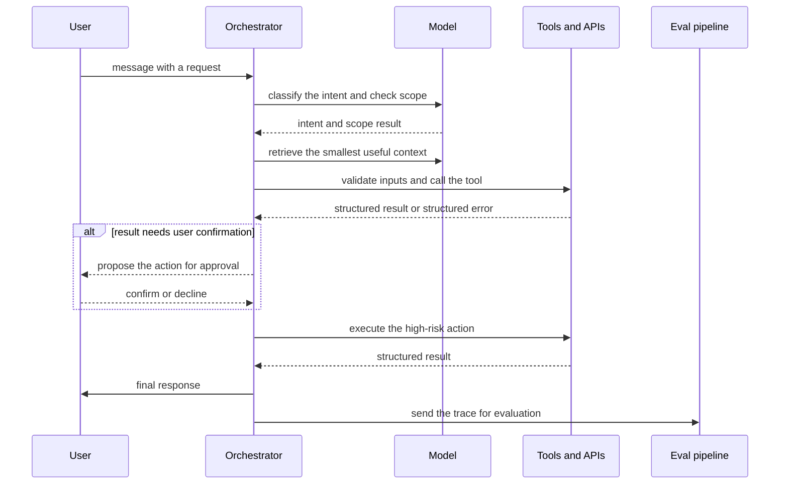
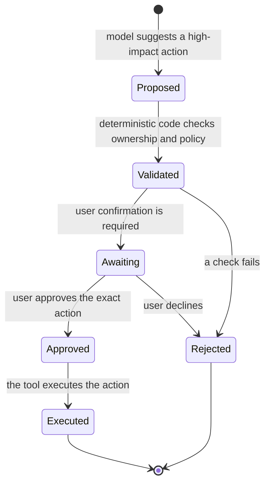

### 1. The Agentic Loop: From Goal to Action

Illustrates the core agent loop from Section 1, What Is an Agentic AI System — decompose a goal, act through tools, update state, and repeat until a stopping condition is reached.

### 2. Single-Agent vs. Multi-Agent: A Design Tradeoff

Illustrates Section 2, Single-Agent vs. Multi-Agent Systems, and the tradeoff between one control loop and many specialized roles with contracts.

### 3. Model Routing: Matching Model Strength to Each Step

Illustrates the model-layer strategy from Section 3, The Model Layer — send each step to a cheap model or a strong one based on complexity, and demand structured outputs everywhere.

### 4. Memory and State: Data Architecture First

Illustrates Section 5, Memory and State — keep workflow state separate from memory, and choose each store by access pattern.

### 5. The Orchestrated Lifecycle of One Request

Illustrates the explicit control flow from Section 6, Orchestration — one user request moving through intent, context, tools, confirmation, response, and asynchronous evaluation.

### 6. The Approval Gate: Suggest, Validate, Approve, Execute

Illustrates the human-in-the-loop pattern from Section 8, Approval Gates and Policy Control — the model suggests, code validates, the user approves, and only then does the tool execute.

