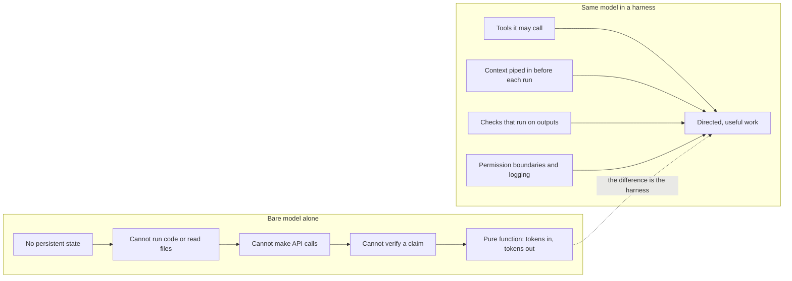
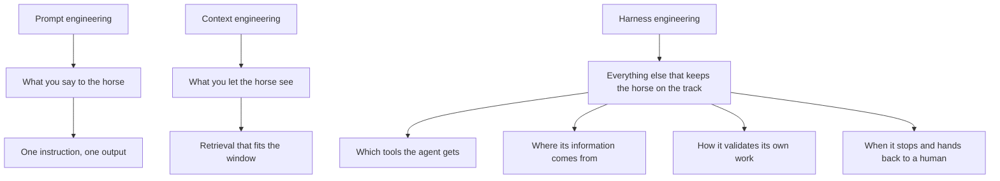
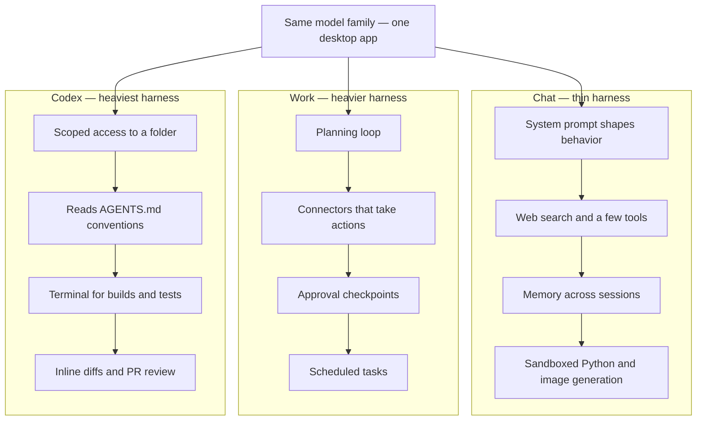
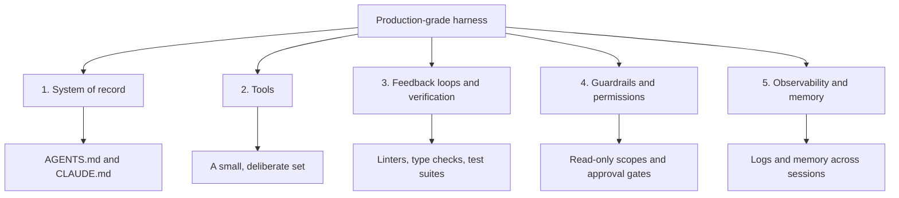
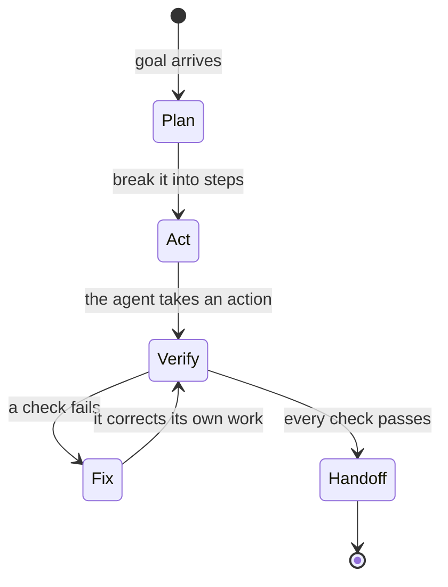
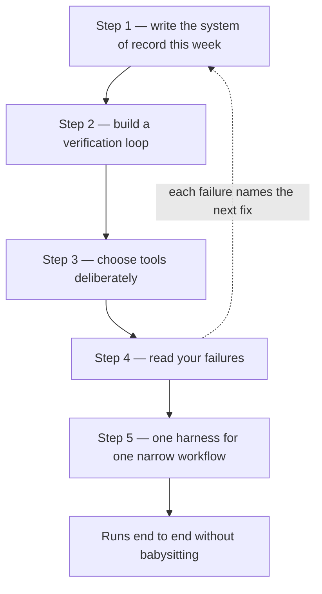

# Harness Engineering Explained in 20 Mins!

The most important thing in AI right now has nothing to do with picking the right model — in fact, the teams shipping the most impressive AI systems will tell you the model is the easy part. This article, distilled from a video by AI educator and practitioner Aishwarya Srinivasan, explains what harness engineering is, why it is quickly becoming the discipline that separates AI demos from AI products, and how you can start practicing it this week. It is written for software engineers, AI engineers, and technical builders who want their agents to do dependable work for hours at a time rather than produce one-off answers.

## Diagrams

### 1. The Horse and the Harness: Turning Raw Power into Directed Work

Illustrates Section 2.1, The Horse and the Harness, and Section 2.2, What an LLM Can and Cannot Do on Its Own — the same model alone is a pure function, while the same model in a harness produces directed work.

### 2. Three Disciplines: Prompt, Context, and Harness Engineering

Illustrates Section 2.3, Where Harness Engineering Sits Next to Prompt and Context Engineering — each discipline governs a bigger span, from a single exchange to the whole autonomous run.

### 3. Chat, Work, and Codex: Three Harnesses in One App

Illustrates Section 3, Finding the Harness in the ChatGPT Desktop App — the same model family behaves like three different products as the harness gets heavier.

### 4. The Five Components of a Production-Grade Harness

Illustrates Section 4, The Five Components of a Production-Grade Harness — the layer you build around the model, and the concrete form each component takes.

### 5. The Verification Loop: An Agent That Checks Its Own Work

Illustrates Section 4.3, Feedback Loops and Verification, and Step 2 in Section 5.2, Build a Verification Loop — checks run automatically so the agent discovers its own mistakes before you do.

### 6. The Five-Step Roadmap: From One File to One Workflow

Illustrates Section 5, A Five-Step Roadmap to Building Your Own Harness — write one file this week, then add verification, tools, failure reading, and finally one narrow workflow running end to end.

## Table of Contents

1. The Model Is the Easy Part
2. What a Harness Is — and Why a Model Alone Can't Do Real Work
    - 2.1 The Horse and the Harness
    - 2.2 What an LLM Can and Cannot Do on Its Own
    - 2.3 Where Harness Engineering Sits Next to Prompt and Context Engineering
    - 2.4 A Term That Spread in Weeks
    - 2.5 Better Results Without a Better Model
3. Finding the Harness in the ChatGPT Desktop App
    - 3.1 Chat: A Thin Harness for Conversation
    - 3.2 Work: A Heavier Harness for Getting Things Done
    - 3.3 Codex: The Heaviest Harness of All
4. The Five Components of a Production-Grade Harness
    - 4.1 The System of Record
    - 4.2 Tools
    - 4.3 Feedback Loops and Verification
    - 4.4 Guardrails and Permissions
    - 4.5 Observability and Memory
5. A Five-Step Roadmap to Building Your Own Harness
    - 5.1 Step 1 — Create Your System of Record This Week
    - 5.2 Step 2 — Build a Verification Loop
    - 5.3 Step 3 — Choose Tools Deliberately
    - 5.4 Step 4 — Read Your Failures
    - 5.5 Step 5 — Build One Complete Harness for One Narrow Workflow
6. The Model Is the Commodity, the Harness Is the Product

## 1. The Model Is the Easy Part

Walk into any conversation about building with AI and the question you will hear most often is "which model should we use?" The video argues this is the wrong question. The teams shipping the most impressive AI systems in 2026 will tell you that model selection is the easy part; the hard part, and the part where value is actually created, is everything wrapped around the model.

The story that frames the whole video comes from OpenAI. A three-person team started with an empty repository in late August 2025, wrote no code themselves for five months, and ended up with a million lines of production code and 1,500 merged pull requests — every line of it generated by Codex, their coding agent. The detail the team obsessed over, according to the video, was not the prompt and not even the model. It was the harness: the execution environment that made the agent's work possible, reviewable, and safe.

The video covers three things. First, what a harness even is, and why a model by itself — no matter how smart — is genuinely handicapped without one. Second, a close look at a product most people use every day, the ChatGPT desktop app, to find the real harness inside its Chat, Work, and Codex experiences; the argument is that once you see it there, you will see it everywhere. Third, the five components of every production-grade harness, plus a step-by-step roadmap for building one yourself.

The instructor's background is worth noting as context: Aishwarya Srinivasan spent more than ten years in machine learning and AI, holding data-scientist roles at Microsoft, Google, and IBM, has a master's degree in data science from Columbia University, and led developer relations at the AI startup Fireworks AI before leaving to build her own AI startup. She has also co-founded Gen Academy, an AI skill-building platform focused on what teams actually build in production. She frames harness engineering as building directly on top of two ideas she has covered in earlier videos, loop engineering and context engineering, both linked from the video's description.

## 2. What a Harness Is — and Why a Model Alone Can't Do Real Work

### 2.1 The Horse and the Harness

The name carries its own explanation. A horse is powerful and fast — but raw power is not useful work. Without a harness, a horse cannot pull a cart or plow a field. The harness is the piece of equipment that converts raw power into directed, useful work. In this analogy the model is the horse, and the harness is everything you build around it: the tools it is allowed to call and the schemas for calling them, the information piped into its context before each run, the checks that run on its outputs, the permission boundaries defining what it can touch, and the logging that records what it actually did.

### 2.2 What an LLM Can and Cannot Do on Its Own

The reason this matters is that a large language model on its own is a far more limited object than most people realize. Strip away the product around it and what remains is a frozen set of weights that maps input tokens to output tokens — that is the entire interface. Concretely, the model by itself:

- Has no persistent state — everything is gone once the context window closes.
- Cannot execute code.
- Cannot read a file from disk.
- Cannot make an API call.
- Cannot even verify a single claim it produces.

In other words, a bare LLM is a pure function: tokens in, tokens out. Everything you experience as "AI doing useful work" comes from the layer wrapped around that model, and that layer is the harness. Boiled down to a single phrase: the harness is the plumbing around the model.

### 2.3 Where Harness Engineering Sits Next to Prompt and Context Engineering

Harness engineering is easy to confuse with two terms you already know, and the video places all three precisely:

- **Prompt engineering** optimizes a single exchange: one instruction, one output. It is what you say to the horse.
- **Context engineering** manages what the model can see: what gets retrieved and what fits inside the context window. It is what you let the horse see.
- **Harness engineering** covers everything else that keeps the horse on the track. Neither of the other two disciplines addresses what happens when an agent runs autonomously for hours and makes hundreds of decisions without any supervision — and that gap is exactly what harness engineering fills.

Harness engineering is the deliberate design of that execution environment: which tools the agent gets, where its information comes from, how it validates its own work, and when it stops and hands control back to a human.

### 2.4 A Term That Spread in Weeks

The term itself is very new, and its origin story explains why it spread so fast. In February 2026, Mitchell Hashimoto — co-founder of HashiCorp and creator of Terraform — published a post about his AI adoption journey in which he described a stage he called "engineering the harness." His rule was simple:

> Every time an agent makes a mistake, you engineer the environment so it cannot make that mistake again. It is not a better prompt — it is a permanent fix.

Six days later, OpenAI published its write-up of the million lines of Codex-generated code, and Anthropic followed up with a piece on building efficient harnesses for long-running agents. Within weeks, the term was everywhere.

### 2.5 Better Results Without a Better Model

If you suspect harness engineering is just model quality in disguise, the video points to a clean experiment on exactly this question: one engineer took 15 different LLMs and improved the coding performance of all of them in a single afternoon — without touching a single model. The only thing that changed was the harness. Same weights, better environment, measurably better results. That is the concept in its purest form.

## 3. Finding the Harness in the ChatGPT Desktop App

To make the idea concrete, the video takes a product that is sitting on most viewers' desktops and pulls back the layers. In July 2026, OpenAI merged the Codex app and the ChatGPT app into one desktop application containing three experiences: Chat, Work, and Codex. The detail most people missed, the video argues, is that the headline shipment that day was not a new model — it was a harness. The same underlying model family behaves like three completely different products depending on which of these environments it runs in.

### 3.1 Chat: A Thin Harness for Conversation

The Chat experience feels like just talking to a model, but it isn't. Even here there is a thin harness at work, tuned for the turn-by-turn conversations that happen in a chat window:

- A **system prompt** that shapes behavior before you type a single word.
- A **set of tools** the model can invoke — for example, web search when you ask a question that needs fresh information.
- A **memory system** that persists facts across your sessions.
- A **sandboxed Python environment** for any file analysis.
- Built-in **image generation**.
- **Safety filters** running on inputs and outputs.

### 3.2 Work: A Heavier Harness for Getting Things Done

Work mode is the same application with a toggle flipped, but now you are talking to an agent, not a model. It gathers context from your files and connected applications, decomposes a goal into steps, and runs for hours to produce finished documents, spreadsheets, and presentations. The model's raw capability did not change — the harness got heavier. Work adds:

- A **planning loop**.
- **Connectors** into your actual tools and the ability to take actions across them.
- **Approval checkpoints** where the agent pauses before doing anything consequential.
- **Scheduled tasks** that keep running even after you walk away.

Those approval checkpoints deserve attention: they are a guardrail, a harness component, placed there by an engineer who decided the agent should stop at exactly that point rather than guess. The video flags this as a detail to remember — it returns when the five components are laid out.

### 3.3 Codex: The Heaviest Harness of All

Codex mode is the heaviest harness of the three and, for technical viewers, the most instructive. It gets a sandboxed execution environment or scoped access to a local folder, where you explicitly grant what it can touch. Before it writes a single line, it reads the `AGENTS.md` file at the root of your repository — your team's accumulated instructions and conventions. It has a terminal, so it can actually run your build and your test suite and observe its own failures. It produces diffs for your review, inline, and it can actually review pull requests. Every capability is scoped, logged, and wrapped in a feedback loop.

That, the video says, is exactly why the same intelligence that makes small talk in the Chat tab can autonomously refactor a codebase in the Codex tab: the weights of the model did not change — the environment and the harness did. So when someone asks "which AI is the best?", the honest answer is that they are asking about the horse when they should be asking about the harness.

## 4. The Five Components of a Production-Grade Harness

Whenever you use Chat, Work, or Codex — or Claude Code on the Anthropic side — you are a harness *customer*: someone else engineered that environment for you. Harness engineering is learning to build that layer yourself, for your own agents and your own workflows. Which raises the obvious question: what is that layer actually made of?

Almost every production system uses some combination of five components, and you will feel it even if one of them is missing.

### 4.1 The System of Record

The first component is instruction files — the system of record for how an agent should work. If you have used Claude Code or Cursor, you have seen `CLAUDE.md` or `AGENTS.md` in the root of a project: a plain Markdown file the agent reads before working, containing the project structure, the conventions, the build commands, and the decisions your team has already made.

The OpenAI team hit this trap directly. Without written answers to questions like "what abstractions should I use?", the agent guesses — and guesses wrong, repeatedly. Their conclusion: if knowledge lives in Slack threads and Google Docs instead of the repository, the agents cannot really see it, so it might as well not exist. Everything the agent needs has to live where the agent works.

### 4.2 Tools

The second component is tools: what can your agent actually do? Run shell commands, edit files, search the web, query a database, and so on. Most people fall into one of two extremes — access to everything, which makes behavior unpredictable, or access to almost nothing, which makes the agent talk but not really act. Good harness design sits in between: a small, deliberate set of tools, where you can justify for each one why the agent needs it.

### 4.3 Feedback Loops and Verification

The third component is the one most people skip — and the video is explicit that you should not. An agent needs a way to check its own work without asking you. In code, that machinery already exists: a linter, a type checker, or a real test suite that runs automatically after every change, so the agent observes its own failures and fixes them before you even look at the output.

### 4.4 Guardrails and Permissions

The fourth component answers a different question: what is the agent explicitly *not* allowed to do? Which parts are read-only? Which commands require approval? At what point does it stop and ask, instead of guessing? The approval prompts you see in ChatGPT's Work experience are this exact component, designed at OpenAI scale. Every serious agent tool exposes these settings — and most people never touch them. You need to set them deliberately.

### 4.5 Observability and Memory

The fifth component is observability and memory. Observability is a record of everything the agent did: every tool call, every decision, every error. Memory carries useful state across different sessions, because the model itself cannot carry anything. When a run goes wrong — and it will — the record is the only way to reconstruct what happened, instead of guessing.

## 5. A Five-Step Roadmap to Building Your Own Harness

Theory is useful, but the video closes with the practitioner's question: how do you actually go build one? The roadmap below is meant to be worked through week by week.

### 5.1 Step 1 — Create Your System of Record This Week

The instruction file already has a home in every tool you might use. In Codex — whether the CLI or the Codex tab inside the ChatGPT desktop app — the file is `AGENTS.md` at your repository's root, and Codex picks it up automatically. In Claude Code it is called `CLAUDE.md`, and you can run the `/init` command to have it generate a starting point for you. Cursor also reads `AGENTS.md`.

Whatever tool you are in, write down four things: how the project is structured, how to run it, how to test it, and your top five conventions. Keep it under a page. Then adopt Hashimoto's discipline as a personal rule: when the agent makes the same mistake twice, do not explain the fix in the chat — write it into the file permanently. Hashimoto has said that almost every line in the `AGENTS.md` of his own project came from a past agent failure. Once a rule is in the file, that mistake essentially never recurs. That single habit is harness engineering in miniature — and it compounds.

### 5.2 Step 2 — Build a Verification Loop

Learn to build your own verification loop. In Python, that means a linter like Ruff plus a handful of real tests; the same idea applies in JavaScript with the standard tooling. Configure your agent to run those checks after every single change — in Claude Code you can wire this up with hooks so the checks fire automatically, instead of relying on the agent to remember.

If your agent is not writing code, the principle still holds: define what correct output looks like, write a script or checklist that validates it, and make that check part of every single run. The goal is simple: agents should discover their own mistakes before you do.

### 5.3 Step 3 — Choose Tools Deliberately

Before building anything custom, spend a week working inside one serious existing harness — either Claude Code or Codex — and actually study how it behaves. When does it ask for permission? How does it use your instruction file? How does it run your tests? You will learn more from watching a well-built harness than from any YouTube tutorial — including, as the video puts it, this one.

Then extend outward: connect your agent to one real system you use every day, using MCP (the Model Context Protocol, covered in a separate video by the same instructor). For every single tool connection, ask the harness question: *What is the worst thing the agent could do with this access — and how have I done anything to prevent it?*

### 5.4 Step 4 — Read Your Failures

Turn on whatever logging your agent tool provides. When a run goes wrong, read through what the agent did, step by step. It might sound tedious, but it is the single highest-leverage habit in the entire video. Every failed run tells you exactly which piece of the harness to build next: is it a missing instruction, a missing check, or a tool the agent should never have had access to? As the video puts it, your harness roadmap is written in your failure logs.

### 5.5 Step 5 — Build One Complete Harness for One Narrow Workflow

This is the graduation project. Pick one repetitive, well-defined task you will be doing every single week, and build the full loop around it: an instruction file, a small set of tools, automated verification, a clear set of permissions, and logging. It should be one workflow, end to end, running reliably without you babysitting it. Do that once, and you will understand the discipline at a level no blog post can ever teach you.

## 6. The Model Is the Commodity, the Harness Is the Product

The video's closing argument looks forward. In 2026 and 2027, the model is increasingly becoming the commodity in the stack: everyone has access to roughly the same frontier intelligence, especially with open-source models — the video name-checks the latest open releases such as Kimi K3 as worth trying out. What you actually compete on is the environment you build around the model: the instruction files, the feedback loops, the permissions, the observability. That is harness engineering, and it is increasingly becoming the standard for most companies.

> You don't get a better agent by finding a better model. You get a better agent by building it with a better harness.

At the end of the day, this is all software engineering — engineering and plumbing the thing around the model. For viewers who want to go further, the video points to its own follow-ups: earlier explainers on loop engineering and context engineering, a free live masterclass on building agentic loops and harnesses, and the six-week "Mastering Agentic AI" program at Gen Academy, which offers both no-code/low-code and code-heavy project tracks and runs cohorts with educational partners including NVIDIA, OpenAI, Pinecone, Replicate, and ElevenLabs.

## Key Takeaways

- A bare LLM is a pure function — tokens in, tokens out. It has no memory, cannot run code, read files, make API calls, or verify its own claims; everything useful comes from the layer around it, and that layer is the harness.
- Harness engineering sits on top of prompt engineering (what you say to the horse) and context engineering (what you let the horse see): it governs long-running, autonomous runs where an agent makes hundreds of unsupervised decisions.
- The term went mainstream in weeks after Mitchell Hashimoto's February 2026 post, OpenAI's million-lines-of-Codex write-up, and Anthropic's piece on harnesses for long-running agents — and an experiment improving all 15 tested LLMs without touching their weights shows the harness, not the model, drives measurable gains.
- The ChatGPT desktop app demonstrates the idea: Chat runs on a thin harness, Work on a heavier one with planning loops, connectors, approval checkpoints, and scheduled tasks, and Codex on the heaviest — sandboxed execution, `AGENTS.md`, a terminal for running builds and tests, and inline diffs.
- Five components make up a production-grade harness: system of record (instruction files), tools, feedback loops and verification, guardrails and permissions, and observability and memory.
- Start by writing a short `AGENTS.md`/`CLAUDE.md` this week, and adopt Hashimoto's rule: never explain the same mistake twice in chat — write the fix into the file permanently.
- Wire automated checks (linters, tests, hooks) into every run, spend a week studying a serious existing harness before building your own, connect tools via MCP one at a time, and treat failure logs as your roadmap.
- As model access commoditizes, competition shifts to the environment: instruction files, feedback loops, permissions, and observability.

## Source

- Video: [Harness Engineering Explained in 20 Mins!](https://www.youtube.com/watch?v=bsmUh5bTNZ4)
- Channel: [Aishwarya Srinivasan](https://www.youtube.com/@aishwaryasrinivasan)
- Fetched at: 2026-09-02T10:58:03.084913+00:00
- Captions note: this article was written from captions transcribed in Hindi (`source_lang: hi`) and translated into English by this pipeline.
