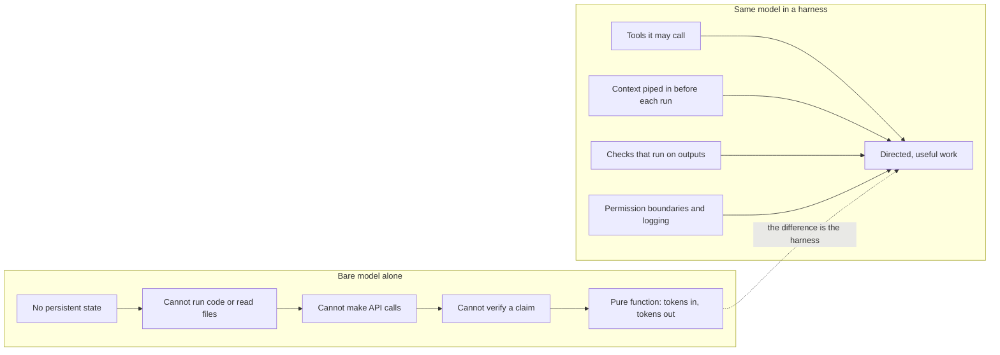
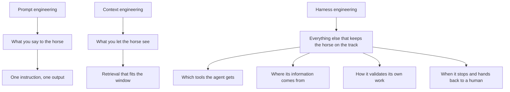
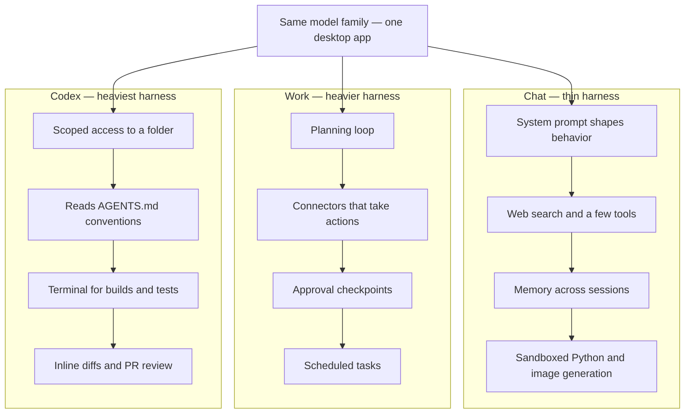
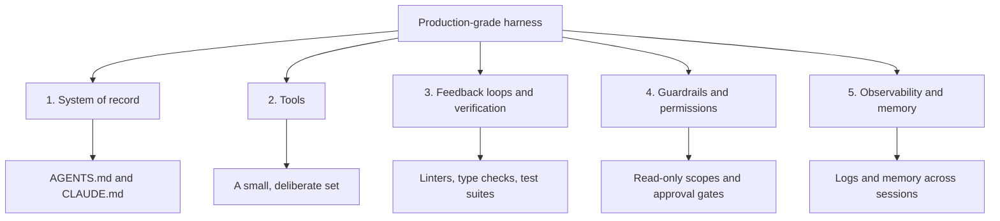
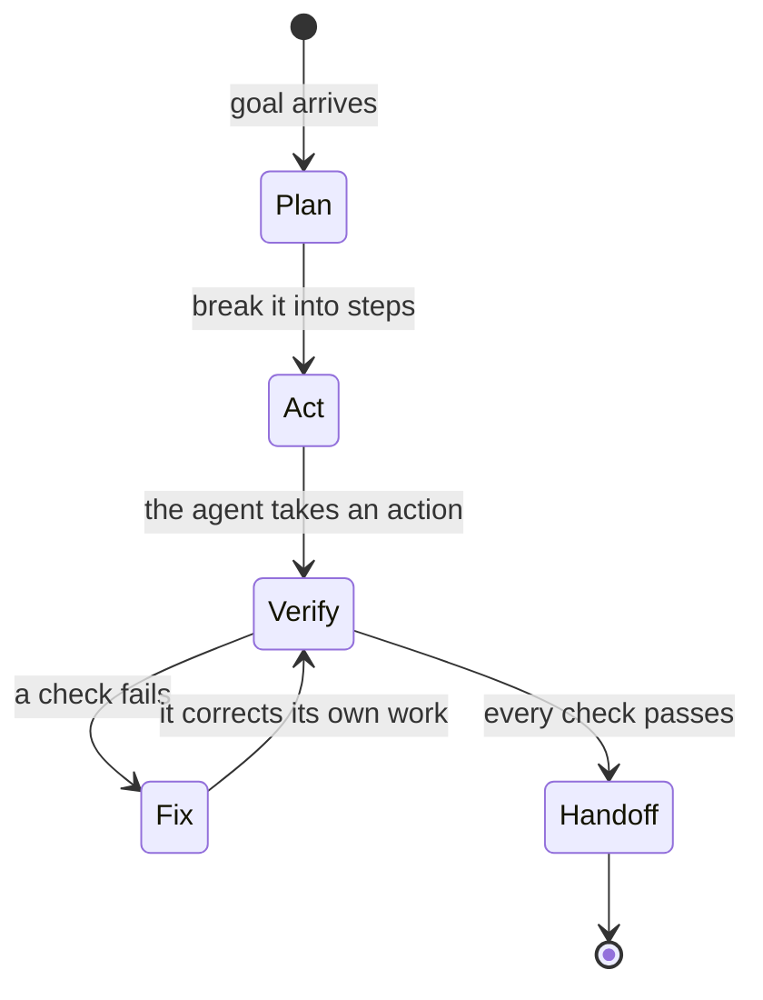
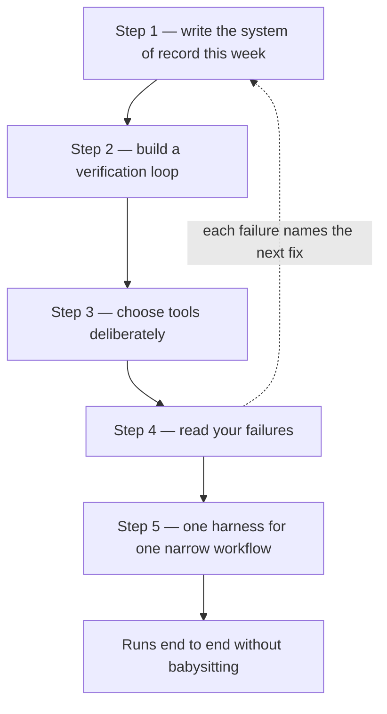

### 1. The Horse and the Harness: Turning Raw Power into Directed Work

Illustrates Section 2.1, The Horse and the Harness, and Section 2.2, What an LLM Can and Cannot Do on Its Own — the same model alone is a pure function, while the same model in a harness produces directed work.

### 2. Three Disciplines: Prompt, Context, and Harness Engineering

Illustrates Section 2.3, Where Harness Engineering Sits Next to Prompt and Context Engineering — each discipline governs a bigger span, from a single exchange to the whole autonomous run.

### 3. Chat, Work, and Codex: Three Harnesses in One App

Illustrates Section 3, Finding the Harness in the ChatGPT Desktop App — the same model family behaves like three different products as the harness gets heavier.

### 4. The Five Components of a Production-Grade Harness

Illustrates Section 4, The Five Components of a Production-Grade Harness — the layer you build around the model, and the concrete form each component takes.

### 5. The Verification Loop: An Agent That Checks Its Own Work

Illustrates Section 4.3, Feedback Loops and Verification, and Step 2 in Section 5.2, Build a Verification Loop — checks run automatically so the agent discovers its own mistakes before you do.

### 6. The Five-Step Roadmap: From One File to One Workflow

Illustrates Section 5, A Five-Step Roadmap to Building Your Own Harness — write one file this week, then add verification, tools, failure reading, and finally one narrow workflow running end to end.

