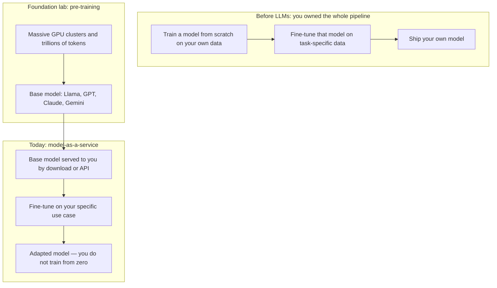
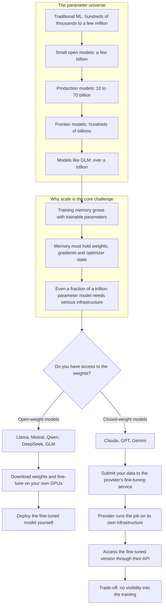
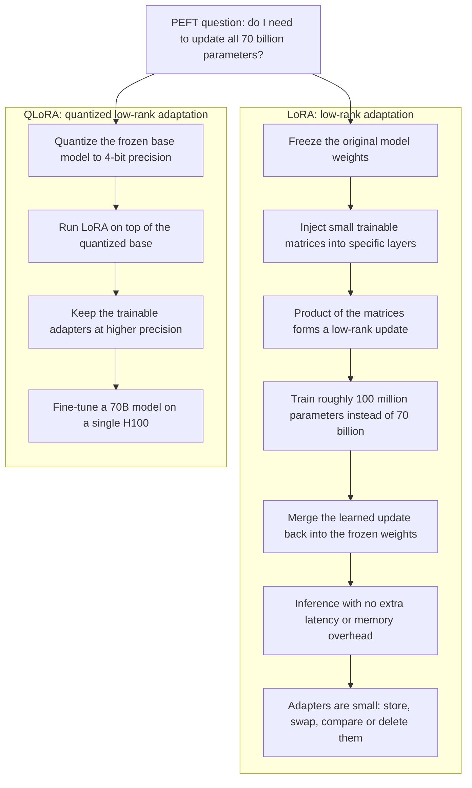
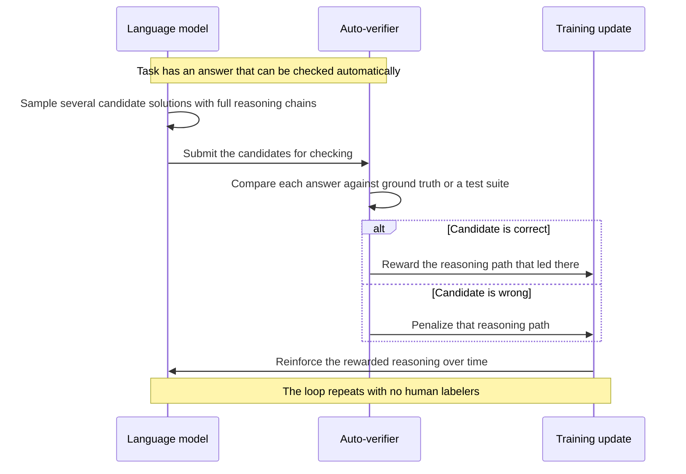
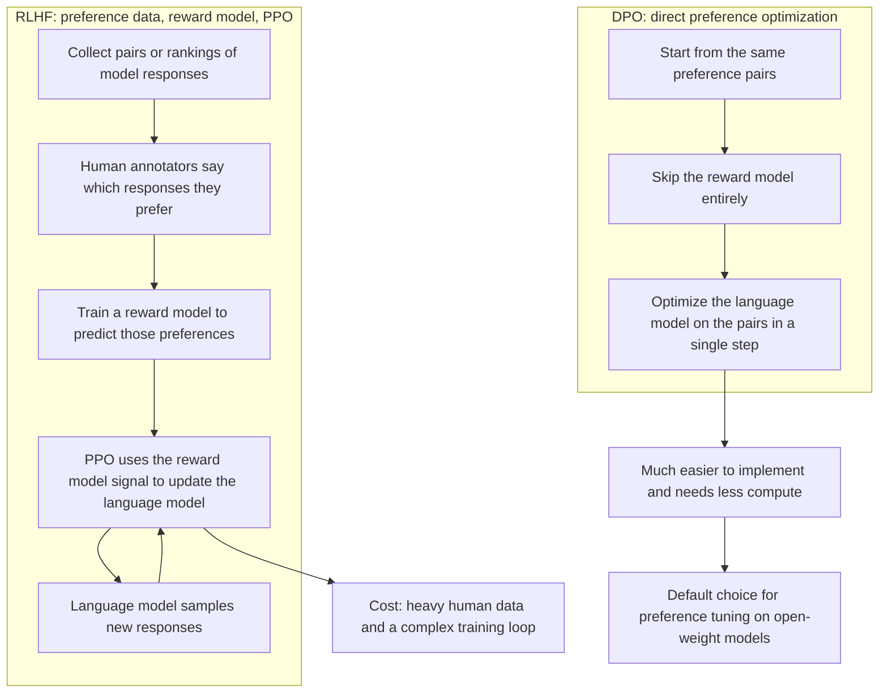
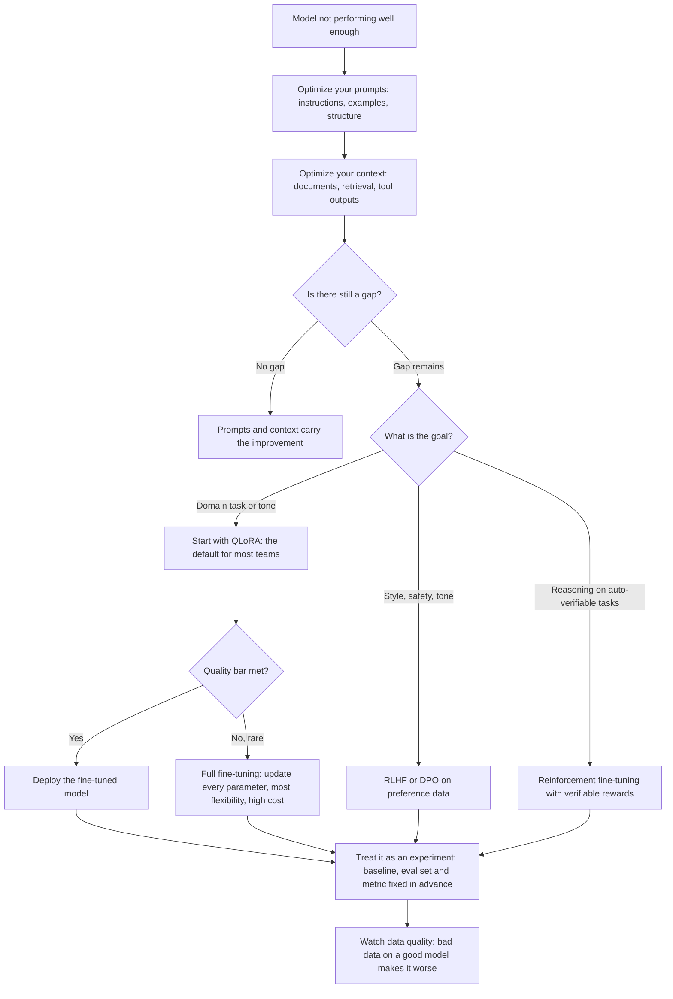

# LLM Fine-Tuning Explained: The Complete Guide

Fine-tuning has become one of the most in-demand skills for AI engineers today — and still one of the least understood. Many practitioners have made a fine-tuning API call once or twice, but the answers get fuzzy very fast once you ask what is actually happening under the hood. This guide covers all of it: where fine-tuning sits relative to pre-training, the difference between fine-tuning open-weight and closed-weight models, the major methodologies (parameter-efficient, full, and reinforcement-based fine-tuning), and when to reach for each one. It is for anyone getting ready to run their first fine-tuning project who wants to understand the methods from a fundamental level rather than just making API calls.

## Diagrams

### 1. Pre-Training vs. Post-Training: Where Fine-Tuning Fits In

Maps to Section 1: the old train-from-scratch workflow versus today's pipeline, where a foundation lab pre-trains a base model that you adapt rather than build from zero.

### 2. Fine-Tuning at Scale: The Parameter Universe and Weight Access

Maps to Section 2: parameter scale explains why fine-tuning is hard, and weight access decides whether you train on your own GPUs or through the provider.

### 3. Parameter-Efficient Fine-Tuning: LoRA and QLoRA

Maps to Section 3: both methods shrink the trainable parameter count; QLoRA adds 4-bit quantization of the frozen base so a 70B model fits on a single H100.

### 4. Reinforcement Fine-Tuning with Verifiable Rewards

Maps to Section 5.1: the automatic reward loop that powers modern reasoning models on tasks with checkable answers.

### 5. RLHF vs. DPO: Two Routes to Preference Alignment

Maps to Sections 5.2 and 5.3: RLHF trains a separate reward model steered by PPO, while DPO skips the reward model and optimizes the preference pairs directly.

### 6. Choosing the Right Fine-Tuning Method

Maps to Section 6, with the full fine-tuning escalation from Section 4 and the experiment baseline and eval habit from Section 7: optimize prompts and context first, then match the method to your goal.

## Table of Contents

1. Pre-Training vs. Post-Training: Where Fine-Tuning Fits
2. Fine-Tuning at Scale: Parameters and Access
3. Parameter-Efficient Fine-Tuning (PEFT)
4. Full Fine-Tuning
5. Reinforcement Fine-Tuning
6. Choosing the Right Method
7. Data Quality and Evaluation: The Real Challenges

## 1. Pre-Training vs. Post-Training: Where Fine-Tuning Fits

The starting point for understanding fine-tuning is the distinction between pre-training and post-training. Pre-training is what foundational labs do inside their own organizations. When OpenAI trains GPT-5.5, when Anthropic trains Claude Opus 4.7, when Meta trains Llama models, or when Google trains its Gemini models, they are running massive pre-training jobs on huge GPU clusters over trillions of tokens of data. That process produces the base model — the thing you actually get out of the box, whether you download it from Hugging Face or call it through an API. You did not train that model; the foundational labs did.

Post-training is everything that happens after that, and fine-tuning is the most common form of post-training. There is a key point to internalize here: this is not a new concept. Fine-tuning is very, very similar to what traditional machine learning practitioners have done for years. In the old workflow, teams trained their own models from scratch on their own data and then fine-tuned those same models on more specific data for more specific tasks. As a company, you owned the entire pipeline.

With large language models, the game has changed slightly, into what is effectively model-as-a-service. The pre-trained model is created by the foundational lab and served to you via an API, and you can take that model and fine-tune it to perform better on your specific use case. The crucial shift is that you are not training from zero anymore. You are adapting a model that is already trained on a great deal of knowledge — and that change has profound implications for how much compute, data, and expertise the whole exercise requires.

## 2. Fine-Tuning at Scale: Parameters and Access

### 2.1 The parameter universe

This is where a lot of people get confused. In traditional machine learning, model parameters might number in the hundreds of thousands, or a few million for bigger models. With large language models, the parameters live in a completely different universe. You are looking at a few billion parameters for small open-source models, 10 to 70 billion for the models most teams actually run in production, hundreds of billions for frontier models, and over a trillion parameters for models like GLM.

That scale is exactly why fine-tuning LLMs is genuinely challenging: updating even a fraction of a one-trillion-parameter model is not something you can casually do on a single GPU. Training memory grows with the number of trainable parameters — the training run must hold not only the weights being updated but also the gradients and optimizer state produced along the way — so at these sizes even a modest amount of training is a serious infrastructure problem. Every method discussed below is, in one way or another, an answer to this problem of scale.

### 2.2 Open-weight models: full control

The second thing to understand is when you can actually fine-tune a model yourself and when you cannot. Open-weight models are the easy case. When inference providers like Hugging Face Inference or Nebius Token Factory give you an API to an open-source — or rather, open-weight — model, what they are really doing is hosting the model weights and distributing them across GPUs. Because the weights are open, you can go in and change those parameters through fine-tuning. Models like Llama, Mistral, Qwen, DeepSeek, GLM, and [one model name unclear in transcript] are all examples of open-weight models that you can download, fine-tune, and deploy yourself.

### 2.3 Closed-weight models: fine-tuning through the provider

Closed-source models are a completely different story. Anthropic's Claude models, OpenAI's GPT models, and Google's Gemini models are all closed-weight: you cannot fine-tune them from your own infrastructure, because you do not have access to their weights. If you want to fine-tune a closed-source model, you have to use the native fine-tuning service of that provider. OpenAI has a fine-tuning API, Google offers one inside Vertex AI, and Anthropic also has its own service. The workflow is: you submit your data, they run the job on their infrastructure, and you get back a fine-tuned version that you access through their API. What you give up is visibility — you never see how the fine-tuning actually happens under the hood. That is simply the trade-off you accept when you work with closed-source models.

## 3. Parameter-Efficient Fine-Tuning (PEFT)

The first big bucket of fine-tuning methods — and the place most people get confused — is parameter-efficient fine-tuning, or PEFT. This is where techniques like LoRA (low-rank adaptation) and QLoRA (quantized low-rank adaptation) live.

The idea behind PEFT is simple, and it is worth stating as a question:

> Do I really need to update every single parameter in a 70-billion-parameter model just to make it better at my task?

The answer is usually no — and all of PEFT is built around that answer.

### 3.1 LoRA (low-rank adaptation)

LoRA stands for low-rank adaptation. It freezes the original model weights and injects small trainable matrices into specific layers of the model. You only train those small matrices; at inference time they combine with the frozen weights to produce the adapted behavior. Instead of training 70 billion parameters, you are essentially training maybe 100 million — a massive reduction in compute, memory, and cost. The base model's original knowledge stays intact and untouched; LoRA just learns a compact adjustment on top of it.

Concretely, for each layer it touches, LoRA learns a small pair of matrices whose product forms a low-rank update — the "low rank" in the name refers to this update living in a much smaller dimensional space than the full weight matrix it adjusts. Because the update is an addition to the frozen weights, it can be merged back into the original weights ahead of time; the fine-tuned model then runs at inference with no extra latency or memory overhead. And because the learned adjustment is small and separate, it is easy to store, swap, compare, or delete — you can experiment with several fine-tunes of the same base model without keeping multiple full copies of it.

### 3.2 QLoRA (quantized low-rank adaptation)

QLoRA takes the idea one step further. It quantizes the frozen base model down to four-bit precision, then runs LoRA on top of that quantized base. Quantization is a compression step: the weights are stored at a much lower numerical precision than the one used during training, which shrinks their memory footprint dramatically at some cost in precision. QLoRA keeps the small trainable adapters in higher precision, so the adaptation itself is learned precisely even though the base it adjusts is compressed. Because the base weights are so small in memory, you can fine-tune a 70-billion-parameter model on a single H100 this way. QLoRA is honestly the default starting point for most teams fine-tuning their own open-source models today. If you want to experiment, you can start with Hugging Face's PEFT library, which makes getting QLoRA up and running drastically faster.

## 4. Full Fine-Tuning

Full fine-tuning is the opposite approach: you update every single parameter in the model. It gives you the most flexibility and usually the best quality, because nothing about the model is held fixed. But it is expensive, slow, and requires a serious amount of GPU infrastructure, precisely because you are back to updating billions or trillions of parameters.

The practical guidance is to reach for full fine-tuning only when PEFT is not giving you the quality bar you need — which is very rare in practice. For most teams, LoRA or QLoRA is more than enough.

## 5. Reinforcement Fine-Tuning

The next category to understand is reinforcement fine-tuning, which has exploded in the last year. There are three flavors worth knowing.

### 5.1 Reinforcement fine-tuning with verifiable rewards

The first flavor is reinforcement fine-tuning with verifiable rewards — the technique behind models like OpenAI's o-series, DeepSeek R1, and most modern reasoning models. The idea is simple: you take a task where the answer can be automatically verified, like a math problem or a coding problem where you can run a test. You let the model generate multiple attempts; the correct ones get rewarded and the wrong ones get penalized, and over time the model learns to reason better. In practice the loop looks like this: the model produces several candidate solutions — often complete chains of reasoning — each candidate is checked against the ground-truth answer or a test suite, the reasoning paths that led to correct answers are reinforced, and the paths that led to wrong ones are pushed down. No human labelers are needed at any point, which is precisely what makes the loop scalable. This is powerful whenever your task has an answer that can be checked automatically.

### 5.2 RLHF (reinforcement learning from human feedback)

The second flavor is RLHF — reinforcement learning from human feedback — the classic technique that powered ChatGPT. The approach starts with preference data collected from humans, trains a reward model on that data, and then uses the reward model to guide the actual language model through algorithms like PPO (proximal policy optimization). The pipeline runs roughly like this: collect pairs or rankings of model responses, have human annotators express which responses they prefer, train a reward model to predict those preferences, and then use the reward model's signal inside PPO to update the language model toward responses that score higher. RLHF is powerful, but it is expensive: you need a lot of high-quality human preference data, and the training loop is complex.

### 5.3 DPO and preference optimization

The third category is preference optimization, and this is where DPO — direct preference optimization — comes in. To see the contrast: PPO is the core RL algorithm used inside RLHF, which trains a separate reward model and uses it to steer the language model. DPO is a simpler alternative that skips the reward model entirely. Instead of training a reward model and then optimizing against it, DPO directly optimizes the language model on the preference pairs in a single step. It is much easier to implement and requires less compute, and it has become the default choice for most teams doing preference tuning on open-source models.

## 6. Choosing the Right Method

So when do you use what? The first piece of advice is to remember that fine-tuning is not necessarily the first lever you should pull. Before you even get started with fine-tuning, start optimizing your prompts, then start optimizing your context. Prompt optimization means improving the instructions, examples, and structure you send with every request, so the model is set up to answer the way you want. Context optimization means improving the material available inside the model's context window — the documents, retrieved knowledge, or tool outputs it can draw on — so it has what it actually needs to respond well. Both steps should give you a decent bump in performance on their own. Just as importantly, they act as a benchmark: once prompts and context are as good as you can make them, any remaining gap is what fine-tuning has to close, and you can measure exactly how much additional improvement the fine-tuning delivered.

When you do fine-tune, the guidance is:

- **Start with QLoRA for domain adaptation** — when you just want the model to be better at your specific task or tone.
- **Use full fine-tuning only if QLoRA is not enough.**
- **Use RLHF or DPO when you care about aligning the model to human preferences** — for example style, safety, or tone.
- **Use reinforcement fine-tuning with verifiable rewards when you are training a reasoning model** on tasks that have automatic verification.

To make this easier in practice, the video pairs this guidance with a decision tree for choosing the right methodology for your use case, and a set of resources are shared in the description below.

## 7. Data Quality and Evaluation: The Real Challenges

Across all of these methods, the biggest challenge is data quality. This deserves to be stated bluntly:

> Fine-tuning with a bad dataset on a good model makes the model bad — not better.

A "bad" dataset does not only mean wrong answers. It also means examples that misrepresent the task you actually care about, inconsistent formats that teach the model contradictory habits, examples that contradict what the model already knows, or simply too few high-quality samples to steer behavior reliably. A model will faithfully absorb whatever patterns its training data contains, so bad patterns become bad behavior. No amount of clever parameter-efficient machinery or reinforcement-learning sophistication can compensate for feeding the model bad examples.

The second biggest challenge is evaluation. You need a proper eval set and a clear metric in place before you start, or you will have no idea whether fine-tuning actually improved anything. A proper eval set is a representative, held-out collection of examples that stand for the real task — separate from anything used in training — and a clear metric is a measure you commit to in advance that matches the outcome you care about. Both challenges point to the same habit: treat fine-tuning like an experiment with a defined baseline and a defined yardstick, not a blind API call.

## Key Takeaways

- Fine-tuning is the most common form of post-training: it adapts an already pre-trained model to a specific use case rather than training from scratch.
- Model scale is the core challenge — small open-source models start at billions of parameters and frontier models exceed a trillion — which is why parameter-efficient methods dominate.
- Open-weight models (Llama, Mistral, Qwen, DeepSeek, GLM, and others) can be fine-tuned on your own infrastructure; closed-weight models (Claude, GPT, Gemini) can only be fine-tuned through their providers' native services.
- PEFT is usually the right starting point: LoRA freezes the base weights and trains small injected matrices, while QLoRA additionally quantizes the base model to 4-bit, letting you fine-tune a 70B model on a single H100.
- Full fine-tuning updates every parameter and offers the most flexibility and best quality, but is expensive and rarely necessary.
- Reinforcement fine-tuning comes in three flavors: verifiable rewards (for reasoning models on auto-verifiable tasks), RLHF (reward model trained on human preferences, steered with PPO), and DPO (skips the reward model and optimizes preference pairs directly).
- Optimize prompts and context before fine-tuning, and treat them as a benchmark; start with QLoRA, escalate to full fine-tuning only if needed, and choose alignment or reasoning methods based on your objective.
- The two biggest failure points are data quality and evaluation — bad data makes a good model worse, and without an eval set and metric you cannot tell whether fine-tuning helped at all.

## Source

- Video: [LLM Fine-Tuning Explained: The Complete Guide](https://www.youtube.com/watch?v=Wx1oiBCmxjY)
- Channel: Aishwarya Srinivasan ([@aishwaryasrinivasan](https://www.youtube.com/@aishwaryasrinivasan))
- Fetched: 2026-09-02

Note: the original captions for this video were transcribed from Hindi (phonetic) and translated into English by this pipeline.
