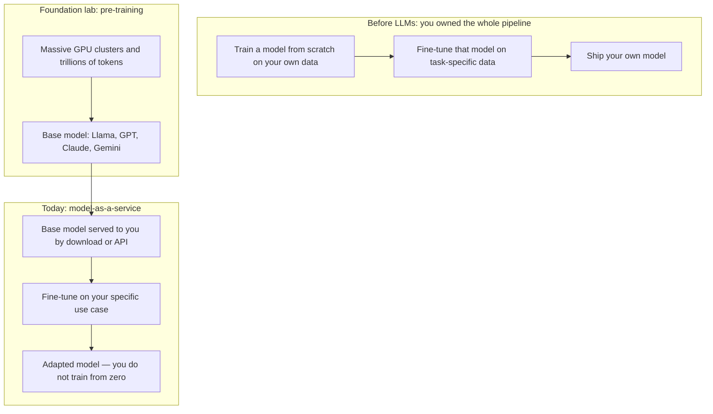
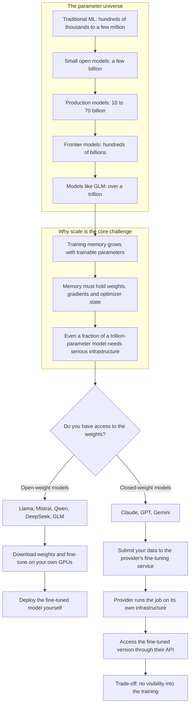
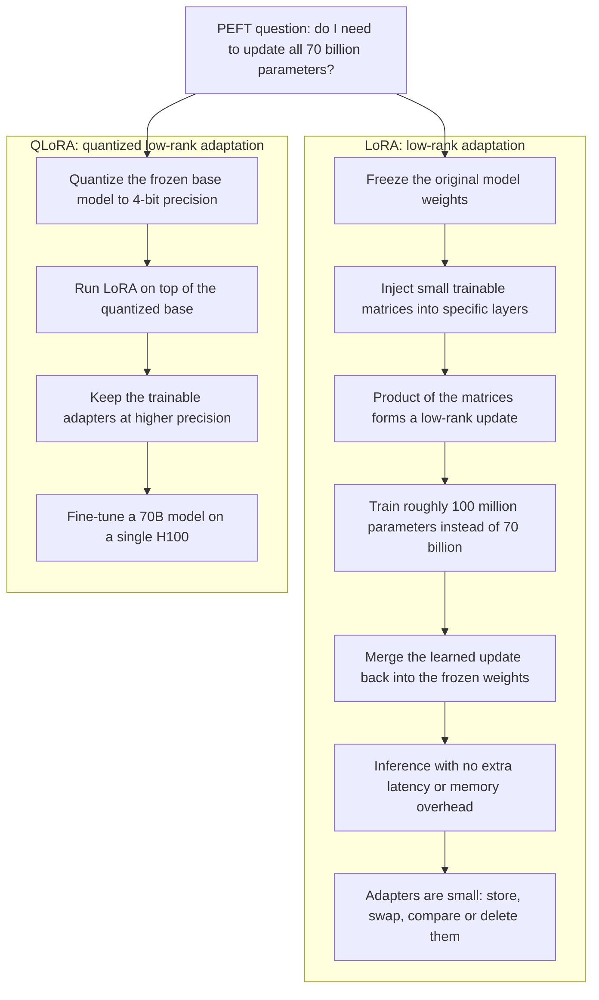
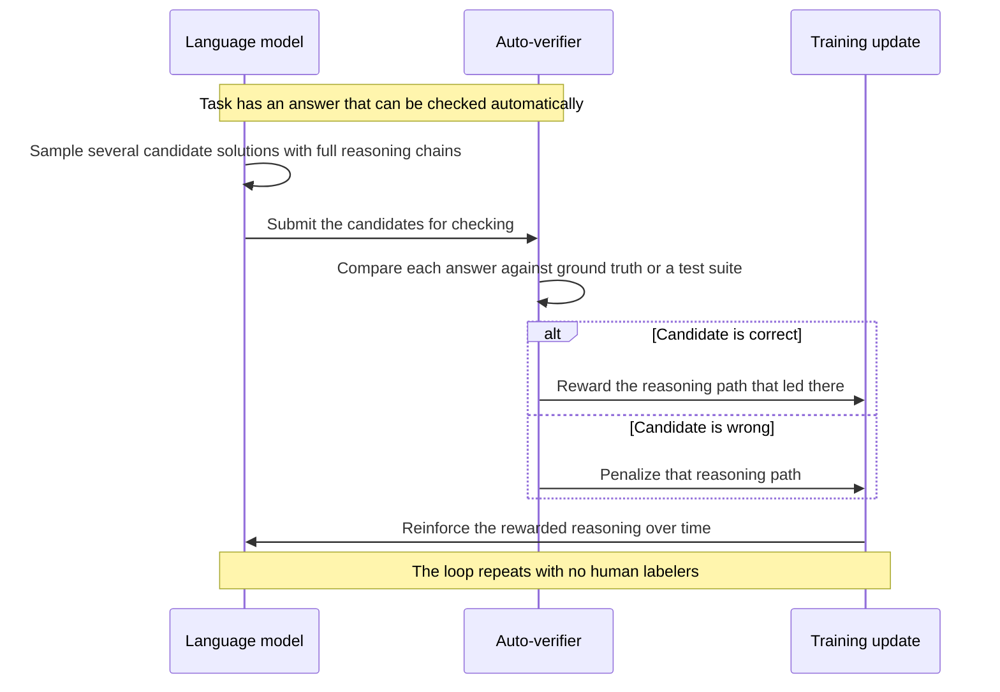
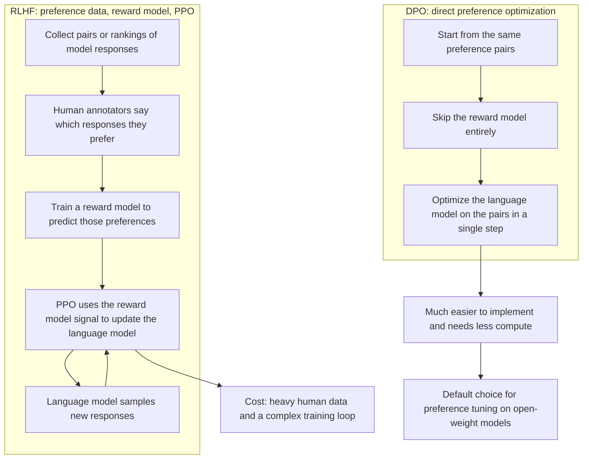
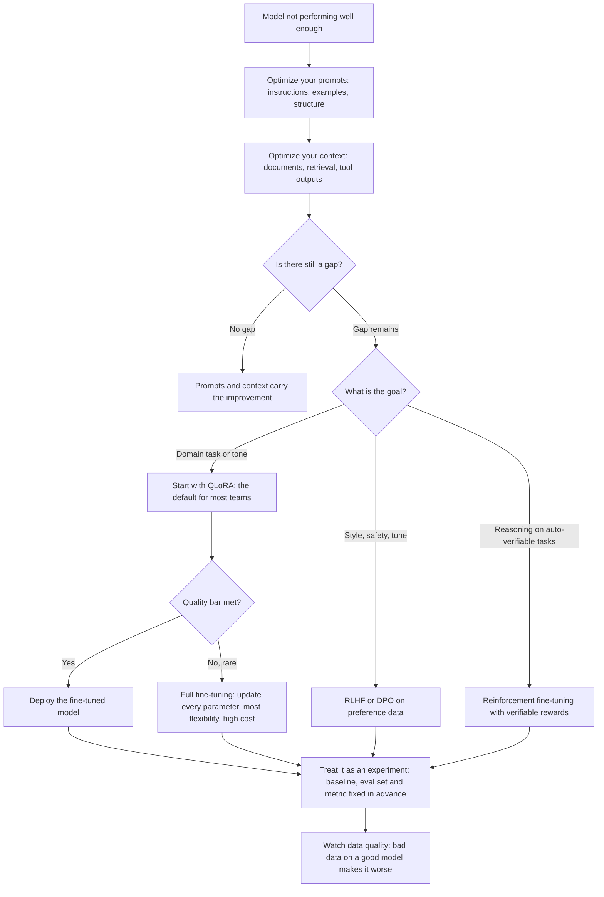

## Diagrams

### 1. Pre-Training vs. Post-Training: Where Fine-Tuning Fits In

Maps to Section 1: the old train-from-scratch workflow versus today's pipeline, where a foundation lab pre-trains a base model that you adapt rather than build from zero.

### 2. Fine-Tuning at Scale: The Parameter Universe and Weight Access

Maps to Section 2: parameter scale explains why fine-tuning is hard, and weight access decides whether you train on your own GPUs or through the provider.

### 3. Parameter-Efficient Fine-Tuning: LoRA and QLoRA

Maps to Section 3: both methods shrink the trainable parameter count; QLoRA adds 4-bit quantization of the frozen base so a 70B model fits on a single H100.

### 4. Reinforcement Fine-Tuning with Verifiable Rewards

Maps to Section 5.1: the automatic reward loop that powers modern reasoning models on tasks with checkable answers.

### 5. RLHF vs. DPO: Two Routes to Preference Alignment

Maps to Sections 5.2 and 5.3: RLHF trains a separate reward model steered by PPO, while DPO skips the reward model and optimizes the preference pairs directly.

### 6. Choosing the Right Fine-Tuning Method

Maps to Section 6, with the full fine-tuning escalation from Section 4 and the experiment baseline and eval habit from Section 7: optimize prompts and context first, then match the method to your goal.

