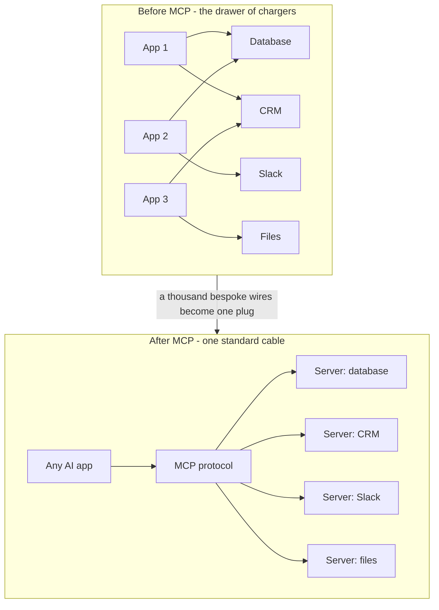
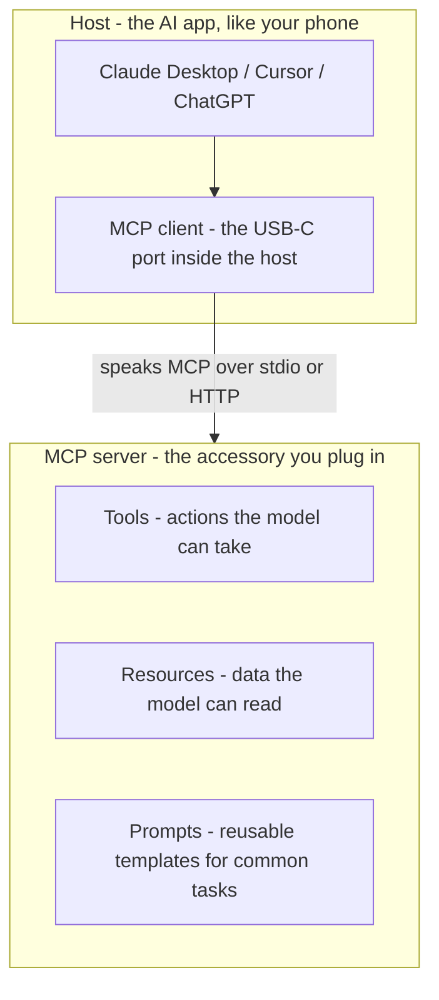
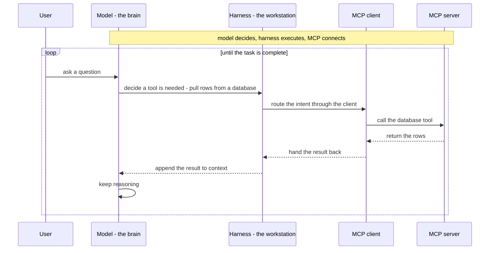
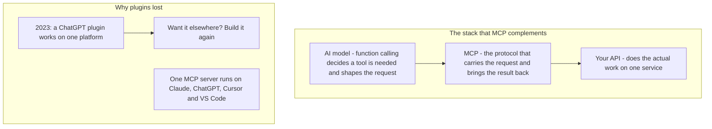
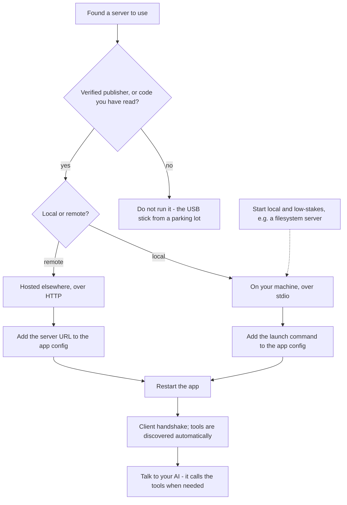
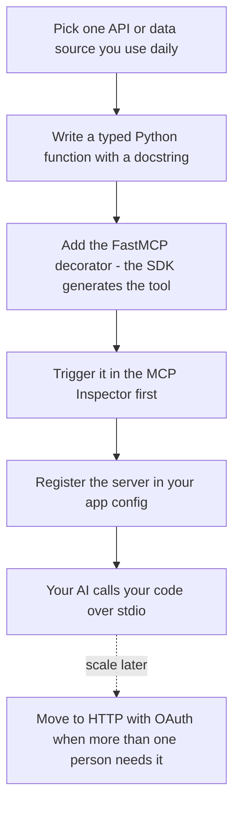

# MCP Complete Explanation

The Model Context Protocol (MCP) has quietly become the standard way AI connects to everything — your files, your databases, your tools — yet most people who use it every single day still cannot explain what it actually is. This article breaks down exactly that: what MCP is, how it works under the hood, where it sits inside an AI agent, and how it compares to function calling, APIs, and plugins. By the end you will also know where to find MCP servers, how to plug one in safely, and how to build your own — and if you are building anything with AI in 2026, this is baseline knowledge now.

## Diagrams

### 1. From Point-to-Point Chaos to One Standard Plug
Illustrates Sections 1–2: the drawer-of-chargers problem and the USB-C fix that MCP introduces.

### 2. Host, Client, Server: The Three Pieces
Illustrates Section 3: the host, the in-host client, and the server map onto the phone, its USB-C port, and the accessory — plus the three things a server exposes.

### 3. Where MCP Sits: The Agent Loop
Illustrates Section 4: the harness loop in which the model decides, the harness executes, and MCP connects.

### 4. MCP Below Function Calling, Above Your APIs
Illustrates Section 5: MCP layers under function calling and over plain APIs, and the plugin era ended because MCP is one open port everywhere.

### 5. Local vs Remote — and the Gate Before You Plug In
Illustrates Sections 7–8: choosing between a local stdio server and a remote HTTP server, behind the verification gate the security section demands.

### 6. The Fifteen-Minute Server: From Function to Live Tool
Illustrates Section 9: FastMCP turns a typed, documented function into a tool, the Inspector validates it, and your client starts calling your code.

## Table of Contents

1. Why MCP Exists: The Drawer of Chargers Problem
2. What MCP Is: The USB-C for AI
3. The Three Pieces: Host, Client, and Server
4. Where MCP Sits Inside an AI Agent
5. MCP vs. Function Calling, APIs, and Plugins
6. Finding MCP Servers
7. Local and Remote Servers: How You Actually Use One
8. The Security Reality No Tutorial Mentions
9. Building Your First MCP Server

## 1. Why MCP Exists: The Drawer of Chargers Problem

MCP only makes sense once you feel the pain that it actually solves. Imagine you are building an AI application whose model needs to talk to your database, your CRM, your file system, and maybe even Slack. Every one of those connections is a custom integration: you write it, you test it, you maintain it. Now just scale that up — ten applications and a hundred tools — and you are looking at potentially a thousand different integrations, each one bespoke and brittle.

This is the drawer of chargers we all had before USB-C: one cable per device, none of them interchangeable. The moment you lived through that drawer, you understood the pattern was broken. The AI ecosystem has hit the same wall — many models, many tools, many data sources, all wired together by hand with point-to-point connectors that only work for the exact pair they were built for. That is the problem MCP exists to solve.

## 2. What MCP Is: The USB-C for AI

MCP is the USB-C for AI. It is an open standard, originally released by Anthropic in November 2024, that gives AI models and the tools and data around them one common language for connecting. You build a connector once, and any MCP-compatible AI application can use it — whether it is Claude, ChatGPT, Cursor, or your own custom agent — with no rewrites and no special casing per platform.

And it is not a one-company thing anymore. In December 2025, Anthropic donated MCP to the Linux Foundation, making it a vendor-neutral, community-governed standard. That is why the download numbers exploded: the industry essentially agreed on the shape of the plug. The protocol went from roughly 100,000 downloads a month to 97 million a month in about eighteen months, and it has become the default way an AI application connects to the outside world. That is the "what" — now for the genuinely interesting part.

## 3. The Three Pieces: Host, Client, and Server

There are exactly three pieces to how MCP works, and once you hold them in your head, every MCP diagram you have ever squinted at suddenly makes sense: the host, the client, and the server. The USB-C analogy maps onto them almost perfectly.

**The host is the AI application itself** — Claude Desktop, Cursor, VS Code, ChatGPT, and so on. Think of the host as your phone.

**The MCP client lives inside the host.** It is the USB-C port on that phone: it speaks the protocol and manages the connection, and you really never need to see it. From your point of view it is invisible plumbing; from the protocol's point of view it is the endpoint doing the talking.

**The MCP server is the accessory you plug in** — a small program that wraps some tools and data sources (your database, your calendar, GitHub, whatever you choose) and exposes them in the standard MCP format. And do not let the word "server" intimidate you. An MCP server can literally be a hundred lines of Python code running on your laptop.

### 3.1 What a Server Gives You: Tools, Resources, and Prompts

A server actually gives the model three kinds of things: tools, resources, and prompts. The clearest way to see the difference is to imagine onboarding a new employee:

- You give the new hire software access so they can take actions — that is **tools**.
- You give them the company wiki so they can read what they need — that is **resources**.
- You give them your standard operating procedures for common workflows — those are **prompts**.

Translated to AI terms: tools are what the model can *do*, resources are what it can *read*, and prompts are reusable templates for doing tasks well. A filesystem server, for example, exposes read and write operations as tools and lets the model open files as resources.

### 3.2 Discovery at Runtime: Why It Feels Like Magic

Here is the genuinely elegant part. When a client connects to a server, it just asks, "What do you have?" The server responds by advertising its tools, resources, and prompts, complete with descriptions and typed inputs. Everything is discovered at runtime — nothing is hardcoded into the client or the model. That single discovery step is what makes MCP feel like magic compared with wiring integrations by hand: add a server, and the application instantly knows what the server offers and how to call it.

## 4. Where MCP Sits Inside an AI Agent

Knowing the parts, the natural next question is where MCP sits inside an actual AI agent — because MCP alone is not an agent. This is the part most explainers completely skip.

When people say "AI agent," what is really running is a harness: a loop around the model. The model does the reasoning; the harness handles everything else. It manages memory, tracks state, decides when to go around the loop again, and — critically — executes actions in the real world.

Think of the agent as a smart new employee. The model is the brain. The harness is the workstation and the workflow. And MCP is the company badge: the standardized access layer that gets the agent into every system it is allowed to touch, without needing a bespoke key for each door.

### 4.1 The Loop: Model Decides, Harness Executes, MCP Connects

Here is the loop in motion. The model decides it needs something external — say, pulling rows from a database. The harness routes that intent through an MCP client to the right server. The server does the actual work, and the result flows back into the model's context so it can keep reasoning. Model decides, harness executes, MCP connects — that is the whole dance.

This is exactly why MCP took off together with agents. An agent is only as useful as the systems it can touch, and MCP made touching systems standardized instead of bespoke. Before MCP, every tool integration meant teaching the agent a new, one-off interface; with MCP, any agent that speaks the protocol can use any server.

## 5. MCP vs. Function Calling, APIs, and Plugins

The most common confusion around MCP is what it replaces. The answer: nothing you already use — it sits underneath the layers you already have and standardizes the connection between them.

### 5.1 Function Calling Is a Model Capability; MCP Is the Transport

Function calling is a *capability of the model*: the model looks at a task, decides a tool is needed, and produces a structured request with the right arguments. MCP is the *protocol* that carries that request to the tool and brings the result back. They are not competitors; they are complementary layers.

A framing that makes this stick: function calling answers questions like "should I make a call, and what should I say?" MCP answers "how does that call actually reach the other end?" Function calling is you deciding to call somebody and dialing the number; MCP is the telephone network that lets any phone reach any other phone. You need both. When you build with MCP you are not replacing function calling — you are giving it somewhere standardized to land.

### 5.2 Plain APIs Don't Go Anywhere

What about plain APIs? Your APIs don't go anywhere. An API is a point-to-point connection to one service; MCP is a standard layer *on top of* your API that lets an AI model discover and call it in a consistent way. The API still does all the work — MCP just gives every model the same way to find it and talk to it. If someone tells you MCP replaces your APIs, they have completely misunderstood the stack.

### 5.3 Why Plugins Lost

The plugins comparison is best explained with a little history. Back in 2023, ChatGPT plugins were the hot thing — and they had exactly the problem you would expect. A plugin was proprietary: you built it for one platform, and if you wanted the same capability anywhere else, you had to build it again. Plugins were the old proprietary charger: one cable per brand.

MCP flips that model. Instead of every AI platform running its own plugin store, there is one open protocol, and every platform implements the same port. Build your server once and it works on Claude, on ChatGPT, on Cursor, on VS Code, and on whatever agent framework you are running. That is why the plugin era quietly ended — and why even the platforms that built plugin stores moved to MCP. To be fair, plugins are not all invalid today; some tools still use them. But MCP has become the more standard way of doing it.

## 6. Finding MCP Servers

Concepts done, comparisons done — now the practical part. There are thousands of MCP servers out there right now, over 10,000 public ones at last count, so discovery is genuinely the easy part. Three places to look:

- **The official MCP registry.** This is the canonical directory, where verified publishers increasingly list their servers.
- **The Model Context Protocol servers repository on GitHub.** It contains the reference servers — including `filesystem`, `fetch`, and `memory` — and is one of the most-starred repositories in the whole space.
- **Community directories like Pulse MCP.** These are great for browsing by category, whether you want a Notion server, a Postgres server, or a GitHub server.

The rule of thumb: before you ever build your own MCP server, search first. The integration you need probably already exists.

## 7. Local and Remote Servers: How You Actually Use One

Before using a server, you need to understand one fork in the road: MCP servers come in two flavors — local and remote.

A **local server** runs on your machine and talks to the client over something called stdio — standard input and output between processes. It is what you want for local files and experimentation. A **remote server** is hosted somewhere else; you connect to it over HTTP and typically authenticate with OAuth, the same way you sign in to any app with your Google account. Remote is how most companies expose their products.

Actually using a server turns out to be anticlimactic. In Claude Desktop, Cursor, or VS Code, all you do is add a small configuration entry: either the command that launches a local server, or the URL of a remote one. Restart the app, and the client handles the handshake and discovers the tools automatically. After that you simply talk to your AI normally, and it uses the tools when it needs them.

The recommended starting point is to go local with something low-stakes, like a filesystem server, and watch how the model calls its tools — build your intuition there before scaling up to many servers.

## 8. The Security Reality No Tutorial Mentions

Before you go connect twenty servers to everything you own, stop. This is the part almost no MCP tutorial talks about, and it deserves to be taken seriously.

The uncomfortable truth: an MCP server is code that gets a direct line into your AI's context — and often into your real accounts and data. Installing a random MCP server is like plugging a USB stick you found in a parking lot into your laptop. Yes, it can be that scary — and there are numbers to back it up. Independent assessments found that only 13% of publicly available MCP servers meet high trust thresholds for documentation, maintenance, and reliability. And early 2026 produced real incidents, not hypothetical ones: dozens of CVEs; tool-poisoning attacks in which malicious instructions were hidden inside tool descriptions; and a hosted platform with a path-traversal flaw that exposed thousands of applications. This actually happened.

### 8.1 The Practitioner's Checklist

- **Prefer official servers from verified publishers — or read the code before you run it.** Server code is usually small enough that you actually can.
- **Least privilege, always.** If a server only needs to read data, give it read-only credentials.
- **Keep a human in the loop for everything sensitive or irreversible** — things like writes, deletes, or sending messages.

### 8.2 Doing This at Team Scale

At team scale the production pattern is simple: put your MCP servers behind a central gateway or an internal registry so you control exactly which servers your agents can reach. Default everything to scoped read-only credentials, and put sensitive operations behind human approval. That setup handles thousands of tool calls a day without ever handing your agent the keys to everything. Security and scale are not opposites — the guardrails are what let you scale.

## 9. Building Your First MCP Server

Once you know what MCP is, how it works, and how to use it safely, it is time for the fun part: building one. Your first working MCP server is genuinely a fifteen-minute project, and Python is the shortest path.

### 9.1 FastMCP: The 15-Minute Path

The official Python SDK includes FastMCP, and the developer experience is beautiful: you write a normal Python function with type hints and a docstring, put a decorator on it, and the SDK turns it into a fully described MCP tool automatically — no protocol plumbing by hand. For TypeScript developers, the official TypeScript SDK is just as solid.

Then you test with the MCP Inspector, a local web interface where you can trigger your tools manually before any model touches them. Once everything looks good, add the server to your Claude Desktop or Cursor configuration file and watch your AI call your code.

### 9.2 The Project to Build This Week

Here is a concrete project worth building: pick one API or data source you use every day — maybe Notion, a weather API, or a read-only view of your own database — and wrap it in one well-tested tool over stdio. Validate it in the Inspector, connect it to your client, and only graduate it to HTTP with OAuth once more than one person needs it. Most people overbuild their first server; don't do that.

If you walk away from this whole topic remembering one thing, let it be this:

> MCP is not the intelligence part — it is the plumbing part.

But right now, the teams winning with AI are exactly the ones doing that plumbing: giving their models a standardized way to actually touch real-world data. A full list of the tools, repositories, and resources mentioned in the video (plus a companion guide) is in the video description; and for a deeper, end-to-end path into agentic AI, the creator and her co-founder Arvind run a six-week live certification taught by the two of them, with partner companies including NVIDIA, OpenAI, LangChain, Pinecone, Fireworks AI, and ElevenLabs.

## Key Takeaways

- MCP (Model Context Protocol) is an open standard for connecting AI models to tools and data — the "USB-C for AI" — created by Anthropic (November 2024) and donated to the Linux Foundation in December 2025, making it a vendor-neutral, community-governed standard.
- Adoption exploded from about 100,000 downloads a month to 97 million a month in roughly eighteen months, and MCP has become the standard way AI applications connect to external systems.
- Three pieces make it work: the host (the AI application), the client (the protocol-speaking port inside the host), and the server (the program that wraps tools, resources, and prompts in the standard format). Servers advertise what they offer, and everything is discovered at runtime — nothing is hardcoded.
- MCP alone is not an agent. An agent is a harness loop around a model: the model decides, the harness executes, and MCP connects it to the real world.
- MCP complements rather than replaces function calling (a model capability) and APIs (point-to-point service connections); it won the standard's race against proprietary, per-platform plugins.
- Over 10,000 public MCP servers exist; find them via the official MCP registry, the Model Context Protocol servers GitHub repository, and community directories like Pulse MCP. Search before you build.
- Servers come in two flavors: local (over stdio) and remote (over HTTP, typically OAuth). Using one means adding a small config entry and restarting — the client handles handshake and discovery.
- Security is the part most tutorials skip: only about 13% of public servers meet high trust thresholds, and real attacks (tool poisoning, path traversal) have occurred. Prefer verified or code-reviewed servers, use least-privilege credentials, and keep humans in the loop for sensitive actions; at team scale, route servers through a central gateway or internal registry.
- Building a first server is a 15-minute project with FastMCP: a typed, documented Python function plus a decorator becomes a full MCP tool, testable in the MCP Inspector before any model touches it.

## Source

- Video: [MCP Complete Explanation](https://www.youtube.com/watch?v=_fzpnqt39jQ)
- Channel: [Aishwarya Srinivasan](https://www.youtube.com/@aishwaryasrinivasan)
- Fetched: 2026-09-02T12:54:27+00:00
- Note: the video's captions are auto-transcribed from audio in Hindi (`source_lang: hi`); this article was translated from those captions by this pipeline, so minor transcription errors may remain.
