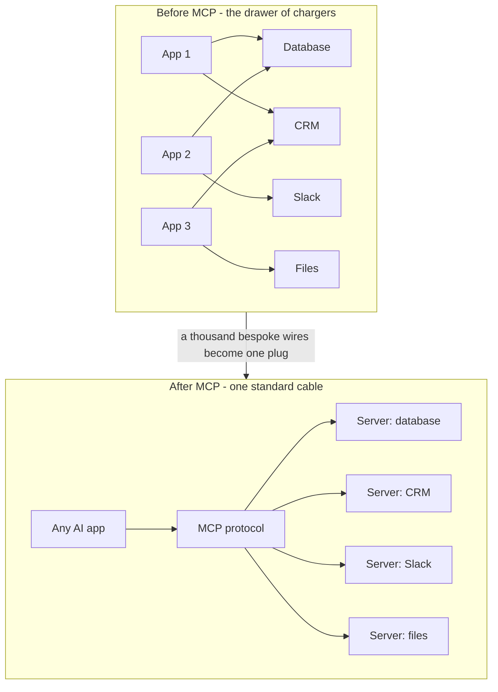
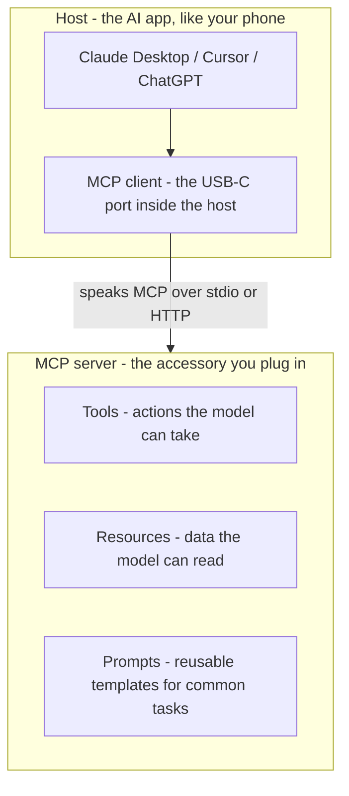
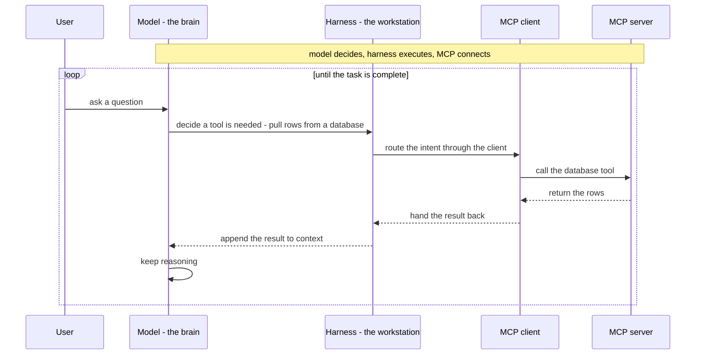
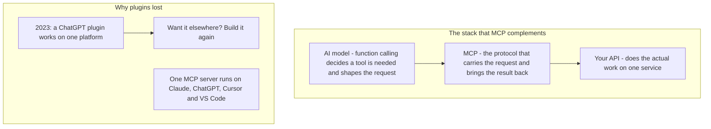
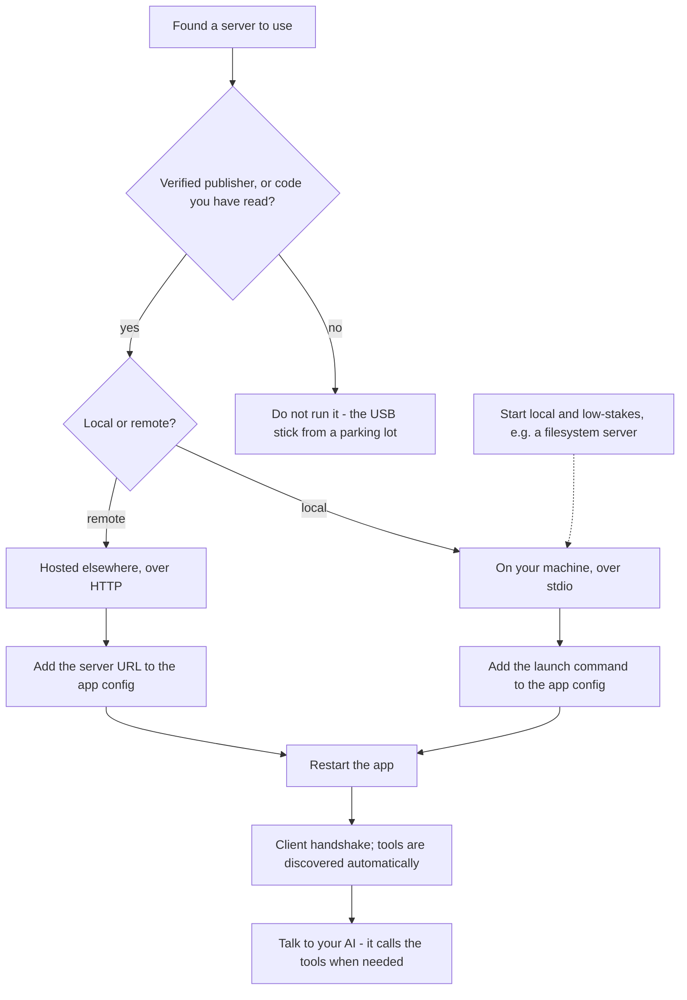
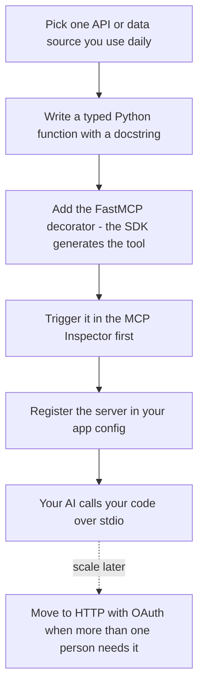

## Diagrams

### 1. From Point-to-Point Chaos to One Standard Plug
Illustrates Sections 1–2: the drawer-of-chargers problem and the USB-C fix that MCP introduces.

### 2. Host, Client, Server: The Three Pieces
Illustrates Section 3: the host, the in-host client, and the server map onto the phone, its USB-C port, and the accessory — plus the three things a server exposes.

### 3. Where MCP Sits: The Agent Loop
Illustrates Section 4: the harness loop in which the model decides, the harness executes, and MCP connects.

### 4. MCP Below Function Calling, Above Your APIs
Illustrates Section 5: MCP layers under function calling and over plain APIs, and the plugin era ended because MCP is one open port everywhere.

### 5. Local vs Remote — and the Gate Before You Plug In
Illustrates Sections 7–8: choosing between a local stdio server and a remote HTTP server, behind the verification gate the security section demands.

### 6. The Fifteen-Minute Server: From Function to Live Tool
Illustrates Section 9: FastMCP turns a typed, documented function into a tool, the Inspector validates it, and your client starts calling your code.

