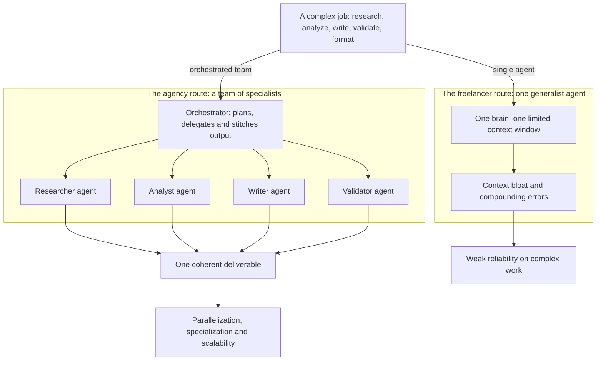
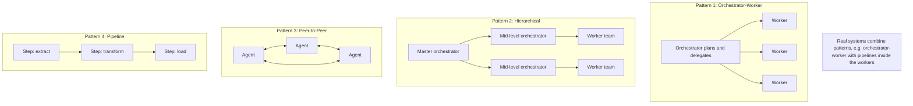
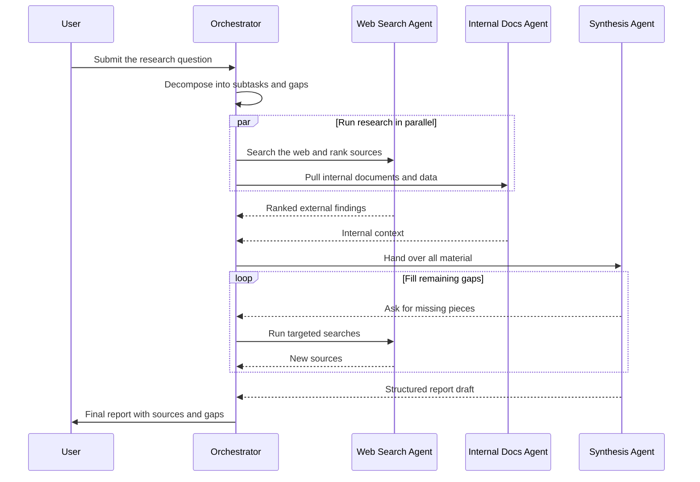
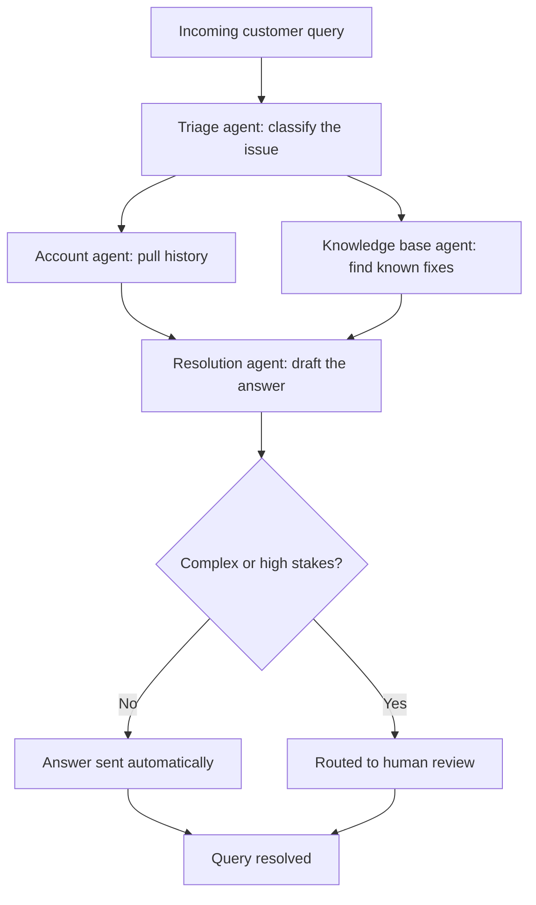
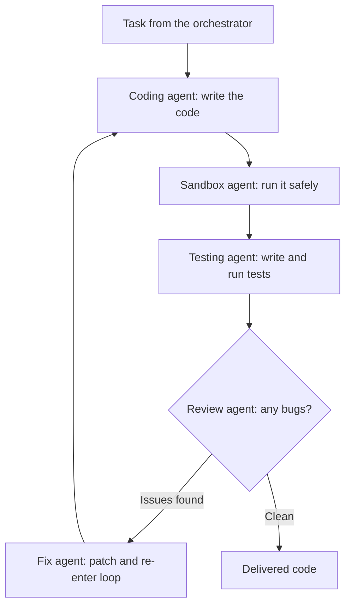
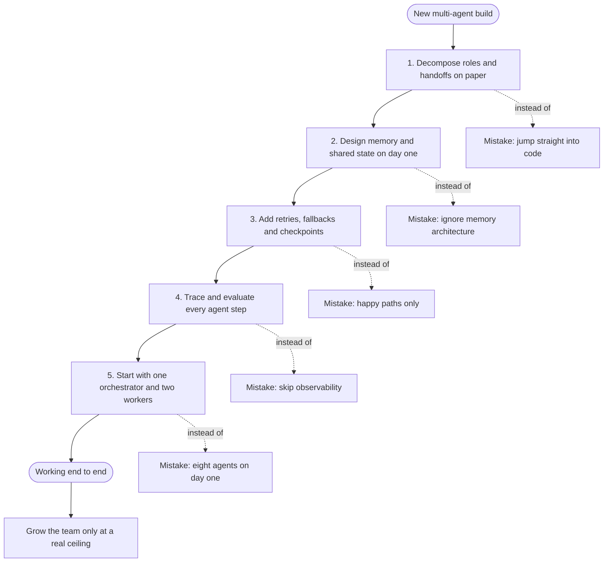

# Multi-Agent AI Systems Explained: The Complete Guide

By now, almost everyone has heard the term "AI agent." But most content stops at the single agent — one model that reasons, uses a few tools, and completes a task end to end — while the teams actually shipping serious AI systems in production have moved on to multi-agent systems: whole teams of specialized agents working together like a well-run startup. In this guide, Aishwarya Srinivasan, an AI professional working in Silicon Valley, breaks down what multi-agent AI systems actually are, why they beat a single agent at complex work, the four design patterns powering nearly every production-level system, the five horizontal use cases where companies are quietly automating work that used to take an entire department, and the mistakes teams make over and over when they start building. It is for AI engineers, technical leaders, and builders who want to go from agent demos to production-grade systems — by the end, terms like orchestrator, sub-agents, hierarchical patterns, and peer-to-peer networks should feel straightforward instead of intimidating.

## Diagrams

### 1. From One Generalist to a Coordinated Team

Illustrates Section 1 (Why Multi-Agent AI Systems?) — the shift from an overloaded single generalist to an orchestrator-led team of specialists.

### 2. The Four Design Patterns at a Glance

Illustrates Section 2 (The Four Design Patterns) — the four production topologies, with the reminder that real systems combine them.

### 3. Autonomous Research: A Question Becomes a Report

Illustrates Section 3.1 (Autonomous Research and Analysis) — parallel specialists turn a question into a structured report in minutes.

### 4. Customer Support: Triage to Human Review

Illustrates Section 3.2 (Customer Support Automation) — triage through resolution, escalating to a human only when the case is complex enough.

### 5. Software Development and QA: The Self-Correcting Loop

Illustrates Section 3.3 (Software Development and QA) — agents that write, run, test and review code in a self-correcting loop.

### 6. Five Mistakes, Five Guardrails: The Build Path

Illustrates Section 4 (Five Mistakes to Avoid When Building Multi-Agent Systems) — each common mistake paired with the guardrail that prevents it, ending at Section 5's rule: start small and ship.

## Table of Contents

1. Why Multi-Agent AI Systems?
2. The Four Design Patterns
3. Where Multi-Agent Systems Are Used in Production
4. Five Mistakes to Avoid When Building Multi-Agent Systems
5. The One Rule to Remember

## 1. Why Multi-Agent AI Systems?

### 1.1 What a Single AI Agent Really Is

At its simplest level, an AI agent is just a large language model acting as the brain — with access to tools, memory, and the ability to make decisions and take actions. Instead of only chatting with you, it can go and do things: call APIs, write code, move data around, deploy code for you, send an email, pull in some data, write a document, and place it in your Google Drive. A clean way to think about it is that an agent is an LLM given arms, legs, and a toolkit.

This is where most people stop. They learn how to build a single agent that can reason, maybe use a few tools, and complete a task end to end. But here is the reality of production: most real-world AI systems do not rely on just one agent. They rely on multiple agents working together. Teams shipping AI in the real world have moved from one super-smart agent doing everything to entire teams of AI agents where each agent owns one specific job and all of them coordinate to deliver something a single agent could never pull off. This one shift in thinking — from a single generalist to a coordinated team — is the entire difference between what people build in demos and what they ship in production.

### 1.2 Where the Single Agent Hits Its Ceiling

Picture how a single AI agent works today: you give it a task, it reasons through it, maybe calls a tool or two, and returns an answer. That is like having one really smart generalist on your team. They can write, code, analyze, do a bit of everything — but they are still one person: one brain, one focus, and one limited context window.

The limits show up fast on real jobs. Imagine you are building an automated market research pipeline. You need to pull data from the web, analyze it, write a report, validate the numbers, and format everything into a presentation. If you give that whole job to a single agent, you are basically asking one human to be a researcher, an analyst, a writer, a fact-checker, and a designer all at the same time. The context window gets bloated, the task becomes very complex, and errors start compounding on each other in ways that are very hard to untangle. The result: the reliability of the system is not really good.

### 1.3 The Multi-Agent Alternative: A Team of Specialists

This is exactly where multi-agent AI systems come in. Instead of one agent doing everything, you have a team of specialized agents, each with a clear role, working together. One agent goes and searches the web. Another analyzes the data. A third drafts the report. A fourth validates the numbers. They pass work to each other, they can run things in parallel, and the whole operation is coordinated by what is called an orchestrator agent.

Think of the orchestrator as the project manager. It breaks down the goal, assigns the tasks, and stitches the final output together. The workers do the actual work; the orchestrator makes sure the right work happens in the right order and comes back together into one coherent deliverable.

### 1.4 The Analogy: A Brilliant Freelancer vs. a Well-Run Agency

The analogy to hold onto throughout the video: a single agent is like a brilliant freelancer, and a multi-agent system is like a well-run agency. Both can do good work, but for any complex, long-horizon task, the agency setup wins every single time. In an agency, the writer does not have to also be the project manager and the accountant. Each person owns one thing and gets really, really good at it.

### 1.5 Three Benefits to Lock In

Beyond the analogy, multi-agent systems deliver three concrete benefits.

- **Parallelization** — multiple tasks can happen at the same time instead of one after another.
- **Specialization** — each agent becomes really good at the narrow thing it was assigned to do, instead of being mediocre across everything.
- **Scalability** — you can add more agents as complexity grows without rebuilding the whole system from scratch.

## 2. The Four Design Patterns

Once you understand the *why*, the next question is the *how*: how do you actually structure these agents to work together? There is not just one way to do it — there are four (and probably more), and almost every production multi-agentic AI system you have ever heard of uses one of them or some combination of them.

First, a definition: a design pattern is just a reusable blueprint for solving a common problem. Think of it as a recipe — you do not reinvent how to make pasta every time you cook it; you follow a proven structure and adapt it to your specific ingredients. In multi-agent AI, four patterns have emerged as the dominant ones in production.

### 2.1 The Orchestrator–Worker Pattern

This is by far the most common pattern, and probably the first one you will ever build. You have one orchestrator agent at the top that plans and delegates. Below it are the worker agents, each with a specific job. The orchestrator does not actually do the work — it only coordinates. Picture a conductor leading an orchestra: they are not playing the violin or the cello; they are making sure every musician comes in at exactly the right moment with exactly the right note. That is the orchestrator, and the musicians are the workers.

### 2.2 The Hierarchical Multi-Agent Pattern

Think of the hierarchical pattern as orchestrator–worker but with multiple layers, like a real company org chart. You might have a top-level orchestrator at the C-suite, then several mid-level orchestrators acting like department heads, each managing its own team of workers. This is what you see in very large enterprise workflows.

For example, imagine building an AI system to run an entire e-commerce business. You would have an orchestrator for inventory, one for customer service, one for logistics — and all of them roll up to a master orchestrator coordinating across the whole thing. The bigger the company, the bigger the org chart, the bigger the workflows, and the bigger the pattern gets.

### 2.3 The Peer-to-Peer Pattern (Network of Agents)

In the peer-to-peer pattern, sometimes called a network of agents, there is no central boss. Agents talk directly to each other and collectively figure out the output. It is like a group of expert consultants in a room hashing out a strategy together: no one is officially in charge, and the answer emerges from the conversation they are having.

This pattern is less common in production because it is harder to debug and control the behavior. But it is incredibly powerful in scenarios where distributed decision-making is the actual point — multi-agent simulations, market modeling, competitive game environments, and agentic research. Those are the places where you *want* different perspectives clashing with each other, and where the best answer is the one the group converges on rather than the one a single planner dictates.

### 2.4 The Pipeline (Sequential) Pattern

The pipeline, or sequential, pattern is the most straightforward of the four. Agents work in a chain: the output of one agent becomes the input of the next one, and so on. It is literally an assembly line.

Its big advantage is predictability. You always know exactly what each agent does and in what order it does it, which makes the system easy to reason about, test, and operate. The classic use cases are document processing, content workflows, and data transformation — anywhere the steps do not really change much from one run to the next.

### 2.5 The Part Most People Skip: Combine the Patterns

Here is the part most people skip when they are learning about this: you do not have to pick just one pattern. The most powerful production systems combine them. You might have an orchestrator–worker setup at the top level, with some of the worker agents internally running pipelines. That is totally valid — and often it is the right call. Pattern choice is a design tool, not a religion; real systems mix them freely.

## 3. Where Multi-Agent Systems Are Used in Production

All of these patterns are fun to learn, but the use cases are where the money is being made right now. There are five spaces where teams are quietly automating work that used to take an entire department. All five are horizontal use cases: they apply across industries, whether healthcare, finance, retail, or logistics.

### 3.1 Autonomous Research and Analysis

You give the system a question and it spins up a bunch of agents to search the web, pull from internal documents, synthesize the findings, identify the gaps, and produce a structured report. Law firms do case research this way, investment banks do market research, and pharma companies do literature reviews — all with multi-agent AI systems. The result is a step-change in speed: what used to take a human analyst three full days can now happen in three minutes.

### 3.2 Customer Support Automation

Customer support automation with agents is way beyond a single chatbot. Here is how it might work in practice: one agent triages the incoming query; another pulls the customer's account and full purchase history; a third checks the internal knowledge base; and a fourth drafts a resolution and routes it to a human review only when it is complex enough to need one. For a sense of the scale this reaches in production, customer case studies are worth reading — for example, Klarna publicly reported that its AI assistant is doing the work equivalent of 700 full-time agents.

### 3.3 Software Development and QA

This space is absolutely exploding. You have agents writing code, other agents running it in a sandbox, agents writing and executing tests, and agents reviewing the output for quality. Tools like Claude Code, Devin, and Cursor agents are all built on exactly this architecture. The cool part is that these systems do not just write code once — they iterate over it, catch their own bugs, and self-correct.

### 3.4 Data Pipeline Automation

Instead of manually building and maintaining ETL pipelines, imagine agents that understand a business question, write the data queries, pull from the right resources, transform the data, validate it for accuracy, and produce a dashboard-ready output. This is especially powerful in industries like retail and supply chain, where the data lives in 15 different systems that do not talk to each other — exactly the messy, multi-source reality where an agent team shines.

### 3.5 Content Production at Scale

In content production, one agent researches the topic, another drafts the content, a third checks for accuracy and brand voice, and a fourth formats the result for different distribution channels. Marketing teams use this to take one piece of long-form content and turn it into dozens of distribution-ready assets in minutes. Think about it: a single blog post can become a LinkedIn carousel, a Twitter thread, a newsletter section, and a podcast script — all from one source.

Look closely and the pattern beneath all five use cases is the same. The task that used to require multiple humans working in a sequence is now handled by multiple agents working in parallel — with humans staying in the loop for review and oversight wherever it matters.

## 4. Five Mistakes to Avoid When Building Multi-Agent Systems

If this all sounds amazing and you want to build one of these systems, great — but there are five things teams consistently underestimate when they start. The mistakes are very predictable and very avoidable, and knowing them up front can save you from weeks of rework.

### 4.1 Jumping Into Code Before Decomposing the Task

This has been a major time killer. Teams open up Cursor and just start writing agent code before they have mapped out what each agent is responsible for and where the handoff happens. The rule is simple: design first, then build. Spend time on paper before opening the editor. What does agent A produce for agent B? What happens when agent B fails? These are the questions to start with. Design the entire system, and only then jump into building it.

### 4.2 Ignoring Memory Architecture

In a single-agent system, memory is quite simple. In a multi-agent system you have to actively design what is private to one agent, what is shared across all agents, and how state passes between them. Production systems use a combination of short-term in-context memory, long-term vector storage with tools like Pinecone, and shared external state sources like Redis and Postgres. Design this on day one — not on day 30, when everything is on fire and retrofitting state management into a working system is painful.

### 4.3 Building Only for Happy Paths

Multi-agent systems fail in really interesting ways. One agent quietly produces a bad output that cascades through every single thing downstream. An API times out mid-pipeline. A model returns a malformed JSON response. You need retry logic, you need fallback behaviors, and you need human-in-the-loop checkpoints for high-stakes decisions. Build for failure from day one — always.

### 4.4 Skipping Observability

If you cannot trace what each agent did, what it was given, and what it produced, you cannot debug the system when something breaks — and things *will* break. The tooling is catching up: platforms like LangSmith are building serious tracing and evaluation tooling specific to agentic systems, and you should use any of them. Your future self, debugging a production issue at 2 AM, will thank you.

### 4.5 Starting Too Complex

This is the mistake seen most often. Teams design elaborate eight-agent systems for problems that two agents could solve perfectly well. More agents mean more coordination overhead, more failure points, and more ways things can go wrong. Instead, start with one orchestrator and one or two worker agents, and see them working end to end. Add complexity only when you genuinely hit a ceiling — not because an elaborate architecture sounds cool on a whiteboard.

## 5. The One Rule to Remember

If you walk away from this guide remembering one thing, let it be this:

> The simplest multi-agent system that solves the problem will always beat the most elegant one that does not ship.

So when you are building, always think about scalability and reliability on day one. Start small, make the end-to-end flow actually work, and grow the team of agents only when the problem genuinely demands it.

## Key Takeaways

- A single AI agent is an LLM given tools, memory, and the ability to act — but it is still one brain with one limited context window, so complex multi-stage work (research, analysis, writing, validation, formatting) overloads it with context bloat and compounding errors.
- A multi-agent system replaces the single generalist with a team of specialized agents coordinated by an orchestrator — the project manager that breaks down the goal, assigns tasks, and stitches the final output together.
- Think freelancer versus agency: for any complex, long-horizon task, the agency setup wins, because each specialist gets genuinely good at one job.
- The three benefits to design for are parallelization, specialization, and scalability — adding agents as complexity grows without rebuilding from scratch.
- Four design patterns dominate production: orchestrator–worker (most common), hierarchical multi-agent (org-chart layers of orchestrators), peer-to-peer networks (no central boss, emergent answers — best for simulations, market modeling, games, and agentic research), and pipeline/sequential (an assembly line prized for predictability). Real systems combine them.
- The five horizontal use cases are autonomous research and analysis, customer support automation, software development and QA, data pipeline automation, and content production at scale — each replacing a sequence of humans with a team of parallel agents, with humans kept in the loop for review.
- Avoid the five predictable mistakes: coding before decomposing the task, ignoring memory architecture, building only for happy paths, skipping observability, and starting too complex.
- The simplest system that solves the problem beats the most elegant one that does not ship — design for scalability and reliability on day one.

## Source

- Video: [Multi-Agent AI Systems Explained: The Complete Guide](https://www.youtube.com/watch?v=-zBbij9rrEI)
- Channel: [Aishwarya Srinivasan](https://www.youtube.com/@aishwaryasrinivasan)
- Metadata fetched at: 2026-09-02T12:54:41.999393+00:00
- The captions this article was written from were auto-transcribed from Hindi and translated to English by this pipeline; the Hindi track was phonetic (Hinglish) transcription of English speech, reconstructed as faithfully as possible.
