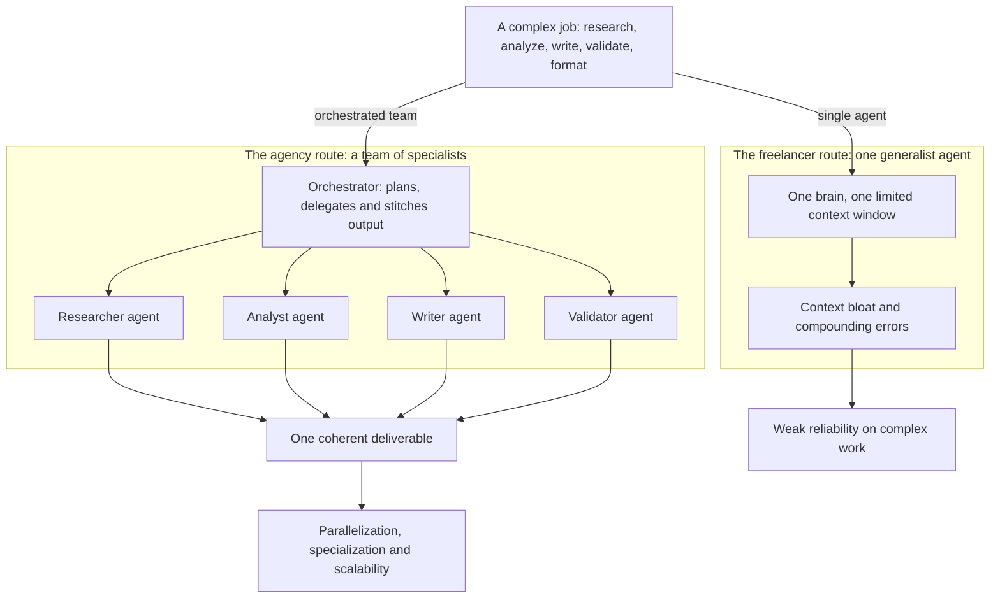
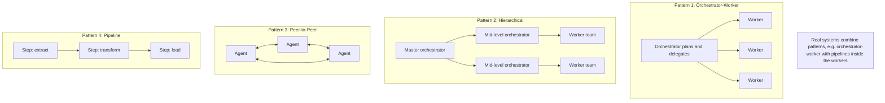
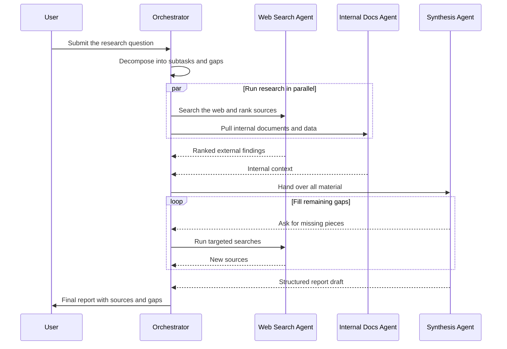
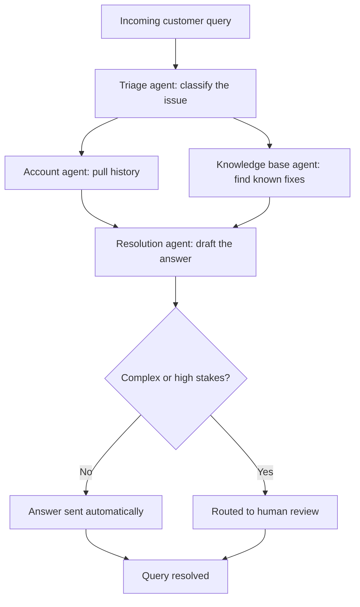
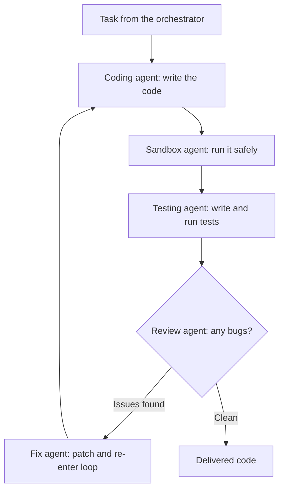
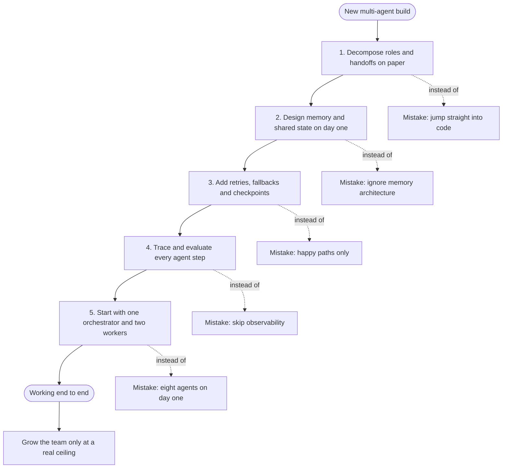

## Diagrams

### 1. From One Generalist to a Coordinated Team

Illustrates Section 1 (Why Multi-Agent AI Systems?) — the shift from an overloaded single generalist to an orchestrator-led team of specialists.

### 2. The Four Design Patterns at a Glance

Illustrates Section 2 (The Four Design Patterns) — the four production topologies, with the reminder that real systems combine them.

### 3. Autonomous Research: A Question Becomes a Report

Illustrates Section 3.1 (Autonomous Research and Analysis) — parallel specialists turn a question into a structured report in minutes.

### 4. Customer Support: Triage to Human Review

Illustrates Section 3.2 (Customer Support Automation) — triage through resolution, escalating to a human only when the case is complex enough.

### 5. Software Development and QA: The Self-Correcting Loop

Illustrates Section 3.3 (Software Development and QA) — agents that write, run, test and review code in a self-correcting loop.

### 6. Five Mistakes, Five Guardrails: The Build Path

Illustrates Section 4 (Five Mistakes to Avoid When Building Multi-Agent Systems) — each common mistake paired with the guardrail that prevents it, ending at Section 5's rule: start small and ship.

