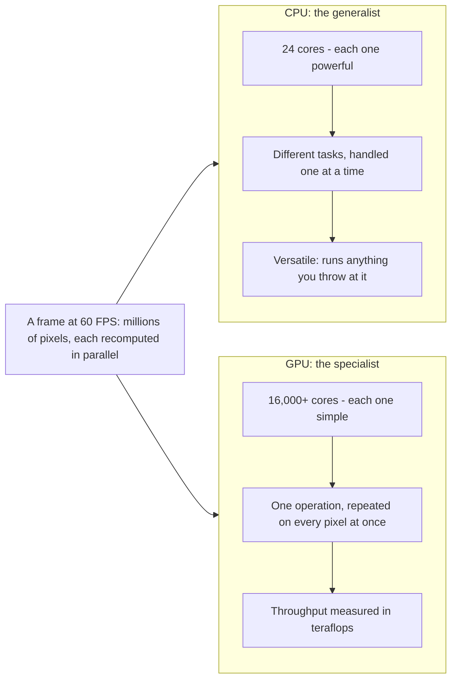
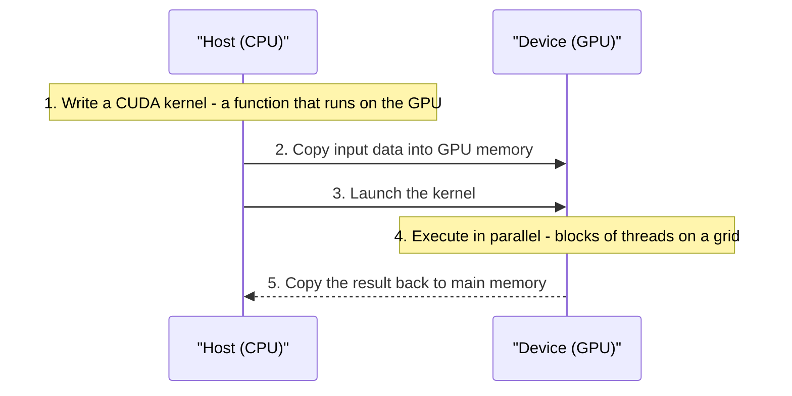
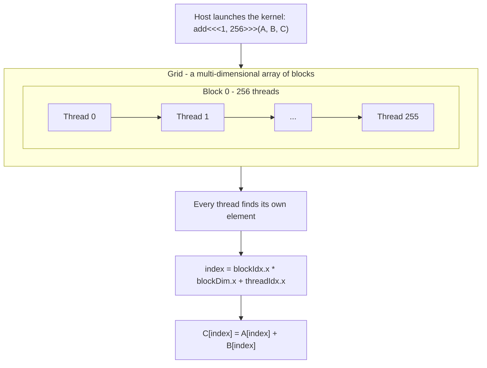

# Nvidia CUDA in 100 Seconds

CUDA is NVIDIA's parallel computing platform, and it is the technology that lets developers put the GPU to work on far more than video games. This article covers everything the video teaches: what CUDA is and where it came from, why GPU hardware is built for massive parallelism, how CUDA's programming model works, and a step-by-step walkthrough of a first CUDA program in C++. It is written for developers and data scientists who want a clear mental model of the platform that powers modern AI training.

## Diagrams

### 1. Why GPUs Win at Parallel Work

Illustrates Section 2, "Why GPUs Are Built for Parallel Work": when the same operation must run on millions of pixels at once, thousands of simple GPU cores beat a handful of powerful CPU cores.



### 2. Host and Device: The Five-Step CUDA Flow

Illustrates Section 3, "How CUDA Works: Host, Device, and Execution": every CUDA program is a five-step handshake - kernel first, data over, launch, execute, then results back.



### 3. Grid, Blocks, and Threads: Inside a Kernel Launch

Illustrates Section 4, "Building Your First CUDA Application": how the launch `add<<<1, 256>>>` maps 256 threads onto the grid and why each thread computes its own index.



## Table of Contents

1. What Is CUDA?
2. Why GPUs Are Built for Parallel Work
3. How CUDA Works: Host, Device, and Execution
4. Building Your First CUDA Application
5. Where to Go Next

## 1. What Is CUDA?

CUDA — Compute Unified Device Architecture — is a parallel computing platform that allows you to use your GPU for more than just playing video games. Developed by NVIDIA in 2007 and based on the prior work of Ian Buck and John Nickolls, CUDA has since revolutionized the field by letting people compute over large blocks of data in parallel. In doing so, it unlocked the true potential of the deep neural networks behind artificial intelligence: a CUDA kernel lets a developer tap directly into the GPU's raw power, and data scientists around the world are using it at this very moment to train the most powerful machine learning models.

## 2. Why GPUs Are Built for Parallel Work

To understand CUDA, you first have to understand the hardware it targets. The Graphics Processing Unit (GPU) was historically used for exactly what its name implies: computing graphics. When you play a game at 1080p and 60 FPS, you have over two million pixels on the screen, each of which may need to be recalculated after every frame. That demands hardware capable of doing a lot of matrix multiplication and vector transformations in parallel — and "a lot" is an understatement.

Modern GPUs are measured in teraflops: how many trillions of floating-point operations the chip can handle per second. The gap between CPU and GPU is enormous. A modern CPU such as the Intel Core i9 has 24 cores, while a modern GPU like the RTX 4090 has over 16,000 cores. A CPU is designed to be versatile, handling whatever task you throw at it, whereas a GPU is designed to do one thing really well: go fast in parallel. CUDA exists to give developers a way to harness all of those cores.

## 3. How CUDA Works: Host, Device, and Execution

CUDA splits the work between two processors: the host (your CPU) and the device (the GPU). The flow of a typical CUDA program looks like this:

1. You write a function called a CUDA **kernel** that runs on the GPU.
2. You copy data from your main RAM over to the GPU's memory.
3. The CPU tells the GPU to execute the kernel in parallel.
4. The GPU executes the kernel in units called **blocks**, which themselves organize threads into a multi-dimensional **grid**.
5. The final result is copied back from the GPU to main memory.

The multi-dimensional grid is a key idea: it lets the arrangement of threads mirror the shape of the data being processed, which matters when that data is itself multi-dimensional.

## 4. Building Your First CUDA Application

To build a CUDA application you first need an NVIDIA GPU, then you install the CUDA toolkit, which includes device drivers, a runtime, compilers, and developer tools. The actual code is most often written in C++ — as in this demo, developed in Visual Studio.

### 4.1 The Kernel: A Function That Runs on the GPU

First, the `__global__` specifier defines a function — a CUDA kernel — that runs on the actual GPU. The example kernel adds two vectors together: it takes pointer arguments `A` and `B`, the two vectors to add, and a pointer `C` for the result. Because the kernel may execute billions of times in parallel across threads, each invocation must first calculate the global index of the thread it is running on, so that every thread writes to its own distinct element:

```cpp
__global__ void add(int *A, int *B, int *C) {
  int index = blockIdx.x * blockDim.x + threadIdx.x;
  C[index] = A[index] + B[index];
}
```

Here `blockIdx`, `blockDim`, and `threadIdx` describe where the current thread sits inside the block-and-grid structure: which block it belongs to, how large the blocks are, and its position within its block.

### 4.2 Managed Memory: Sharing Data Between CPU and GPU

Next, the demo uses **managed memory** (`cudaMallocManaged`), which tells CUDA that the allocated data can be accessed from both the host CPU and the device GPU, without the need to manually copy data between them — a convenience that skips the explicit copy step described in the general flow above. The CPU-side `main` function then uses a `for` loop to initialize the arrays with data, ready to be handed to the GPU.

### 4.3 Launching the Kernel: The Triple Brackets

To actually run the kernel, the data is passed to `add` with some unusual syntax: `add<<<1, 256>>>(A, B, C);`. Those triple brackets configure the kernel launch, controlling how many blocks and how many threads per block are used to run the code in parallel. Getting that configuration right is crucial for optimizing multi-dimensional data structures, such as the tensors used in deep learning.

```cpp
// Allocate managed memory and initialize A and B on the CPU,
// then launch one block of 256 threads to run add() on the GPU.
add<<<1, 256>>>(A, B, C);
cudaDeviceSynchronize();
```

`cudaDeviceSynchronize` pauses the execution of the CPU-side code and waits until the GPU work is complete. When the kernel finishes, the data is available back on the host machine, and the program can use the result — printing it to standard output, for instance. Compile and run with the CUDA compiler (`nvcc`), and congratulations: you just ran 256 threads in parallel on your GPU.

## 5. Where to Go Next

To go beyond this introduction, NVIDIA's GTC conference is a natural next step: it comes up every year, it is free to attend virtually, and it features talks on building massive parallel systems with CUDA.

## Key Takeaways

- CUDA (Compute Unified Device Architecture) is NVIDIA's parallel computing platform, introduced in 2007, that lets developers use the GPU for general-purpose computation — including the deep neural networks behind AI.
- GPUs are hardware built for parallelism: where a high-end CPU has dozens of cores (e.g., 24 on the Intel Core i9), a modern GPU has over 16,000, and its throughput is measured in teraflops.
- CUDA programs split work between a host (CPU) and a device (GPU): define a kernel that runs on the GPU, get the data into GPU memory, launch the kernel, and copy results back.
- Kernel execution is organized into blocks of threads arranged in a multi-dimensional grid — a structure that maps naturally onto multi-dimensional data like the tensors used in deep learning.
- A kernel is marked with the `__global__` specifier, and each thread computes its own global index to operate on the right element.
- Managed memory (`cudaMallocManaged`) lets the CPU and GPU share data without manual copying; `cudaDeviceSynchronize` makes the host wait for GPU work to finish.
- A minimal CUDA program is short: one kernel, a launch configured with the triple-bracket syntax, and a synchronization call — the demo runs 256 threads in parallel.

## Source

- Video: [Nvidia CUDA in 100 Seconds](https://www.youtube.com/watch?v=pPStdjuYzSI)
- Channel: Fireship
- Fetched at: 2026-09-02T10:24:15.624214+00:00
- Note: captions are auto-generated and were lightly reconstructed for this article.
