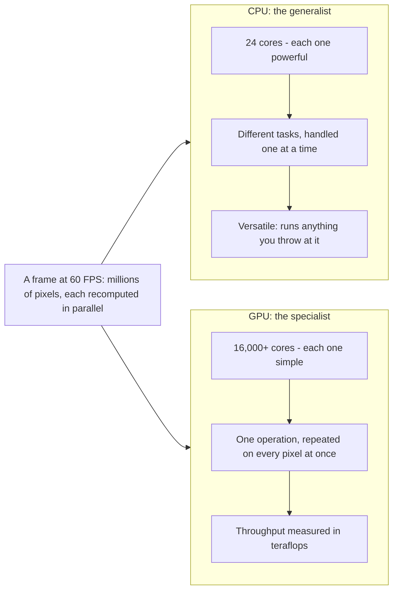
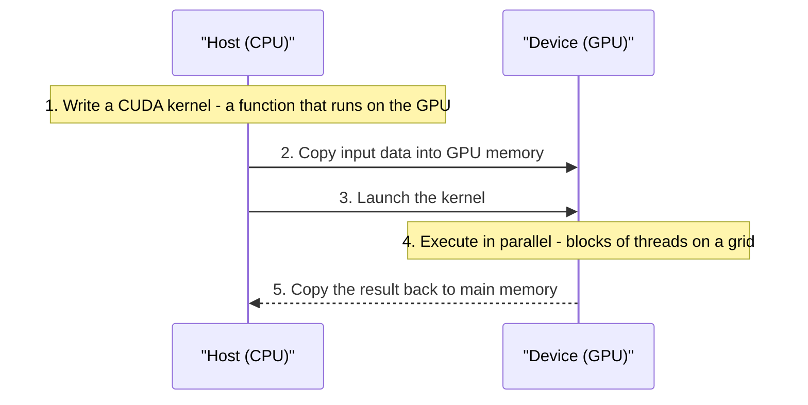
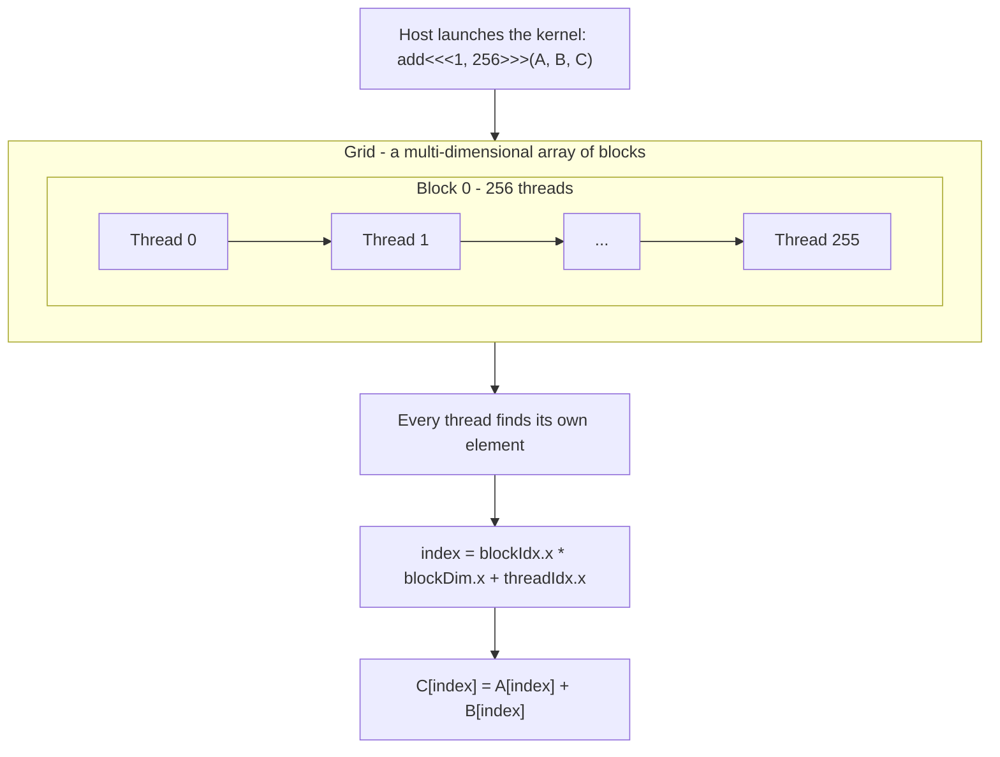

## Diagrams

### 1. Why GPUs Win at Parallel Work

Illustrates Section 2, "Why GPUs Are Built for Parallel Work": when the same operation must run on millions of pixels at once, thousands of simple GPU cores beat a handful of powerful CPU cores.

### 2. Host and Device: The Five-Step CUDA Flow

Illustrates Section 3, "How CUDA Works: Host, Device, and Execution": every CUDA program is a five-step handshake - kernel first, data over, launch, execute, then results back.

### 3. Grid, Blocks, and Threads: Inside a Kernel Launch

Illustrates Section 4, "Building Your First CUDA Application": how the launch `add<<<1, 256>>>` maps 256 threads onto the grid and why each thread computes its own index.

