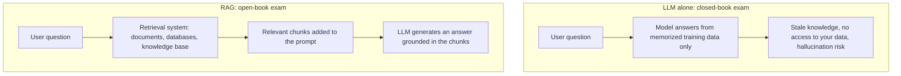
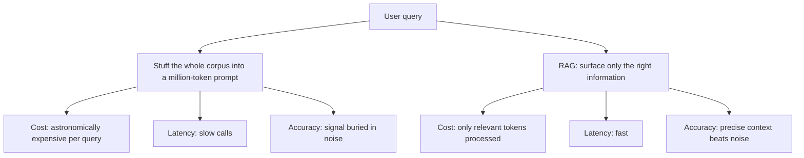
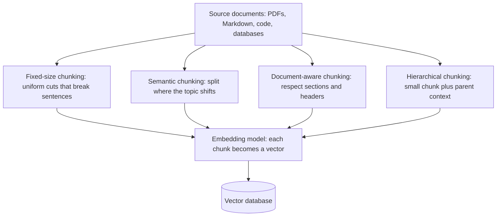
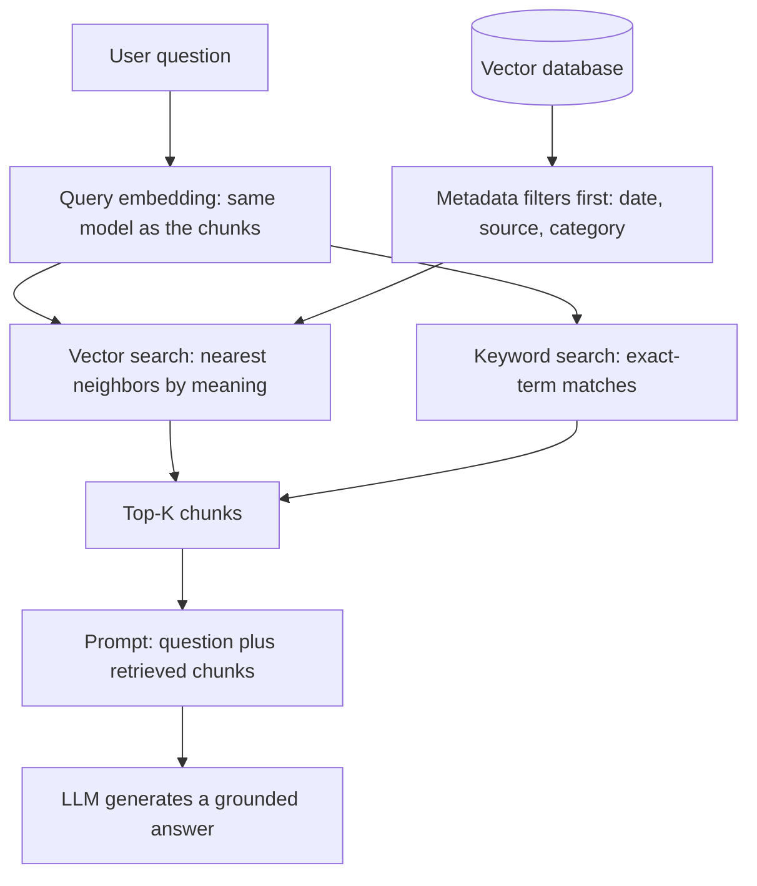
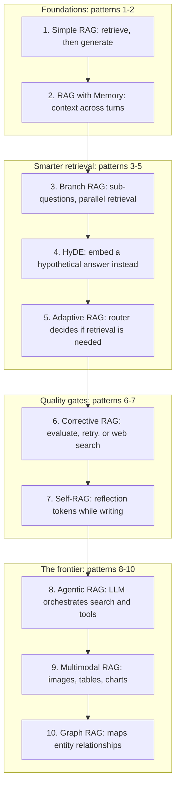
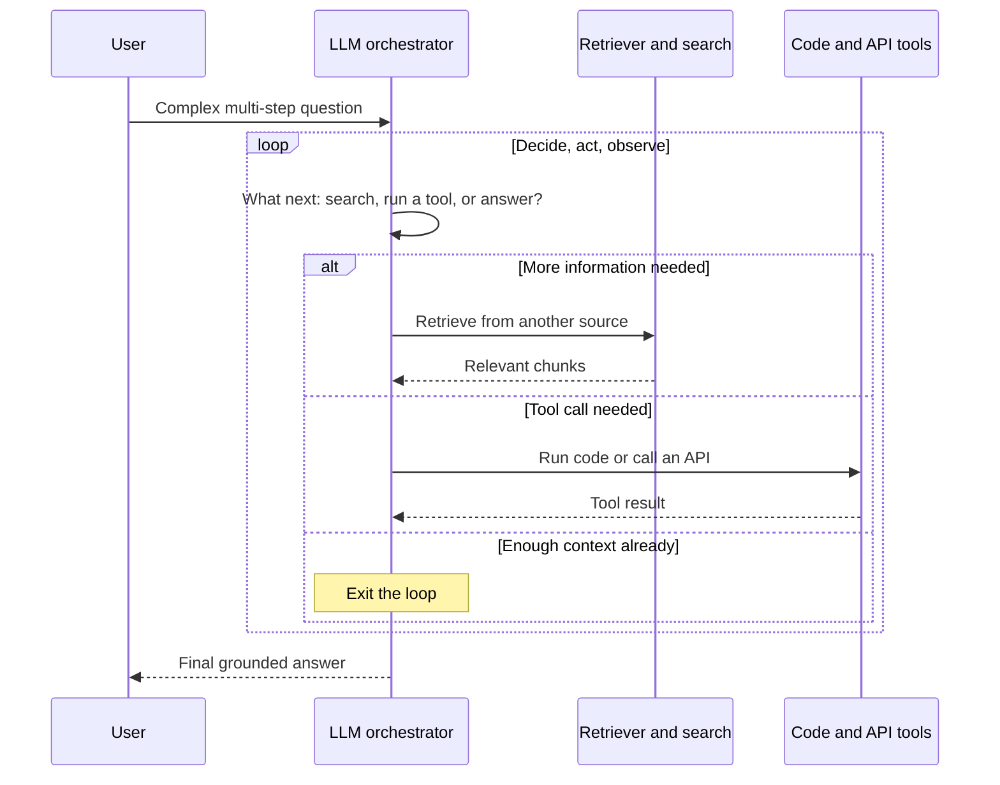

# RAG Explained in 12 Minutes

If you have been hearing "RAG" everywhere and wondering what it actually is, this guide is for you: it explains what Retrieval-Augmented Generation really is, why some people are getting it wrong, how every component works under the hood, and ten RAG patterns worth knowing in 2026. It distills a video by Aishwarya Srinivasan, a machine-learning practitioner who has spent the last decade working in AI — she holds a master's degree in data science from Columbia University and has worked as a data scientist at Microsoft, Google, and IBM — and who now builds The Gen Academy, an AI skill-building platform focused on what teams are building in production right now. The goal is to explain the *why* behind everything, not just the textbook definitions, for engineers, product managers, and anyone building applications on large language models.

## Diagrams

The six figures below mirror the interactive deck in diagrams.html: figures 1 and 2 frame what RAG is and why it beats context stuffing, figures 3 and 4 dissect the architecture, and figures 5 and 6 map the ten patterns of 2026.

### 1. RAG at a Glance: Closed Book vs. Open Book

Shows the open-book-exam contrast from Section 1, "What Is RAG?": the LLM alone answers from memory, while RAG adds a retrieval system so that generation is grounded in your sources.

### 2. Context Stuffing vs. Retrieved Context: Cost, Latency, Accuracy

Maps the second misconception from Section 2, "Two Misconceptions That Persist": bigger context windows lose to RAG on cost, latency, and accuracy.

### 3. The Indexing Pipeline: Chunking, Embedding, Storing

Follows the offline half of Section 3, "Inside the Architecture: How RAG Works": the chunking strategies, embedding models, and vector database covered in Sections 3.1 through 3.3.

### 4. Query Time: Hybrid Retrieval and Grounded Generation

Traces the online path through Sections 3.2 and 3.4 of "Inside the Architecture": embedding the query, hybrid search, and prompt assembly before the LLM writes.

### 5. Ten RAG Patterns: The Evolution of an Architecture

Compresses all of Section 4, "Ten RAG Patterns to Know in 2026", into one progression that also doubles as the rebuttal to the 'RAG is dead' myth from Section 2.1.

### 6. Agentic RAG: The Orchestrator Loop

Zooms into the pattern from Section 4.8, where the LLM orchestrates retrieval, APIs, and code in a loop until it has enough context to answer.

## Table of Contents

1. What Is RAG?
2. Two Misconceptions That Persist
3. Inside the Architecture: How RAG Works
4. Ten RAG Patterns to Know in 2026
5. Where to Go From Here

## 1. What Is RAG?

The analogy that makes RAG click is an open-book exam. You do not have every fact memorized, but you have a pile of textbooks and notes sitting next to you. When a question comes up, you flip through the right sections, read what is relevant, and write your answer based on what you just found. You are not making things up — you are grounding your answer in actual source material. That is exactly what RAG does for a large language model.

A standard LLM like GPT, Claude, or Gemini is like a student who only has what they memorized during training. They are smart; they can reason, write, and explain. But their knowledge has a cutoff date, and most importantly, they have no idea what is in your documents, your company's databases, or your internal knowledge base. RAG — retrieval-augmented generation — fixes that. Instead of relying purely on what the model memorized, RAG gives it the ability to look things up first, pull in relevant information, and then generate an answer that is grounded in the retrieved context.

RAG is really two things working together:

- a **retrieval system** that finds the right information, and
- a **generation system** — the LLM — that uses that information to answer intelligently.

That partnership is the whole game. And it is not a marginal technique:

> RAG is not a cool trick. It is the foundation of almost every serious enterprise AI application being built right now.

Customer support over internal knowledge bases, internal knowledge assistants, legal document analysis — RAG is underneath every single one of those applications.

## 2. Two Misconceptions That Persist

Before going deeper, it is worth addressing the two biggest misconceptions floating around, because both do real damage to how people think about building AI systems.

### 2.1 Myth: "RAG Is Dead"

People keep saying RAG is dead, and the claim is completely wrong. What actually happened: a few papers came out showing that LLMs can sometimes hallucinate even with retrieved context, and the narrative ran away from there. But RAG is not a single technology — it is an *architectural pattern*, and architectural patterns need to keep evolving. The failure modes got real answers: patterns like corrective RAG, Self-RAG, and agentic RAG, covered later in this article, are all direct responses to earlier limitations of RAG. RAG isn't dying; it is maturing.

### 2.2 Myth: "Bigger Context Windows Mean You Don't Need RAG"

This one is confusing because it sounds logical. If you can stuff a million tokens into a prompt, why bother building a retrieval system at all? Here is why that does not hold up in practice:

- **Cost.** Processing a million-token context on every single query is astronomically expensive at scale.
- **Latency.** Those calls are slow.
- **Performance.** This is the one most people overlook: LLMs actually perform worse when overloaded with irrelevant context. Research shows models lose accuracy when the signal is buried in too much noise.

RAG's job is to surface precisely the right information, so a well-built RAG system consistently outperforms brute-force context stuffing on accuracy, cost, and speed.

## 3. Inside the Architecture: How RAG Works

Understanding each component deeply is what separates people who build RAG systems that work from people who build RAG systems that don't. The pipeline breaks down into ingestion, embeddings, storage, and retrieval.

### 3.1 Ingestion and Chunking

Before anything can be retrieved, a document has to be broken up and stored — and *chunking* is how you break documents up. This matters enormously.

The naive approach is **fixed-size chunking**: cut each document into, say, 500-token pieces. It sometimes works, but it loses context at the boundaries — if a sentence is cut in half between two chunks, neither chunk makes proper sense.

A much better approach is **semantic chunking**, where an embedding model detects where the topic shifts in the text and you break on those natural boundaries instead. Tools like LangChain and LlamaIndex have built-in support for this. For structured content — PDFs with sections, Markdown files with headers — **document-aware chunking** is even better, because it respects the document's actual structure. And there is a more advanced strategy called **hierarchical chunking**, where you store both a small, precise chunk and a larger parent chunk that provides context. When the small chunk is retrieved, the parent is passed to the LLM as well — sometimes called *small-to-big retrieval*, and genuinely one of the best techniques in production RAG.

### 3.2 Embedding Models

Once documents are chunked, each chunk is converted into an **embedding**: a numerical vector that represents the meaning of that text. When a user asks a question, you embed the query too, then find the chunks whose embeddings are closest to the query embedding. That is semantic search.

As of 2026, the go-to embedding models include `text-embedding-3-large` from OpenAI, Voyage 3 from Voyage AI, and open-source options such as BGE Large and E5-Mistral from Hugging Face. The strong recommendation is to benchmark embedding models on *your own domain*, because performance varies significantly — a model that is great on legal text may be mediocre on code documentation.

### 3.3 Vector Databases

Vector databases are where your embeddings live. The big players are Pinecone, Weaviate, Qdrant, Milvus, and Chroma DB. When choosing one, look at:

- **query latency at your expected scale**,
- **metadata filtering** — you often want to filter by date, source, or category *before* doing the vector search, and
- **hybrid search support**, which leads to the next point: retrieval strategies.

### 3.4 Retrieval Strategies

Pure vector search — finding the most semantically similar chunks — is great, but it is not perfect. Embeddings capture meaning but can miss exact terms, which is why many production systems use **hybrid search**, blending semantic similarity with traditional keyword matching so that exact-name or exact-code matches are not overlooked. The video's real answer to "retrieval is not perfect," however, is the evolution of the retrieval strategy itself: the ten RAG patterns below are, in effect, ten increasingly capable architectures for getting the right context into the generation step.

## 4. Ten RAG Patterns to Know in 2026

Think of these as ten different architectures that solve different problems. The list runs from the simplest starting point to the patterns shaping where the field is going.

### 4.1 Simple RAG

You ask a question, you retrieve the relevant chunks, you stuff them into the prompt, and the LLM answers. Simple RAG is the "hello world" of RAG. It is fine for prototyping, but it is not enough for production.

### 4.2 RAG with Memory

The second pattern adds a memory layer on top of simple RAG. While simple RAG treats every query as a fresh, standalone lookup, a memory layer carries conversational context between turns — earlier questions, answers, and retrievals — so follow-up questions like "and what about the second option?" resolve against what was already discussed. This is the pattern underneath chat-style assistants that still need retrieval.

### 4.3 Branch RAG

Sometimes one query is not enough to answer a complex question. Branch RAG uses an LLM to decompose the user's question into multiple sub-questions, runs parallel retrieval for each of them, and then synthesizes the results into one coherent answer. Instead of one search for a question that actually spans several topics, each sub-question gets its own focused retrieval, and the answer is assembled from all of them.

### 4.4 HyDE

HyDE — short for hypothetical document embeddings — is a clever pattern worth understanding. It solves a real mismatch: query embeddings and document embeddings often look different even when they are talking about the same thing. A question like "what causes inflation?" embeds differently than a paragraph *explaining* what causes inflation, because questions and statements are shaped differently.

HyDE bridges that gap by asking the LLM to generate a hypothetical answer to the query *before* retrieving anything. That hypothetical answer is then embedded and used as the search vector — and because it looks much more like an actual document, retrieval quality improves significantly. It is a neat trick, and it works.

### 4.5 Adaptive RAG

Not every question needs retrieval. If a user asks "what's 2 + 2?", there is no reason to hit the vector database. Adaptive RAG inserts a **routing layer** — essentially a lightweight classifier or an LLM call — that decides whether a question needs retrieval at all, and if so, whether it needs simple retrieval or a more complex multi-step retrieval. The result is a smarter system and lower costs, because retrieval only happens when it earns its keep.

### 4.6 Corrective RAG (CRAG)

Corrective RAG directly addresses a real failure mode: what happens when the retrieved documents are low quality or flat-out irrelevant? CRAG adds an **evaluation step after retrieval**. If the retrieved documents score below a confidence threshold, the system either reformulates the query and tries again, or falls back to a web search to find better information — and only then generates an answer. Think of it as a quality gate on the pipeline, catching bad retrievals before they can poison the final answer.

### 4.7 Self-RAG

Self-RAG takes the self-correction idea further by making the LLM critique itself as it writes. The model is trained or prompted to emit specific **reflection tokens** during generation: "Is retrieval needed here?" "Is this passage actually relevant?" "Is this claim supported by the retrieved context?" The model is questioning its own reasoning in real time. The result is an answer that is more grounded, more accurate, and more transparent about its own confidence. It is more complex to implement, but incredibly powerful for high-stakes applications.

### 4.8 Agentic RAG

Agentic RAG is where RAG meets AI agents — and honestly, it is the direction the whole field is moving. Instead of a single retrieve-then-generate step, agentic RAG uses an LLM as an **orchestrator** that decides what to do next: search for more information, call an API, run some code, retrieve from a different source, or decide that it already has enough context to answer. It loops until the answer is good enough. Frameworks like LangChain and LlamaIndex workflows are built exactly for this pattern, and for complex multi-step queries, agentic RAG is genuinely transformative.

### 4.9 Multimodal RAG

Most RAG systems only handle text, but real-world data contains charts, diagrams, tables, images, and PDFs with mixed content. Multimodal RAG handles all of it. One approach: at ingestion time, a vision-language model generates text descriptions for images and tables, so those descriptions can be embedded and retrieved like any other chunk. A further step stores image embeddings directly alongside the text embeddings. Tools like LlamaIndex support this natively. As enterprise data gets richer and more visual, multimodal RAG is going to become essential.

### 4.10 Graph RAG

Graph RAG is one of the most interesting recent developments. Standard RAG treats a knowledge base as a flat collection of chunks with no relationship between them. Graph RAG instead builds a **knowledge graph** on top of the documents, mapping entities and their relationships explicitly. When a question requires connecting multiple pieces of information — "how does this regulation affect the contracts we signed with these three vendors?" — graph RAG dramatically outperforms standard vector search, because it understands relationships, not just similarity.

## 5. Where to Go From Here

RAG is not dying — it is maturing, and the pattern list above is evidence of how quickly the architecture has evolved from simple retrieve-then-generate into corrective, self-reflecting, agentic, multimodal, and graph-based systems. For a lot more depth on the subject, the video description links a set of resources, and for those serious about mastering agentic AI systems, Srinivasan and her co-founder have built a deep-dive, mastering-agentic-AI bootcamp at The Gen Academy — technical, hands-on, and production-focused, designed both for engineers and for people who do not code in their jobs, like product managers.

## Key Takeaways

- RAG is retrieval-augmented generation: a retrieval system finds relevant information and a generation system (the LLM) answers grounded in it — an open-book exam for language models.
- It is the foundation of serious enterprise AI: customer support over knowledge bases, internal knowledge assistants, and legal document analysis all run on RAG.
- "RAG is dead" is wrong: RAG is an architectural pattern that matures, and patterns like corrective RAG, Self-RAG, and agentic RAG exist precisely because of its early limitations.
- Huge context windows do not replace RAG: brute-force context stuffing is expensive, slow, and degrades model performance when irrelevant content buries the signal.
- Chunking decides retrieval quality: prefer semantic and document-aware chunking over fixed-size cuts; hierarchical chunking with small-to-big retrieval is one of the best production techniques.
- Embedding choice is domain-specific — benchmark models on your own data — and pick a vector database on latency, metadata filtering, and hybrid search support.
- Ten patterns cover the design space: simple RAG, RAG with memory, Branch RAG, HyDE, adaptive RAG, corrective RAG, Self-RAG, agentic RAG, multimodal RAG, and graph RAG.
- Each pattern solves a distinct problem: multi-part questions (Branch RAG), query-document mismatch (HyDE), unnecessary retrieval (adaptive), bad retrievals (corrective), self-critique (Self-RAG), multi-step orchestration (agentic), non-text data (multimodal), and relationships between entities (graph RAG).
- Agentic RAG is where the field is heading — an LLM orchestrator that searches, calls tools, and loops until the answer is good enough.

## Source

- Video: [RAG Explained in 12 Minutes](https://www.youtube.com/watch?v=v0ynfDPpe4E)
- Channel: [Aishwarya Srinivasan](https://www.youtube.com/@aishwaryasrinivasan)
- Fetched: 2026-09-02T12:53:49.522238+00:00

The captions for this video were auto-generated and lightly edited by this pipeline.
