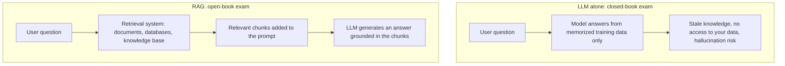
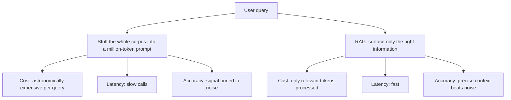
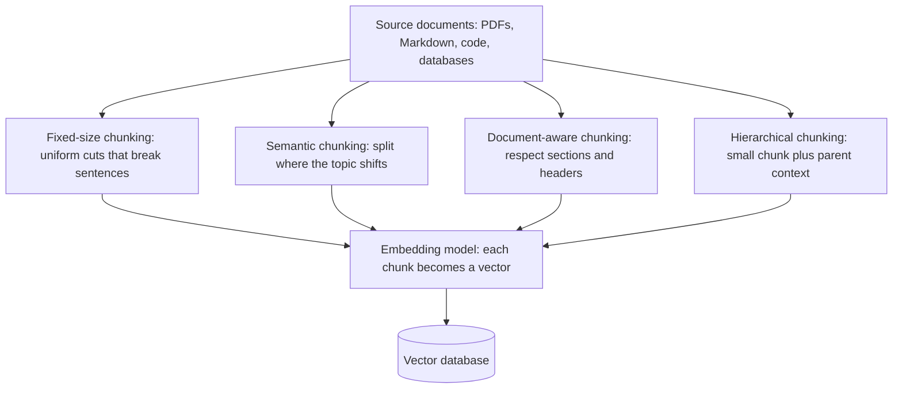
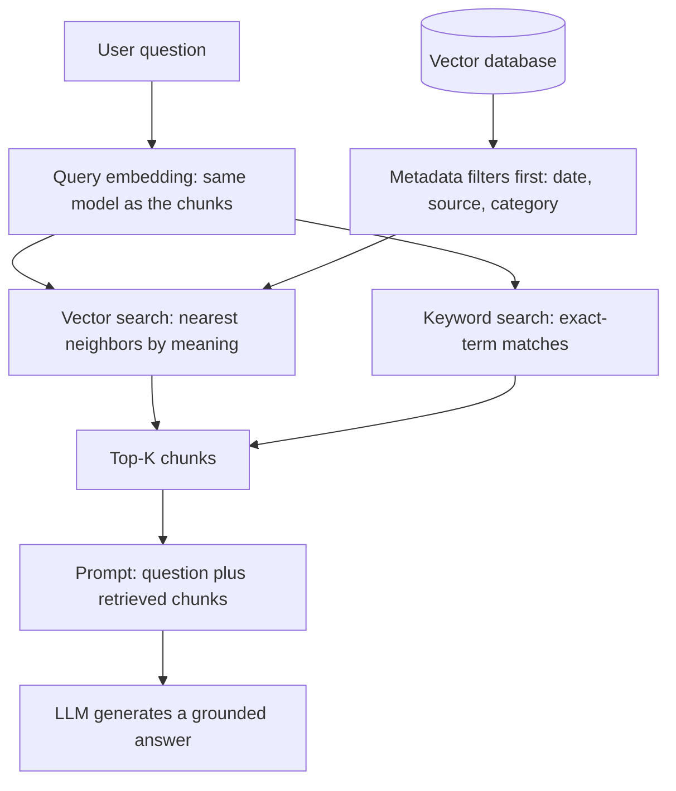
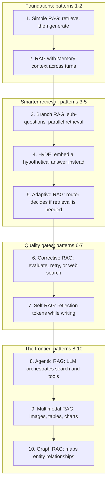
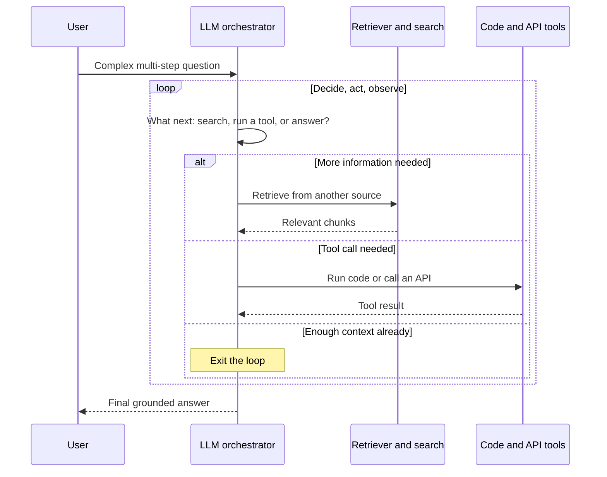

## Diagrams

The six figures below mirror the interactive deck in diagrams.html: figures 1 and 2 frame what RAG is and why it beats context stuffing, figures 3 and 4 dissect the architecture, and figures 5 and 6 map the ten patterns of 2026.

### 1. RAG at a Glance: Closed Book vs. Open Book

Shows the open-book-exam contrast from Section 1, "What Is RAG?": the LLM alone answers from memory, while RAG adds a retrieval system so that generation is grounded in your sources.

### 2. Context Stuffing vs. Retrieved Context: Cost, Latency, Accuracy

Maps the second misconception from Section 2, "Two Misconceptions That Persist": bigger context windows lose to RAG on cost, latency, and accuracy.

### 3. The Indexing Pipeline: Chunking, Embedding, Storing

Follows the offline half of Section 3, "Inside the Architecture: How RAG Works": the chunking strategies, embedding models, and vector database covered in Sections 3.1 through 3.3.

### 4. Query Time: Hybrid Retrieval and Grounded Generation

Traces the online path through Sections 3.2 and 3.4 of "Inside the Architecture": embedding the query, hybrid search, and prompt assembly before the LLM writes.

### 5. Ten RAG Patterns: The Evolution of an Architecture

Compresses all of Section 4, "Ten RAG Patterns to Know in 2026", into one progression that also doubles as the rebuttal to the 'RAG is dead' myth from Section 2.1.

### 6. Agentic RAG: The Orchestrator Loop

Zooms into the pattern from Section 4.8, where the LLM orchestrates retrieval, APIs, and code in a loop until it has enough context to answer.

