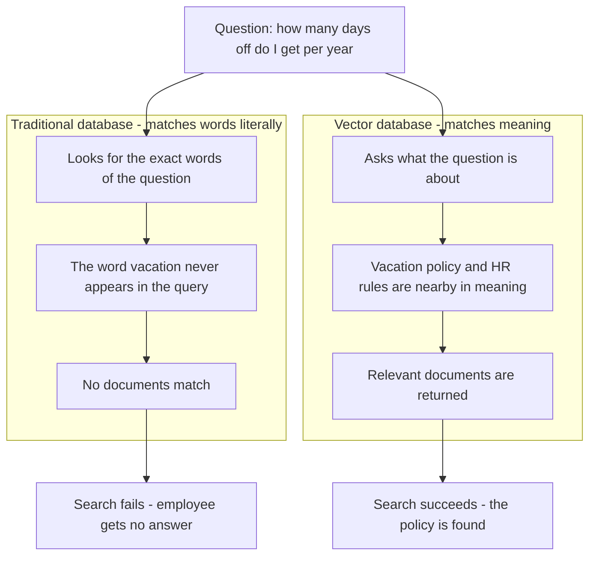
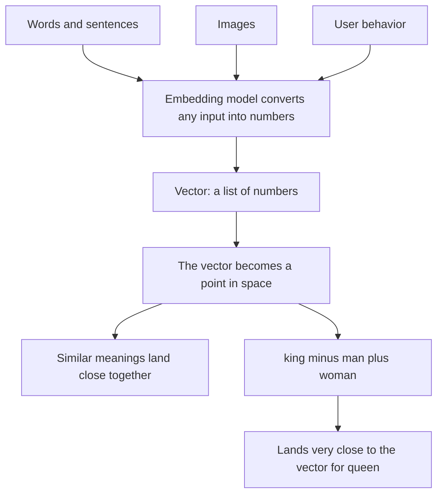
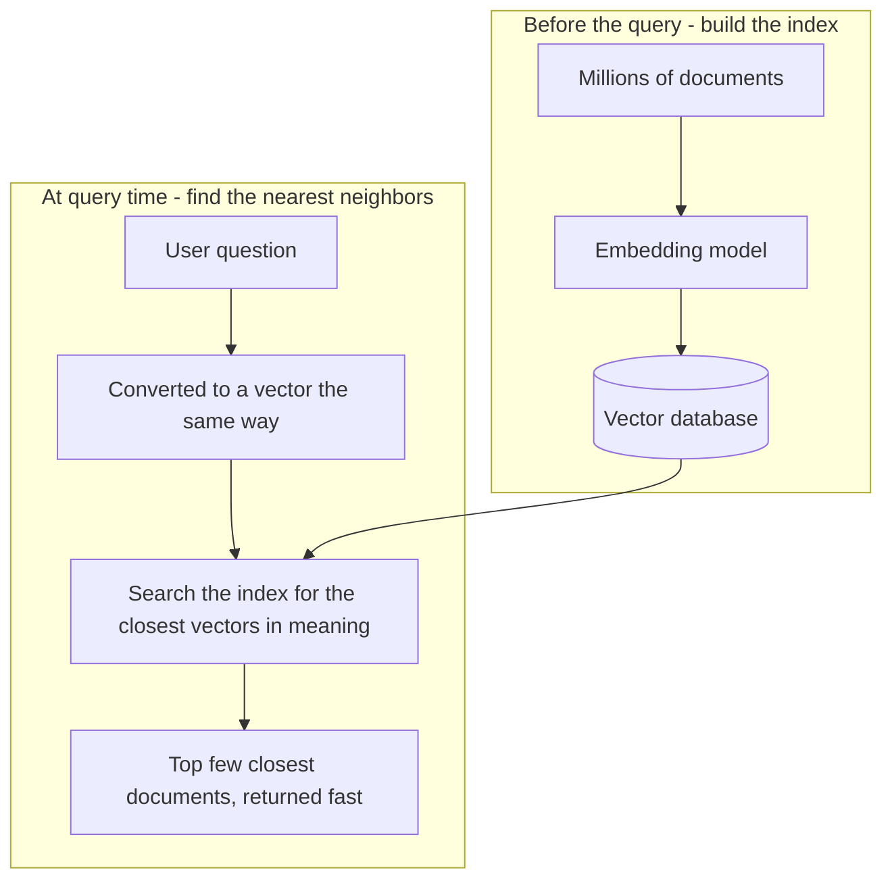
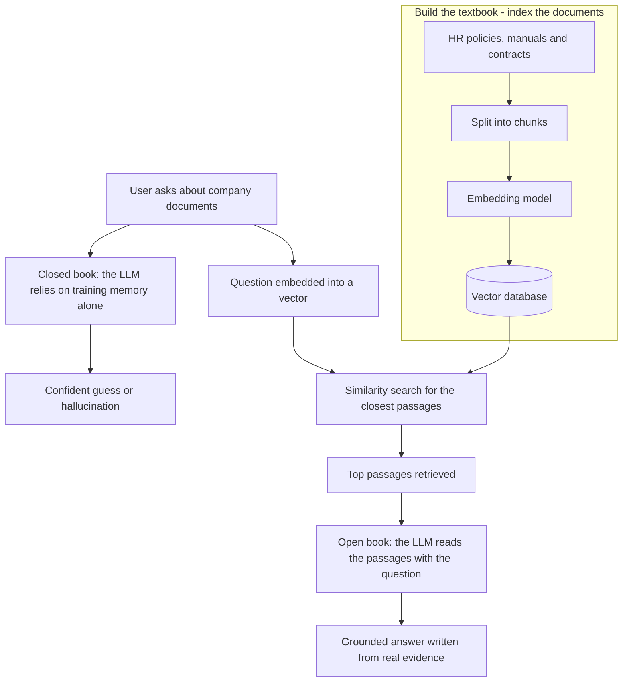
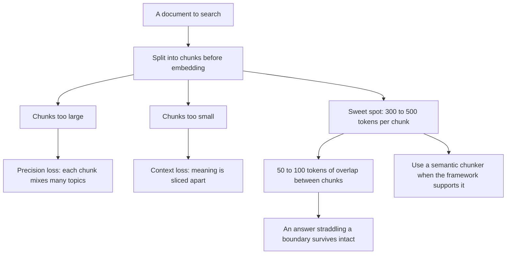
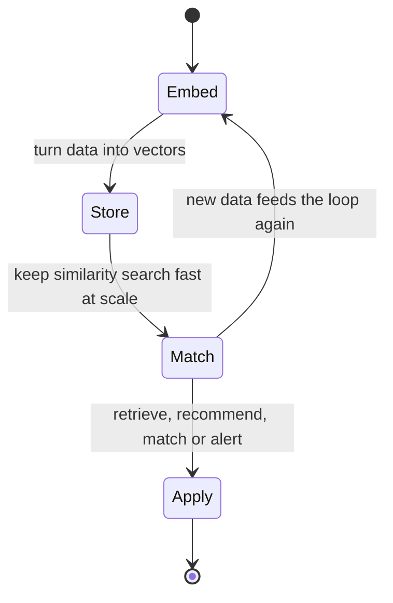

# Vector Databases Explained: The Complete Guide for 2026

Chatbots with memory, semantic search engines, RAG systems, and AI agents that answer questions about your own documents all run on the same piece of unglamorous infrastructure: the vector database. In this guide, Aishwarya Srinivasan — a machine-learning engineer with over ten years of experience at companies including IBM, Microsoft, and Google — explains what vector databases actually do, why ordinary databases cannot do the job, and how meaning-based retrieval works under the hood. It is for anyone who wants to understand the infrastructure behind modern AI before building with it, whether you are wiring up your first retrieval prototype or trying to see past the hype around agents and RAG.

## Diagrams

### 1. Keyword Match vs. Meaning Match: The Problem Vector Databases Solve

Illustrates Section 1, Why Traditional Databases Fall Short: the same question either dies on exact keyword matching or succeeds on meaning matching.

### 2. Embeddings: Turning Words, Images, and Behavior into Points in Space

Illustrates Section 2, Vectors and Embeddings: meaning becomes geometry, and vector arithmetic follows meaning.

### 3. Similarity Search: What a Vector Database Does With Millions of Vectors

Illustrates Section 3, What a Vector Database Actually Does: an index is built once, and every query becomes a fast nearest-neighbor search.

### 4. RAG: The LLM Goes From a Closed-Book Exam to an Open-Book Exam

Illustrates Sections 4.1 and 4.2, Closed-Book vs. Open-Book Exams and the RAG Pipeline, Step by Step: retrieval turns the vector database into the textbook the LLM reads before answering.

### 5. Chunking: Sizing the Passages Before You Embed

Illustrates Section 4.3, Chunking: The Step People Get Wrong, where chunk size trades precision against context.

### 6. The Mental Model: Embed, Store, Match — and Do It Again

Illustrates Sections 6 and 7, Vector Databases Beyond RAG and the Mental Model That Makes It All Click: retrieval, recommendations, visual search, and anomaly detection all run the same loop.

## Table of Contents

1. Why Traditional Databases Fall Short
2. Vectors and Embeddings: How Machines Capture Meaning
3. What a Vector Database Actually Does
4. RAG: Why Vector Databases Are the Backbone of Modern AI
   - 4.1 Closed-Book vs. Open-Book Exams
   - 4.2 The RAG Pipeline, Step by Step
   - 4.3 Chunking: The Step People Get Wrong
5. Choosing Your Vector Database
6. Vector Databases Beyond RAG
7. The Mental Model That Makes It All Click

## 1. Why Traditional Databases Fall Short

The best way to understand why vector databases exist is to start with the problem they solve. Imagine you are building an AI assistant for a company that holds thousands of internal documents — HR policies, product manuals, legal contracts — and your assistant needs to answer employee questions using that information.

The obvious approach is to dump all of those documents into a regular database and search through them. That idea breaks down almost immediately. A traditional database such as MySQL or PostgreSQL is designed for exact or partial text matching. Queries like "find me all the documents where the word *vacation* appears" work perfectly, because the matching is purely lexical: the database is comparing strings, not meaning.

Now consider what a real employee actually asks: *how many days off do I get per year?* The word "vacation" may never appear in that question. A traditional database has no idea that the two are related — no index, no query planner, no operator connects "days off" to the vacation policy in an HR manual. It can only find documents that literally contain the words you typed.

That is the core limitation vector databases were built to solve. They are designed not for exact matching, but for meaning-based matching — finding documents that are *about* the same thing as your question, regardless of whether they share a single word. That distinction is everything: it is what turns a database from a lookup tool into something that understands what your data means.

## 2. Vectors and Embeddings: How Machines Capture Meaning

Before you can understand vector databases, you need to understand vectors — and despite the math-sounding name, the idea is intuitive. Think about how your own brain understands meaning. When you hear the word *king*, you do not just store the letters k-i-n-g; you store a whole web of associations: royalty, power, leadership, crown. Your brain holds a rich, multi-dimensional understanding of what that word means in relation to everything else you know.

Machine learning models do something very similar. They convert words, sentences, images — basically any kind of data — into a list of numbers. That list of numbers is called a **vector** or an **embedding**. The beautiful part is that the numbers are not random. They are positioned in mathematical space in a way that actually captures meaning: words with similar meanings end up with similar numbers, which means they end up close to each other in the vector space.

The classic demonstration: take the vector for *king*, subtract the vector for *man*, and add the vector for *woman*, and you land extremely close to the vector for *queen*. The model has learned that royalty and gender are real, manipulable dimensions of meaning, and vector arithmetic lets you move along them.

> That's not magic. That's a well-trained embedding model doing its job.

When you convert your company's thousands of documents into vectors, you have translated all of that text into a mathematical language that captures meaning rather than keywords. Each document becomes a point in space, positioned so that nearby points are semantically related.

## 3. What a Vector Database Actually Does

The workflow is simple in shape. When a user asks a question — say, *how many days off do I get this year?* — that question is converted into a vector in exactly the same way the documents were. The database then finds the documents whose vectors are closest to the query's vector in meaning, even if those documents share no words at all with the original question.

A vector database is built to do precisely this: store vectors and answer nearest-neighbor-style similarity queries quickly, even across millions of documents. That combination — a meaning-based representation plus retrieval that is fast at scale — is the entire product. Without the speed, scanning millions of vectors for every query would be useless in practice; without the semantic representation, the results would be no better than a keyword search.

Which brings us to the most important place this technology shows up right now: RAG.

## 4. RAG: Why Vector Databases Are the Backbone of Modern AI

**RAG** stands for **retrieval augmented generation**, and it is currently the most important use case for vector databases — the mechanism that lets large language models answer questions about information they never saw during training.

### 4.1 Closed-Book vs. Open-Book Exams

Think about a closed-book exam. You can only answer questions based on what you have memorized. If you did not study something, you are simply stuck. That is essentially a large language model without RAG: it can only answer based on what it learned during training. Ask it something that happened after its training cutoff, or something highly specific to your company, and it will either hallucinate a confident-sounding answer or admit it does not know.

Now imagine an open-book exam. The textbook sits in front of you; you get the question, flip to the relevant chapter, read the relevant section, and write your answer using both your reasoning ability and the actual information from the book. That is RAG.

> The LLM is the student with great reasoning ability, and the vector database is the textbook.

### 4.2 The RAG Pipeline, Step by Step

In practice, a RAG system built on a vector database works like this:

1. Take all of your documents and convert them into vectors using an embedding model.
2. Store those vectors in a vector database.
3. When a user submits a query, convert the query into a vector.
4. Search the database for the most semantically similar documents.
5. Retrieve the top results.
6. Pass those results, together with the original query, to the LLM.
7. The LLM generates a grounded, accurate response instead of guessing.

This is why RAG matters so much: it solves the hallucination problem for domain-specific knowledge. The model never has to bluff about your policies or your product — the relevant passages are placed in front of it, and it reasons from them. The vector database sits at the heart of the retrieval step that makes that possible.

### 4.3 Chunking: The Step People Get Wrong

One mistake the speaker says she sees constantly: treating the database choice as the only decision that matters, when how you chunk documents *before* embedding them matters just as much. Documents are not embedded whole; they are split into passages, and the size of those passages shapes retrieval quality.

> If your chunks are too large, you lose precision. If they are too small, you lose context.

A solid starting point is roughly 300–500 tokens per chunk, with about 50–100 tokens of overlap at chunk boundaries. The overlap matters because a relevant answer can straddle a boundary, and overlap keeps that context from being sliced in half. Where your framework supports it, use a semantic chunker rather than a fixed-size character splitter — chunks that break at meaningful boundaries retrieve better, and the difference in retrieval quality is real, not theoretical.

## 5. Choosing Your Vector Database

If you are ready to start building, the practical question is where to start. The speaker is direct about the landscape, and the options fall into a few clear buckets.

**Chroma DB** is the entry point for local experimentation. It is incredibly easy to set up, works well with LangChain and LlamaIndex, and you can have a working RAG prototype running on your laptop in under an hour.

**Qdrant** is the pick when you want performance and are willing to self-host. It is open source, written in Rust, which makes it extremely fast and memory-efficient, and its documentation is excellent. You can run it locally with Docker in about five minutes.

**Pinecone** suits production applications where you do not want to manage infrastructure. It is currently the most popular fully managed option: it scales automatically, integrates well with most AI frameworks, and its free tier is generous enough to prototype before you commit.

**Weaviate** is worth knowing about because it supports hybrid search — combining vector similarity search with traditional keyword search in the same query. That is powerful for production use cases where you want the strengths of both approaches, such as exact matches on product IDs or part numbers alongside semantic matches on natural language.

The pattern to take away: start with Chroma to learn, graduate to Qdrant if you want to own the stack, reach for Pinecone when you want managed scale, and keep Weaviate in mind when lexical precision and semantic recall need to coexist.

## 6. Vector Databases Beyond RAG

Vector databases are not only for RAG, and it is a mistake to leave with that impression. The same similarity-search machinery powers a surprising share of the products you already use.

**Spotify** uses vector similarity to recommend songs you have never heard but will probably love: your listening history is converted into a vector and matched against a catalog of song vectors. **Netflix** does the same for content recommendation. **Pinterest** lets you photograph a room you like and find visually similar pins, because a vision model converts the image into a vector that can be compared against millions of others.

The pattern even extends to security. In anomaly detection for cybersecurity, normal network traffic clusters together in vector space; behavior that lands far away from that cluster is your alert — an outlier in meaning rather than a rule-match against a known attack signature.

## 7. The Mental Model That Makes It All Click

Every one of these use cases runs on the same three-step mental model. Convert your data into a rich numerical representation (the vector). Store it in a way that makes similarity search fast (the vector database). Then use that machinery for matching, recommendation, or retrieval. Once you internalize that loop, you will start seeing vector database use cases everywhere — because almost any problem that involves finding *the closest thing to this thing* is a vector search problem in disguise.

If you want to go deeper, the speaker's video description links the documentation for Chroma DB, Qdrant, and Pinecone, along with hands-on RAG tutorials and a dedicated explainer on how RAG works — a natural next step once you have the infrastructure mental model in place.

## Key Takeaways

- Traditional databases (MySQL, PostgreSQL) match text literally; vector databases match meaning, finding relevant documents even when they share no words with the query.
- An embedding is a list of numbers that positions data in mathematical space so that semantically similar items land close together — the reason *king − man + woman* lands near *queen*.
- A vector database stores those embeddings and makes similarity search fast even across millions of documents.
- RAG turns an LLM from a closed-book student into an open-book one: retrieve the closest documents to a query, then hand them to the model so it answers from evidence instead of guessing — solving hallucinations on domain-specific knowledge.
- Chunking quality matters as much as database choice: roughly 300–500 tokens per chunk with 50–100 tokens of overlap, and a semantic chunker where available.
- Start with Chroma DB for local prototypes, Qdrant for self-hosted performance, Pinecone for fully managed production, and Weaviate when you need hybrid keyword-plus-vector search.
- The same vector machinery powers recommendation (Spotify, Netflix), visual similarity (Pinterest), and anomaly detection in cybersecurity — and follows one mental model: embed, store for fast similarity search, then match.

## Source

- Video: [Vector Databases Explained: The Complete Guide for 2026](https://www.youtube.com/watch?v=4pUYfY-b5CQ)
- Channel: [Aishwarya Srinivasan](https://www.youtube.com/@aishwaryasrinivasan)
- Fetched: 2026-09-02T10:49:57.927398+00:00

*This article was written from auto-generated captions, which may contain minor transcription errors; the content was reconstructed for accuracy from context.*
