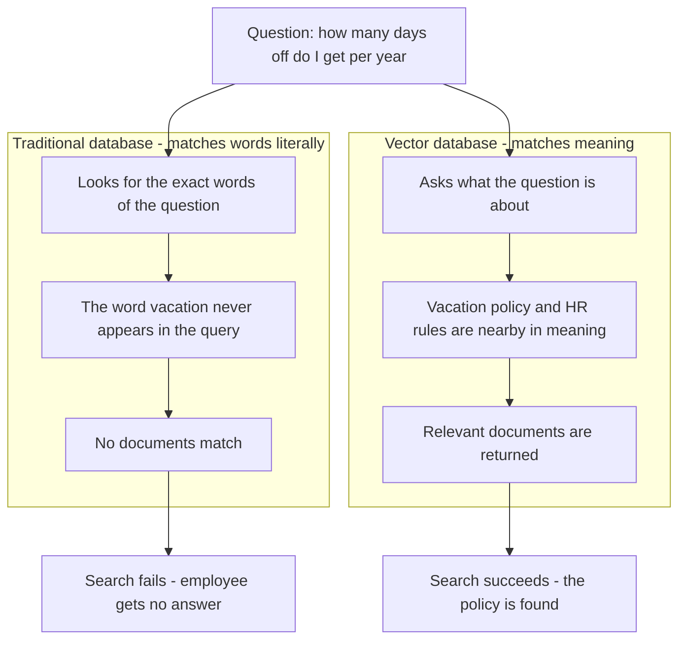
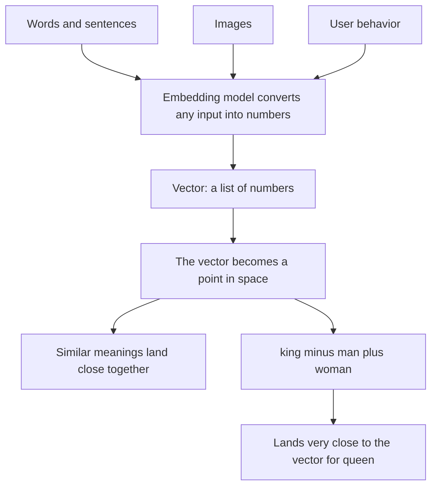
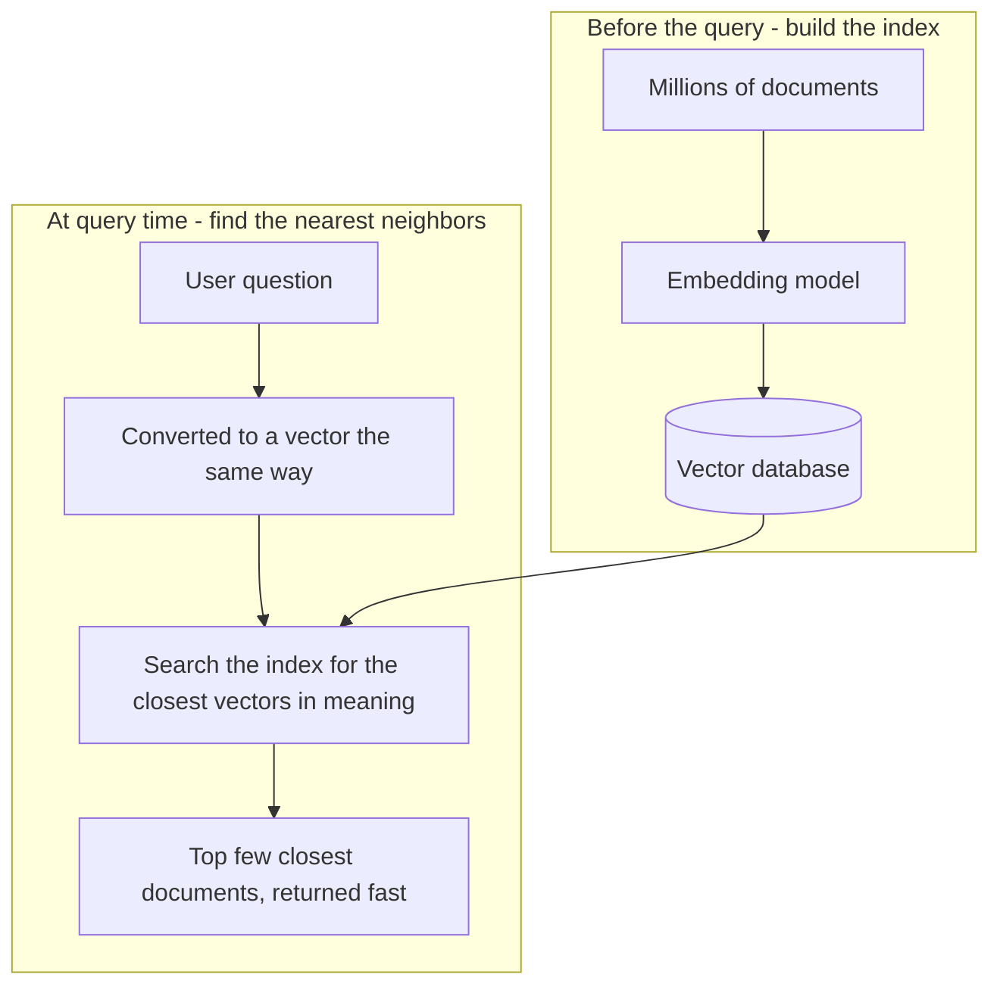
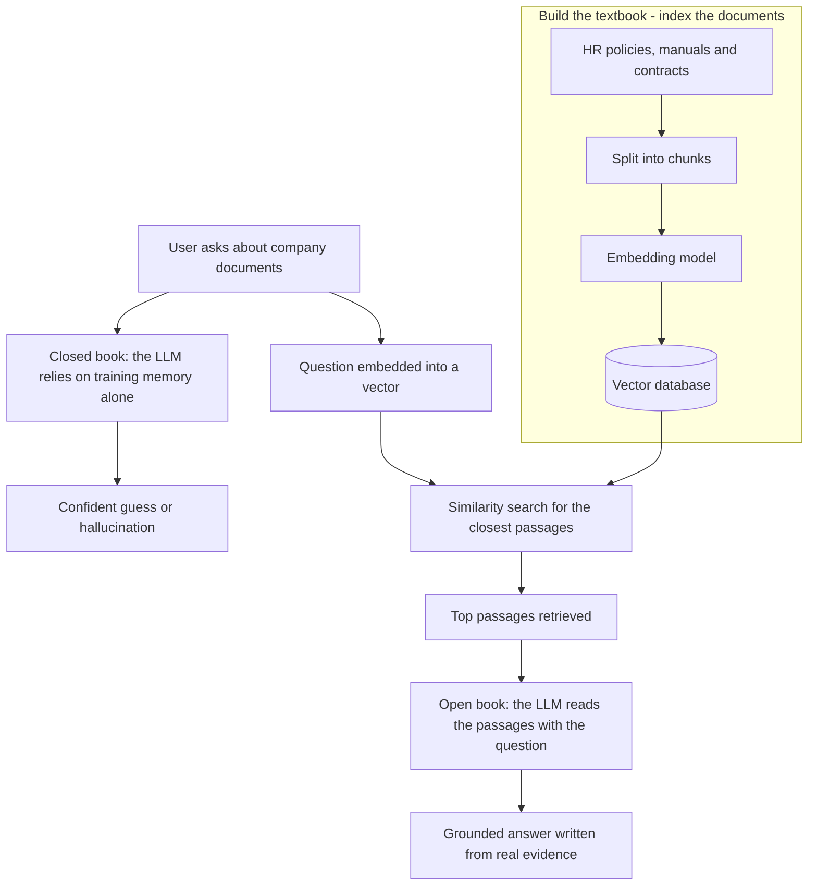
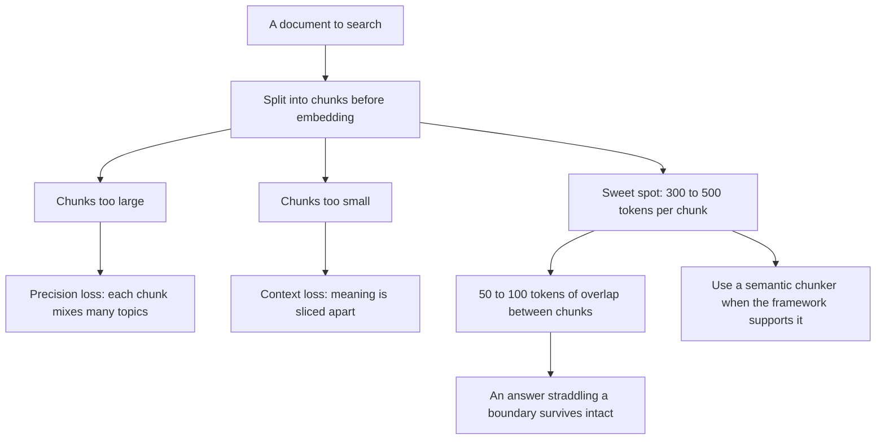
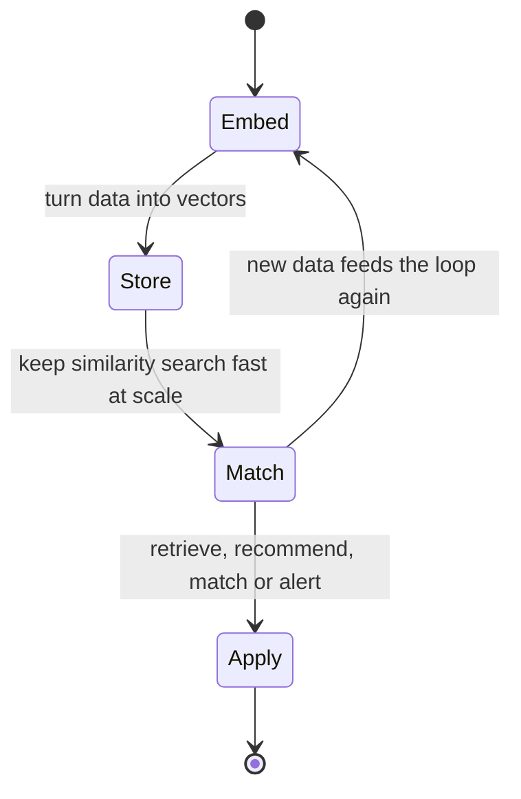

### 1. Keyword Match vs. Meaning Match: The Problem Vector Databases Solve

Illustrates Section 1, Why Traditional Databases Fall Short: the same question either dies on exact keyword matching or succeeds on meaning matching.

### 2. Embeddings: Turning Words, Images, and Behavior into Points in Space

Illustrates Section 2, Vectors and Embeddings: meaning becomes geometry, and vector arithmetic follows meaning.

### 3. Similarity Search: What a Vector Database Does With Millions of Vectors

Illustrates Section 3, What a Vector Database Actually Does: an index is built once, and every query becomes a fast nearest-neighbor search.

### 4. RAG: The LLM Goes From a Closed-Book Exam to an Open-Book Exam

Illustrates Sections 4.1 and 4.2, Closed-Book vs. Open-Book Exams and the RAG Pipeline, Step by Step: retrieval turns the vector database into the textbook the LLM reads before answering.

### 5. Chunking: Sizing the Passages Before You Embed

Illustrates Section 4.3, Chunking: The Step People Get Wrong, where chunk size trades precision against context.

### 6. The Mental Model: Embed, Store, Match — and Do It Again

Illustrates Sections 6 and 7, Vector Databases Beyond RAG and the Mental Model That Makes It All Click: retrieval, recommendations, visual search, and anomaly detection all run the same loop.

